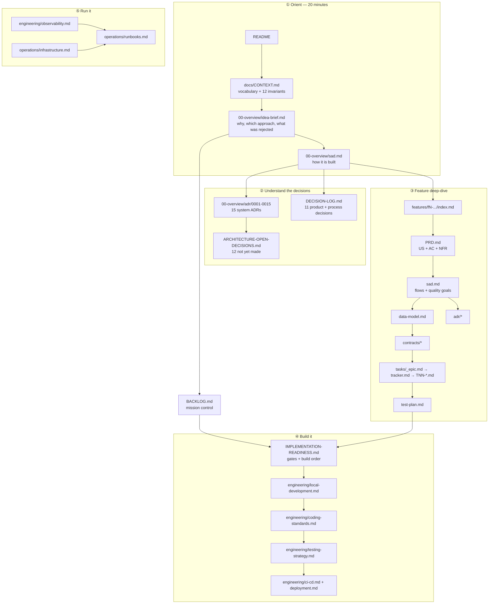

# JobHunter — documentation reading guide

This repository is documentation-first. At the time of writing there is no code: the design, the
decisions and the 108-task plan exist so that implementation is a matter of execution rather than
discovery. That is a deliberate method, decided in [[docs/DECISION-LOG|D8]], and it is why the docs
are a deliverable rather than overhead.

This page explains how the documentation is organised, in what order to read it, and how each artifact
came to exist. For the elevator pitch see [README](README.md); for the working rules an agent or a
contributor must follow, see [CLAUDE.md](CLAUDE.md).

**Shortest path to "I get it":** [README](README.md) → [docs/CONTEXT.md](docs/CONTEXT.md) →
[docs/00-overview/idea-brief.md](docs/00-overview/idea-brief.md) →
[docs/features/f3-claude-batch-enrichment/sad.md](docs/features/f3-claude-batch-enrichment/sad.md).
Twenty minutes, and you will know what this is, why it is built this way, and where the interesting
engineering lives.

---

## 1. Where to start

Dependency order, not chronology. An arrow means *read this first, or the next one will not make sense*.

**If you are a reviewer** and have ten minutes: README → CONTEXT §3 (the invariants) →
[ADR-0001](docs/00-overview/adr/0001-modular-monolith-three-deployables.md) →
[F3's SAD §6](docs/features/f3-claude-batch-enrichment/sad.md) (the resumable Run) →
[F3's tracker](docs/features/f3-claude-batch-enrichment/tasks/tracker.md). That path shows the
vocabulary, one hard architectural trade-off, the most interesting runtime behaviour, and how the work
is actually broken down.

**If you are implementing**, start at
[IMPLEMENTATION-READINESS](docs/IMPLEMENTATION-READINESS.md) §3 for the build order, then go to
[F0's tracker](docs/features/f0-platform-foundation/tasks/tracker.md) and work down it.

---

## 2. The artifact set

Every feature carries the same skeleton. The consistency is the point: once you have read one feature,
you know where everything is in the other nine.

| Stage | Artifact | Answers |
|---|---|---|
| 00 | `CONTEXT.md` | What do these words mean? What is always true? |
| 01 | `idea-brief.md` | Why build this? Which approach? What was rejected, and what would change our mind? |
| 03 | `PRD.md` | What must it do? How will we know it does? |
| 04–05 | `sad.md` | How is it built? What are the quality goals and how are they verified? |
| 04–05 | `adr/NNNN-*.md` | Why this way and not the obvious alternative? |
| 06–07 | `contracts/*` | What exactly crosses the boundary? |
| 08 | `data-model.md` | What is stored, who owns it, which constraint carries which invariant? |
| 13 | `tasks/_epic.md` | What is the whole of this feature, and what does done mean? |
| 13 | `tasks/tracker.md` | Which tasks, in what order, with what dependencies? |
| 13 | `tasks/TNN-*.md` | One PR's worth of work, with its own done-when list |
| 15 | `test-plan.md` | How is every acceptance criterion verified? |

Cross-cutting documents (`BACKLOG`, `DECISION-LOG`, `ARCHITECTURE-OPEN-DECISIONS`,
`IMPLEMENTATION-READINESS`) are marked `status: Living` — they are continuously updated indexes, never
finished.

**If you want to change something rather than understand it**, go to
[docs/DECISIONS-MATRIX.uk.md](docs/DECISIONS-MATRIX.uk.md) (Ukrainian). It presents all 47 decisions
plus 36 tunable parameters as menus with the chosen option marked, each with its blast radius and the
cost of switching — plus five ready-made reconfiguration recipes ("make it half the cost", "remove the
LLM entirely", "move to a cloud cluster with HA"). It is the only document written to be *acted on*
rather than read.

---

## 3. How to read a feature

Take [F3 — Claude batch enrichment](docs/features/f3-claude-batch-enrichment/index.md), the richest one.

1. **`index.md`** — the map of content and the one-paragraph statement of what the feature is for.
2. **`PRD.md`** — user stories and acceptance criteria. Note that ACs contain **no implementation
   tokens**: no API names, no HTTP, no JSON, no SQL. An AC that names a technology is not an AC, it is
   a design decision that escaped into the requirements.
3. **`sad.md`** — the quality goals with their verification method, the runtime sequence diagrams, and
   §11's honest list of risks and accepted debt.
4. **`adr/*`** — the decisions, each with the options actually considered and the consequences
   accepted. The negative consequences are the interesting part.
5. **`data-model.md`** — the schema, with a note on which constraint enforces which invariant. Several
   invariants in this system are enforced by a unique index rather than by application logic, which is
   deliberate.
6. **`contracts/*`** — the prompt, the schema, the parsing rules, the cost model.
7. **`tasks/tracker.md`** — the task table with dependencies and a Mermaid graph.
8. **`test-plan.md`** — the AC-to-test mapping, and the suites the feature's credibility rests on.

Feature ADRs are numbered per feature and referenced as `F3-0001`. System ADRs are `ADR-0005`.

---

## 4. Conventions worth knowing before you read

- **Invariants are numbered.** [CONTEXT §3](docs/CONTEXT.md) lists twelve. Documents reference them by
  number ("invariant 6"), and several are enforced by a database constraint rather than by code.
- **Quality goals are named and verified.** Every SAD has `QG-1`, `QG-2`, `QG-3` with a *How verify*
  line. A quality goal without a verification method is a wish.
- **Several tests assert absence.** The cost-ceiling test passes only if the LLM client is *never
  called*; the CV leakage suite passes only if a sentinel appears *nowhere*. Asserting absence is
  stronger than asserting a resulting state, and where it appears it is deliberate.
- **Estimates are T-shirt sizes.** `S` ≈ 2 h, `M` ≈ half a day, `L` ≈ a full day. Every task is one
  reviewable PR under 500 lines.
- **Task status vocabulary:** `pending` → `in_progress` → `in_review` → `done`.
- **Wikilinks** are used throughout for navigation in Obsidian; they render as plain text on GitHub,
  which is a deliberate trade in favour of the primary reading environment.

---

## 5. Current status

**Pre-code.** All ten features are documented to the readiness gate: PRD, SAD, data model, test plan,
contracts and task breakdown accepted. The [artifact matrix](docs/IMPLEMENTATION-READINESS.md) §1 shows
every feature as Ready.

Nothing has been built. The next action is
[F0 T01 — solution scaffold](docs/features/f0-platform-foundation/tasks/T01-solution-scaffold.md).

Four decisions are open and are marked as blocking their tasks — see
[BACKLOG §6](docs/BACKLOG.md) and [ARCHITECTURE-OPEN-DECISIONS](docs/ARCHITECTURE-OPEN-DECISIONS.md).
Each has a stated default, so none of them blocks starting.

---

## Related

[README](README.md) · [CLAUDE.md](CLAUDE.md) · [docs/README.md](docs/README.md) ·
[docs/CONTEXT.md](docs/CONTEXT.md) · [docs/BACKLOG.md](docs/BACKLOG.md) ·
[docs/DECISIONS-MATRIX.uk.md](docs/DECISIONS-MATRIX.uk.md)
