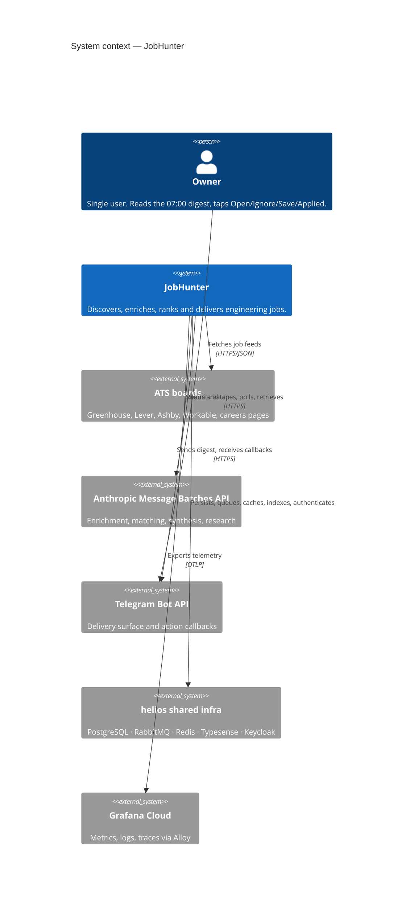
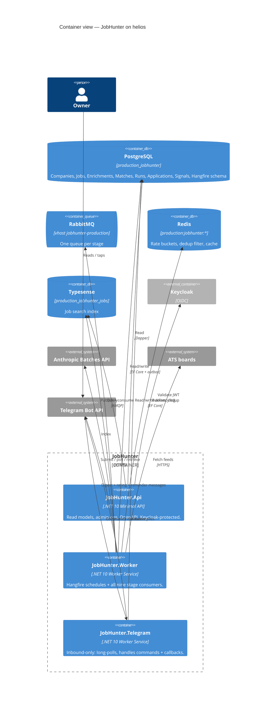
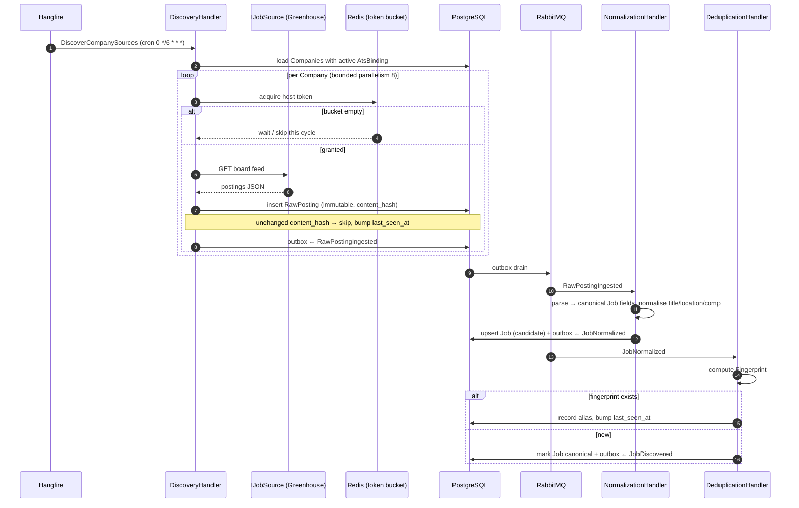
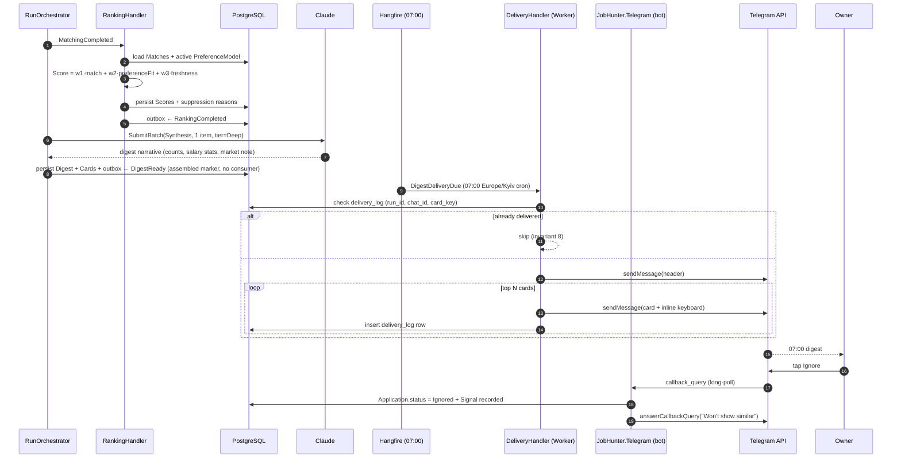
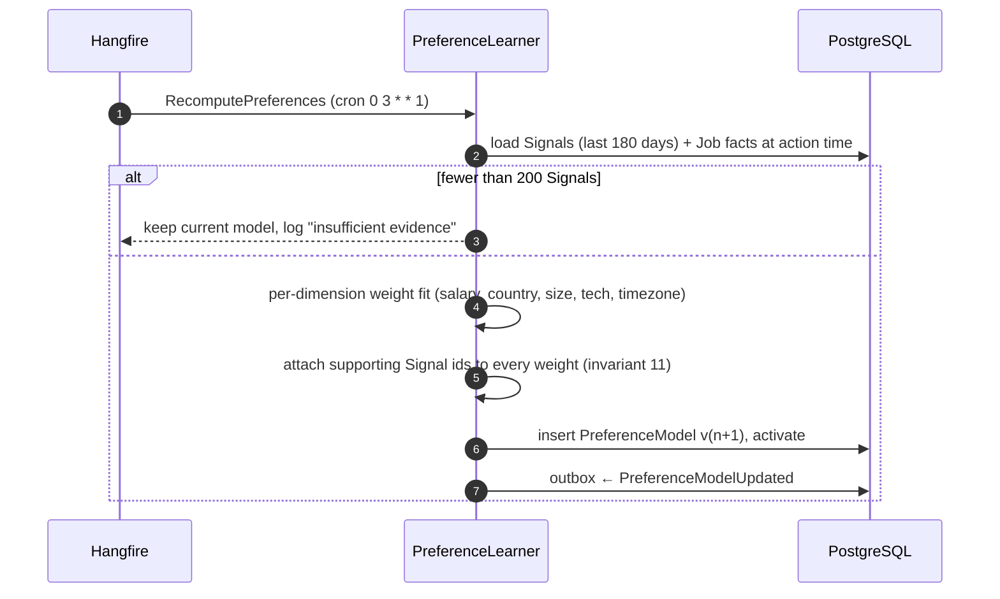

# Software Architecture Document — JobHunter

> System-level architecture. Per-feature SADs live at `docs/features/<slug>/sad.md` and refine
> this one; where they disagree, this document wins. Vocabulary: [[../CONTEXT]].

---

## 1. Introduction and goals

**Intent.** Turn the public ATS surface into one ranked, explained, nine-item morning digest, at a
bounded and observable cost, with every intermediate artifact durable and every stage resumable.

**Top-3 quality goals** (ranked; ties are broken in this order):

| # | Goal | Why it wins ties | How it is measured |
|---|------|------------------|--------------------|
| QG-1 | **Precision of the digest** | A digest nobody trusts is worse than no digest | `precision@10` — Owner marks ≥6 of the top 10 as "worth opening" |
| QG-2 | **Resumability & idempotence** | The Batch API is asynchronous over hours; crashes are normal, not exceptional | Re-running any Run converges; zero duplicate deliveries; zero duplicate LLM spend |
| QG-3 | **Cost predictability** | An unbounded LLM bill kills the project | Cost per Run known to the cent, hard ceiling enforced pre-submission |

**Stakeholders**

| Role | Concern | Artifact they read |
|---|---|---|
| Owner | Does the 07:00 digest contain something worth opening? | Telegram digest |
| Operator (also the Owner) | Did the Run succeed, what did it cost, which sources are degraded? | Grafana dashboards, `/health`, ops digest footer |
| Reviewer (hiring manager) | Is this person's engineering credible? | README → this SAD → one ADR → one task tracker |
| Future maintainer | Where do I add a new ATS? | [[../CONTEXT]] + F1 SAD + `IJobSource` |

---

## 2. Constraints

**Technical**

| # | Constraint | Source |
|---|---|---|
| C1 | .NET 10, C#, `net10.0` TFM everywhere; `TreatWarningsAsErrors` | Plan; `wisewizard` precedent |
| C2 | PostgreSQL is the only durable store of record | ADR-0003 |
| C3 | RabbitMQ is the only inter-stage transport | ADR-0002 |
| C4 | Runs on the shared `helios` k3s cluster; no dedicated infrastructure may be provisioned | [[../operations/infrastructure]] |
| C5 | LLM work goes through the Anthropic Message Batches API, not the synchronous Messages API | ADR-0005 |
| C6 | Deployment is Kustomize + GHCR + GitHub Actions on a self-hosted runner | ADR-0010, `overflow` precedent |
| C7 | Secrets come from Infisical at runtime; none in git, none in image layers | ADR-0011 |
| C8 | All telemetry is OTLP to Grafana Alloy | ADR-0012 |

**Organisational**

| # | Constraint |
|---|---|
| C9 | One part-time solo engineer. Every design choice is also a schedule choice. |
| C10 | Docs-first SDLC: no task is started before its feature has PRD + SAD + data-model + test-plan. See [[../IMPLEMENTATION-READINESS]]. |
| C11 | Test coverage > 90% line and branch, CI-enforced, excluding composition roots. |
| C12 | Every task is one reviewable PR, ≤ 500 LOC, ≤ 1 day. |

**Conventions**

| # | Convention |
|---|---|
| C13 | Ports live in `JobHunter.Domain` / `JobHunter.Application`; adapters live in `JobHunter.Infrastructure`. Dependency direction never inverts. |
| C14 | Naming on shared infra follows helios rules: DB `{env}_jobhunter`, vhost `jobhunter-{env}`, Redis prefix `{env}:jobhunter:`, Typesense `{env}_jobhunter_{collection}`. |
| C15 | Every event is a versioned record in `JobHunter.Contracts`, `PascalCase`, past tense. |
| C16 | English only in code, comments, identifiers and logs. |

**Regulatory / external**

| # | Constraint |
|---|---|
| C17 | `robots.txt`, `Retry-After` and per-host rate budgets are honoured; no anti-bot circumvention. |
| C18 | The CV is personal data. It lives in own Postgres, is transmitted only to Anthropic as prompt content, and is never written to logs or traces. |
| C19 | No write actions toward employers ([[../CONTEXT]] invariant 7). |

---

## 3. Context and scope

**External systems**

| System | Direction | Protocol | Purpose | Failure mode |
|---|---|---|---|---|
| Greenhouse / Lever / Ashby / Workable boards | outbound | HTTPS JSON | Job inventory | Degrade one source; quarantine after 2 consecutive failures |
| Company career pages | outbound | HTTPS HTML/JSON-LD | Long-tail inventory | Best-effort; never blocks a Run |
| Anthropic Message Batches API | outbound | HTTPS JSON | Enrichment, Matching, Digest synthesis, Research | Partial digest; Run stays resumable |
| Telegram Bot API | out + in | HTTPS long-poll | Digest delivery, action callbacks | Retry with backoff; delivery log prevents duplicates |
| Keycloak (helios) | inbound | OIDC | API authentication | API returns 503; pipeline unaffected |
| PostgreSQL (helios) | outbound | TCP 5432 | System of record | Hard dependency — Run fails fast |
| RabbitMQ (helios) | outbound | AMQP 5672 | Stage transport | Outbox retains events; drains on recovery |
| Redis (helios) | outbound | TCP 6379 | Rate-limit buckets, dedup bloom, response cache | Degrade to DB-backed paths |
| Typesense (helios) | outbound | HTTP 8108 | Job search index | Search API 503; pipeline unaffected |
| Grafana Alloy (helios) | outbound | OTLP 4317/4318 | Telemetry | Fire-and-forget; never blocks |



**In scope:** stages 1–9 of [[../CONTEXT]] §2, the read API, the Telegram bot.
**Out of scope:** everything in [[../CONTEXT]] §4.

---

## 4. Solution strategy

| # | Strategic choice | Rationale | ADR |
|---|---|---|---|
| S1 | **Modular monolith, three deployables, nine logical stages, RabbitMQ between them** | Real message boundaries and real backpressure without nine pods for one user. Splitting later is a deployment change, not a rewrite. | [[adr/0001-modular-monolith-three-deployables\|0001]] |
| S2 | **Wolverine over RabbitMQ, with the EF Core transactional outbox** | Handler discovery + durable outbox + idempotent inbox in one library; proven in `overflow`. State change and event publication commit atomically — the precondition for QG-2. | [[adr/0002-rabbitmq-wolverine-transport\|0002]], [[adr/0007-transactional-outbox\|0007]] |
| S3 | **PostgreSQL as the single store; EF Core for writes and migrations, Dapper for read models** | One store to back up, one transaction boundary. EF for the aggregate writes and schema evolution; Dapper where the digest and analytics queries need hand-written SQL. | [[adr/0003-postgresql-efcore-dapper\|0003]] |
| S4 | **Two-tier Claude cascade on the Batch API, with a hard pre-submission cost ceiling** | 50% batch discount plus cheap-tier triage keeps a Run under $2.00 (≈$1.03 typical); the ceiling makes QG-3 enforceable rather than aspirational. | [[adr/0005-anthropic-message-batches-two-tier-cascade\|0005]] |
| S5 | **Run as an explicit, durable, resumable state machine** | The Batch lifecycle spans hours and process restarts. Making the Run a first-class aggregate with a state column and a cost ledger is what makes QG-2 true. | [[adr/0001-modular-monolith-three-deployables\|0001]] |
| S6 | **Ports for every external dependency** | `IJobSource`, `ILlmBatchClient`, `INotifier`, `ISearchIndex`, `IResearchFetcher`. Adding an ATS is a new class, not a change to the pipeline. Also what makes 90% coverage achievable without network. | C13 |

---

## 5. Building block view

```text
src/
├─ JobHunter.Domain/            # zero external deps. Entities, value objects, domain events, ports.
│  ├─ Companies/                #   Company, AtsBinding, AtsKind
│  ├─ Jobs/                     #   Job, RawPosting, Fingerprint, JobLifecycle
│  ├─ Intelligence/             #   Enrichment, Match, Score, ModelTier
│  ├─ Profiles/                 #   Profile, CvVersion, PreferenceModel, Signal
│  ├─ Pipeline/                 #   Run, RunState, Batch, BatchState, CostLedger
│  ├─ Applications/             #   Application, ApplicationStatus, StatusTransition
│  ├─ Research/                 #   CompanyResearch, ResearchClaim
│  └─ Abstractions/             #   IJobSource, ILlmBatchClient, INotifier, ISearchIndex, IClock, …
├─ JobHunter.Application/       # use cases + message handlers. Depends only on Domain.
│  ├─ Discovery/ Normalization/ Deduplication/
│  ├─ Enrichment/ Matching/ Ranking/
│  ├─ Research/ Reporting/ Delivery/
│  ├─ Preferences/ Applications/
│  └─ Common/                   #   Result types, pipeline behaviours, validation
├─ JobHunter.Contracts/         # versioned integration events + DTOs. No behaviour.
├─ JobHunter.Infrastructure/    # adapters. Depends on Application + Domain.
│  ├─ Persistence/              #   JobHunterDbContext, configurations, migrations, Dapper queries
│  ├─ Messaging/                #   Wolverine + RabbitMQ wiring, outbox
│  ├─ Caching/                  #   Redis buckets, dedup filter
│  └─ Http/                     #   resilient HttpClient policies, robots + rate limiting
├─ JobHunter.Scrapers/          # one adapter per ATS: Greenhouse, Lever, Ashby, Workable, CareersPage
├─ JobHunter.Claude/            # AnthropicBatchClient, prompt builders, schema-bound parsers, CostAccountant
├─ JobHunter.Search/            # Typesense indexer + query service
├─ JobHunter.Telegram.Transport/# Shared send-path adapter: TelegramNotifier, the digest/rating/reminder
│                               # renderers, formatters, pacer, callback codec. Composed by BOTH hosts below.
├─ JobHunter.Api/               # ASP.NET Core Minimal API. Read models, admin ops, OpenAPI, Keycloak.
├─ JobHunter.Worker/            # Worker Service. Hangfire schedules + all stage consumers + digest delivery.
├─ JobHunter.Telegram/          # Bot host (inbound-only): long-poll, command + callback handling.
└─ Aspire/
   ├─ JobHunter.AppHost/        # local-dev orchestration only
   └─ JobHunter.ServiceDefaults/# OTel, health, resilience, service discovery — referenced by all hosts
```

**Dependency rule:** `Api | Worker | Telegram → Infrastructure | Claude | Scrapers | Search → Application → Domain`.
`Contracts` is referenced across the solution (directly by Application and Scrapers; hosts get it
transitively) and references nothing. `Domain` references nothing.
Enforced by an architecture test (F0 T12).



---

## 6. Runtime view

### 6.1 Discovery → canonical Job (every 6 hours)



**Pre/postconditions.** Pre: the Company has an `AtsBinding` with confidence ≥ 0.8.
Post: exactly one canonical `Job` per `Fingerprint`; every fetch is represented by exactly one
`RawPosting` row; no event is published unless its state change committed (outbox).

### 6.2 The daily Run — enrichment and matching (02:00)

```mermaid
sequenceDiagram
  autonumber
  participant H as Hangfire
  participant O as RunOrchestrator
  participant DB as PostgreSQL
  participant C as ILlmBatchClient (Anthropic)
  participant P as BatchPoller

  H->>O: StartDailyRun (cron 0 2 * * *)
  O->>DB: create Run{state=Created, ceilingUsd}
  O->>DB: select Jobs discovered since previous Run cut-off
  O->>O: CostAccountant.Estimate(jobs, tier=Cheap)
  alt estimate > remaining ceiling
    O->>DB: Run.state = CostAborted
    O-->>H: abort with reason (invariant 6)
  else within ceiling
    O->>C: SubmitBatch(Enrichment, N items, tier=Cheap)
    C-->>O: batchId
    O->>DB: Batch{stage=Enrichment, state=Submitted} + Run.state = Enriching
  end

  loop every 2 min, exponential backoff, max 6 h
    P->>C: GetBatchStatus(batchId)
    C-->>P: in_progress | ended
  end
  P->>C: GetBatchResults(batchId)
  C-->>P: JSONL results
  loop per item
    P->>P: parse against schema
    alt valid
      P->>DB: upsert Enrichment (run_id, job_id)
    else malformed
      P->>DB: record EnrichmentFailed, retry next Run
    end
  end
  P->>DB: CostLedger += usage; Batch.state = Completed
  P->>DB: outbox ← EnrichmentCompleted

  Note over O,DB: Matching repeats the identical shape at tier=Deep,<br/>input = Job + Enrichment + active Profile.
```

**Resumability.** Every arrow that mutates state writes `(run_id, stage)`-keyed rows. On restart,
the orchestrator reloads the Run, finds `Batch.state = Submitted`, and resumes polling — it never
resubmits. This is QG-2 made concrete.

### 6.3 Ranking → digest → delivery (06:45 / 07:00)



### 6.4 Preference learning (weekly)



---

## 7. Deployment view

Target: the `helios` k3s cluster. Full detail in [[../operations/infrastructure]] and
[[../engineering/deployment]].

| Environment | Namespace | DB | Vhost | Redis prefix | Typesense prefix | Host |
|---|---|---|---|---|---|---|
| staging | `apps-staging` | `staging_jobhunter` | `jobhunter-staging` | `staging:jobhunter:` | `staging_jobhunter_` | `jobhunter-staging.devoverflow.org` |
| production | `apps-production` | `production_jobhunter` | `jobhunter-production` | `production:jobhunter:` | `production_jobhunter_` | `jobhunter.devoverflow.org` |

| Deployable | Replicas (stg/prod) | Ingress | Notes |
|---|---|---|---|
| `jobhunter-api` | 1 / 2 | yes, `/api` | stateless |
| `jobhunter-worker` | 1 / 1 | no | **exactly 1** — Hangfire schedules and Run orchestration are singleton-by-design; scale-out story is per-stage queues, not replicas of the whole worker (see §11 D2) |
| `jobhunter-telegram` | 1 / 1 | no | long-poll must be single-consumer |

**Monitoring**

| Signal | Instrument | Alert |
|---|---|---|
| Metrics | `jobhunter.run.duration`, `jobhunter.run.cost_usd`, `jobhunter.jobs.discovered`, `jobhunter.jobs.deduplicated`, `jobhunter.batch.latency`, `jobhunter.digest.cards`, `jobhunter.source.failures` | Run > 5 h; cost > 70% of ceiling; digest not delivered by 07:15; source failure rate > 20% |
| Traces | One trace per Run, one span per Stage, one span per Batch poll cycle. Health endpoints excluded. | Trace error rate > 1% |
| Logs | OTLP → Loki. Structured, `run_id` and `job_id` on every pipeline log. CV text and secrets never logged. | `level=error` rate |

**Scaling thresholds.** Under 500 companies and 300 jobs/day nothing needs to scale. The first
thing that breaks at 10× is Discovery fan-out; the fix is dedicated per-stage queue consumers,
already possible without code change because every stage is a separate message handler.

---

## 8. Crosscutting concepts

| Concept | Convention | Where defined |
|---|---|---|
| Errors | `Result<T>` / outcome enums for expected business outcomes; exceptions only for programmer errors and infrastructure faults | `JobHunter.Application/Common` |
| Validation | Value objects validate in `TryCreate`; options validate at startup via `.Validate().ValidateOnStart()` | Domain + each `DependencyInjection.cs` |
| Configuration | Options pattern, one options class per adapter, fail-fast at startup | `JobHunter.Infrastructure` |
| Secrets | Infisical at runtime; k8s Secret only carries the machine identity | [[adr/0011-infisical-secrets\|ADR-0011]] |
| Idempotence | Every consumer is idempotent on `(run_id, job_id, stage)`; delivery on `(run_id, chat_id, card_key)` | [[adr/0007-transactional-outbox\|ADR-0007]] |
| Retries | Wolverine per-handler policies; HTTP via `AddStandardResilienceHandler`; ATS fetch honours `Retry-After` | `ServiceDefaults` + `Infrastructure/Http` |
| Time | `IClock` everywhere; schedules in `Europe/Kyiv`; all stored timestamps `timestamptz` UTC | `Domain/Abstractions` |
| Money | `numeric(12,2)`, currency stored explicitly, never `double` | `Persistence` configurations |
| Ids | UUID v7 primary keys — time-ordered, index-friendly, safe to expose | `Persistence` |
| Migrations | EF Core migrations, applied by an init container, never by the app at startup | [[../engineering/deployment]] |
| Telemetry | `AddServiceDefaults()` in every host; `ActivitySource` per stage | `Aspire/JobHunter.ServiceDefaults` |
| Prompts | Versioned C# raw string literals + a JSON Schema per output type; golden fixtures in tests | `JobHunter.Claude` |

---

## 9. Architecture decisions

| # | Title | Status | Affects |
|---|---|---|---|
| [[adr/0001-modular-monolith-three-deployables\|0001]] | Modular monolith, three deployables, nine stages | Accepted | §4 S1, §5, §7 |
| [[adr/0002-rabbitmq-wolverine-transport\|0002]] | RabbitMQ + Wolverine as transport and handler framework | Accepted | §4 S2, §6 |
| [[adr/0003-postgresql-efcore-dapper\|0003]] | PostgreSQL single store; EF Core writes, Dapper reads | Accepted | §4 S3, §8 |
| [[adr/0004-hangfire-scheduling\|0004]] | Hangfire for scheduling, over Quartz.NET | Accepted | §6.1, §6.2 |
| [[adr/0005-anthropic-message-batches-two-tier-cascade\|0005]] | Anthropic Message Batches, two-tier model cascade | Accepted | §4 S4, §6.2 |
| [[adr/0006-structured-output-contract\|0006]] | Schema-bound structured output with tolerant parsing | Accepted | §6.2, §8 |
| [[adr/0007-transactional-outbox\|0007]] | EF Core transactional outbox for event publication | Accepted | §6.1, §8 |
| [[adr/0008-typesense-over-postgres-fts\|0008]] | Typesense for job search over Postgres FTS | Accepted | §5, §7 |
| [[adr/0009-ats-first-no-linkedin\|0009]] | ATS-first ingestion; LinkedIn and aggregators out of scope | Accepted | §3, F1 |
| [[adr/0010-kustomize-ghcr-selfhosted-runner\|0010]] | Kustomize + GHCR + GitHub Actions self-hosted runner | Accepted | §7 |
| [[adr/0011-infisical-secrets\|0011]] | Infisical for runtime secrets; Terraform ConfigMap for non-secret config | Accepted | §8 |
| [[adr/0012-otlp-alloy-grafana-cloud\|0012]] | OTLP → Grafana Alloy → Grafana Cloud | Accepted | §7 |
| [[adr/0013-aspire-local-dev-only\|0013]] | .NET Aspire for local development orchestration only | Accepted | §5 |
| [[adr/0014-keycloak-api-telegram-allowlist\|0014]] | Keycloak OIDC for the API; chat-id allowlist for the bot | Accepted | §3, F9 |
| [[adr/0015-uuidv7-keys-and-timestamptz\|0015]] | UUID v7 keys, `timestamptz` UTC, `numeric` money | Accepted | §8 |

---

## 10. Quality requirements

**QG-1. Digest precision**
- **When:** the Owner opens the 07:00 digest on any workday.
- **Then:** at least 6 of the top 10 Cards are rated "worth opening"; every Card carries ≥1 reason; zero Cards point at a dead apply URL.
- **How verify:** a weekly rating prompt records Owner verdicts into `Signal`; `precision@10` is a tracked metric with a golden-set regression suite over 50 hand-labelled jobs run in CI against recorded model fixtures.

**QG-2. Resumability and idempotence**
- **When:** any host is killed at any point during a Run — including between Batch submission and result retrieval.
- **Then:** restarting converges to the same Digest, spends zero additional Anthropic tokens for already-completed Batches, and delivers each Card exactly once.
- **How verify:** chaos integration test that kills the worker at each of eight checkpoints and asserts final-state equality plus `delivery_log` uniqueness; outbox invariants asserted against a real Postgres via Testcontainers.

**QG-3. Cost predictability**
- **When:** a Run is executed.
- **Then:** total USD cost is recorded per Stage and ModelTier before and after each Batch; the pre-submission estimate never exceeds the configured ceiling; a Run that would exceed it aborts with `CostAborted` and still delivers a reduced digest.
- **How verify:** unit tests on `CostAccountant` pricing arithmetic; an integration test asserting that a Run seeded above the ceiling aborts without calling the client; `jobhunter.run.cost_usd` dashboards.

---

## 11. Risks and technical debt

| # | Risk / debt | Impact | Mitigation / plan |
|---|---|---|---|
| D1 | ATS adapters are contract-coupled to third-party JSON | A silent shape change corrupts inventory | Recorded-fixture contract tests per adapter; schema-drift assertion on every field consumed; adapter failure is isolated |
| D2 | `jobhunter-worker` must run as a single replica | No HA on the pipeline | Accepted for MVP. Path out: move Hangfire to a distributed-lock schedule and split stage consumers into their own deployment — no code change, only manifests |
| D3 | Prompt quality is untestable against the live model in CI | Regressions land silently | Golden fixtures + a nightly "live drift" job comparing live output to fixtures on 10 items, alerting on divergence |
| D4 | Fingerprint dedup may be too coarse for multi-location roles | A real job is hidden | Conservative triple; aliases retained and auditable; a `/api/jobs/{id}/aliases` endpoint for inspection |
| D5 | Single-node cluster, single Postgres | A day's digest is lost | Nightly `pg_dump` to Azure Blob; all Jobs are re-derivable from RawPostings, and RawPostings are re-fetchable |
| D6 | Typesense index can drift from Postgres | Search shows stale jobs | Index is a projection, rebuildable from Postgres by one admin endpoint; nightly reconcile job |

**Accepted debt**
- No HA. One node, one worker replica, one Telegram consumer. The cost of downtime is one delayed digest.
- No event replay/log compaction. RabbitMQ is a transport, not a log; the outbox plus Postgres is the recovery mechanism.
- No vector store. Deferred until job volume justifies retrieval ([[idea-brief]] §14 item 7).

---

## 12. Glossary

Defined once, in [[../CONTEXT]] §1. This document adds no terms.

---

## Related

- [[../CONTEXT]] · [[idea-brief]] · [[../DECISION-LOG]] · [[../IMPLEMENTATION-READINESS]]
- [[../architecture/data-model|Global data model]] · [[../architecture/event-catalog|Event catalog]]
- [[../engineering/deployment]] · [[../engineering/observability]] · [[../engineering/testing-strategy]]
