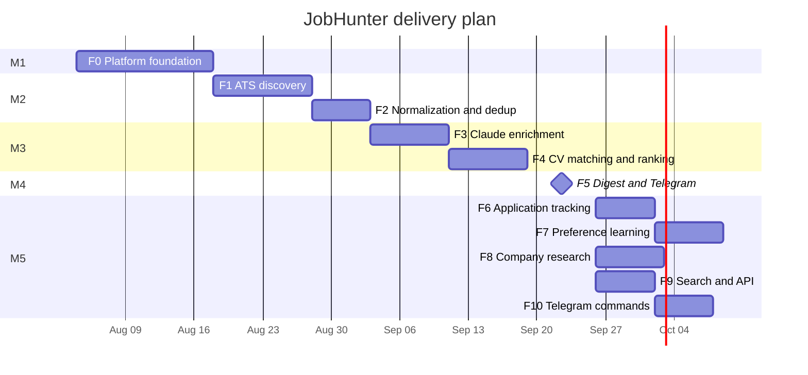

# BACKLOG — Mission Control

> The single place that answers "what is next". Feature detail lives in
> `docs/features/<slug>/`; this page holds ordering, milestones and everything not yet scheduled.
>
> Checkbox legend: `[ ]` not started · `[/]` in progress · `[-]` parked · `[x]` done · `[?]` needs decision

---

## 1. Milestones

| Milestone | Weeks | Features | Exit criterion | Status |
|---|---|---|---|---|
| **M1 — Skeleton** | 1–2 | F0 | `dotnet run` via Aspire brings the whole system up; one green integration test against real Postgres; CI builds three images and deploys to `apps-staging` | [ ] |
| **M2 — Inventory** | 3–4 | F1, F2 | ≥5 000 live Jobs in PostgreSQL from ≥4 ATS kinds; dedup rate reported; zero quarantined sources at steady state | [ ] |
| **M3 — Intelligence** | 5–6 | F3, F4 | Every new Job carries an Enrichment and a Match; a full Run costs ≈ $1.03 against a $2.00 ceiling; a killed worker resumes without duplicate spend | [ ] |
| **M4 — The product** | 7 | F5 | A real digest lands at 07:00 with working Open/Ignore/Save/Applied buttons. **First shippable release.** | [ ] |
| **M5 — Compounding** | 8–13 | F6, F7, F8, F9, F10 | `precision@10` measurably above the M4 baseline; live search API; company dossiers on demand; the whole system reachable from the chat | [ ] |

---

## 2. MVP features

| # | Feature | Milestone | Size | Tracker |
|---|---|---|---|---|
| F0 | [[features/f0-platform-foundation/index\|Platform foundation]] | M1 | XL | [[features/f0-platform-foundation/tasks/tracker\|tracker]] |
| F1 | [[features/f1-ats-job-discovery/index\|ATS job discovery]] | M2 | L | [[features/f1-ats-job-discovery/tasks/tracker\|tracker]] |
| F2 | [[features/f2-normalization-dedup/index\|Normalization & deduplication]] | M2 | M | [[features/f2-normalization-dedup/tasks/tracker\|tracker]] |
| F3 | [[features/f3-claude-batch-enrichment/index\|Claude batch enrichment]] | M3 | L | [[features/f3-claude-batch-enrichment/tasks/tracker\|tracker]] |
| F4 | [[features/f4-cv-matching-ranking/index\|CV matching & ranking]] | M3 | L | [[features/f4-cv-matching-ranking/tasks/tracker\|tracker]] |
| F5 | [[features/f5-daily-digest-telegram/index\|Daily digest & Telegram]] | M4 | L | [[features/f5-daily-digest-telegram/tasks/tracker\|tracker]] |
| F6 | [[features/f6-application-tracking/index\|Application tracking]] | M5 | M | [[features/f6-application-tracking/tasks/tracker\|tracker]] |
| F7 | [[features/f7-preference-learning/index\|Preference learning]] | M5 | M | [[features/f7-preference-learning/tasks/tracker\|tracker]] |
| F8 | [[features/f8-company-research-agent/index\|Company research agent]] | M5 | M | [[features/f8-company-research-agent/tasks/tracker\|tracker]] |
| F9 | [[features/f9-search-and-api/index\|Search & public API]] | M5 | M | [[features/f9-search-and-api/tasks/tracker\|tracker]] |
| F10 | [[features/f10-telegram-commands/index\|Telegram command interface]] | M5 | M | [[features/f10-telegram-commands/tasks/tracker\|tracker]] |

---

## 3. Post-MVP candidates

Not scheduled. Ordered by current appetite.

- [ ] **Interview preparation pack** — given an Application in `Interview`, generate a brief from the JD, the CompanyResearch dossier and the CV: likely questions, gaps to pre-empt, questions to ask. #post-mvp
- [ ] **Salary benchmarking** — aggregate the Enrichment salary estimates by title, level, geography and company stage; report where an offer sits in the distribution. #post-mvp
- [ ] **Recruiter-message triage** — forward a recruiter email/LinkedIn message to the bot; it scores the role against the Profile and drafts an accept/decline. #post-mvp
- [ ] **Weekly market-trend report** — technology and salary movement week over week across the whole corpus. #post-mvp
- [ ] **CV gap report** — the skills that appear most in high-scoring jobs and least in the CV. #post-mvp
- [ ] **Multi-persona targeting** — separate Profiles for backend / platform / AI-engineering roles, each ranked independently. Blocked by [[ARCHITECTURE-OPEN-DECISIONS\|O11]]. #post-mvp
- [ ] **Application deadline and follow-up reminders** — nudge when an Application has sat in `Applied` for 10 days. #post-mvp
- [-] **CV rewriting and cover-letter generation** — parked; a different product that would dominate the roadmap. [[00-overview/idea-brief\|brief]] §14 item 10.
- [-] **Email and Slack delivery** — parked; [[DECISION-LOG\|D2]].

---

## 4. Technical direction

- [ ] **Split `jobhunter-worker` per stage** when any stage saturates a single consumer. No code change expected — see [[ARCHITECTURE-OPEN-DECISIONS\|O7]]. #tech
- [x] **Nightly `pg_dump` to Azure Blob** — now a real task (**F0 T15**), the source R9 restores from. What remains on the backlog is the *rehearsal* of the restore (§5), not the job itself. #tech
- [ ] **Wire the `Applied` tap to `OwnerActionRecorded`** — the digest `Applied` button acknowledges and rewrites the keyboard, but the Telegram host publishes nothing (it runs no Wolverine bus by design), so `OwnerActionHandler` — built and tested under F6 T03 — never fires and no Application is created in production. Route it through an `IOperationScheduler`-style port to the Worker, mirroring `/run` and `/redeliver`, with a per-`(job, owner)` idempotency guard. #tech
- [ ] **Golden-set regression harness** — 50 hand-labelled jobs, run against recorded fixtures in CI, gating prompt changes. Required before the first prompt edit after M4. #tech
- [ ] **Live model drift job** — nightly, compare live output to fixtures on 10 items, alert on divergence (SAD §11 D3). #tech
- [ ] **Dead-letter dashboard** — one Grafana panel per stage queue; today a poisoned message is only visible in RabbitMQ. #tech
- [ ] **Load the corpus into a local eval notebook** for offline ranking experiments without touching production. #tech
- [-] **Vector store for semantic retrieval** — parked until >2 000 jobs/day; [[00-overview/idea-brief\|brief]] §14 item 7. #tech

---

## 5. Operational

- [ ] Runbook rehearsal: restore PostgreSQL from backup into a scratch namespace. #ops #blocker
- [ ] Verify the Anthropic spend alert fires at 70% of the per-Run ceiling. #ops
- [ ] Re-verify `PricingTable` against Anthropic list pricing each quarter — a stale table silently invalidates the cost ceiling ([[operations/infrastructure|infrastructure]] §8). #ops
- [ ] Confirm Grafana Cloud free-tier ingestion headroom with three services reporting. #ops
- [ ] Document the Telegram bot token rotation procedure end to end. #ops
- [ ] Decide RawPosting retention and implement the pruning job — [[ARCHITECTURE-OPEN-DECISIONS\|O3]]. #ops

---

## 6. Open decisions needing an answer

Only one decision remains genuinely open and blocking. O1, O3, O4, O5, O6, O8, O10 and O12 are now
resolved (by ADR or as settled fact) and are recorded under "Decided and closed" in
[[ARCHITECTURE-OPEN-DECISIONS]].

- [?] Is the API internet-facing — [[ARCHITECTURE-OPEN-DECISIONS\|O2]], blocks F9 T04.
- [x] Salary floor: hard filter or down-weight — [[ARCHITECTURE-OPEN-DECISIONS\|O5]], **decided 2026-08-07**:
  down-weight only; the hard pre-filter is an explicit Owner opt-in, off by default. Unblocked F7 T07.

---

## 7. Explicitly not doing

Recorded so it is not re-proposed. Full rationale in [[CONTEXT]] §4 and
[[00-overview/idea-brief]] §14.

LinkedIn scraping · aggregator boards · auto-apply · auto-outreach · multi-tenant SaaS ·
a web or mobile UI · recruiter-side features · Kafka.

---

## Related

- [[00-overview/idea-brief]] §13 (milestone rationale) · [[IMPLEMENTATION-READINESS]] ·
  [[DECISION-LOG]] · [[ARCHITECTURE-OPEN-DECISIONS]]
