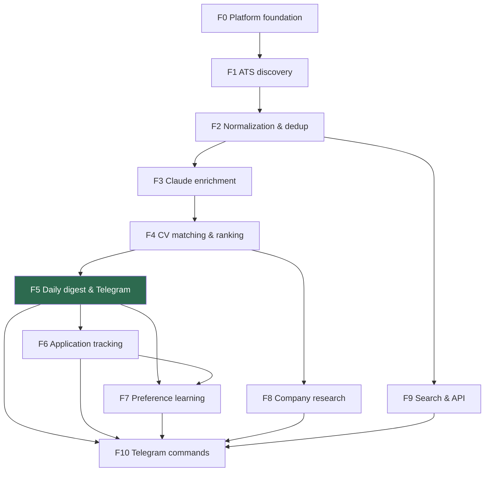

# IMPLEMENTATION READINESS

> The gate between documentation and code. A feature may not have a task started until its row is
> complete. This is the mechanism behind [[DECISION-LOG|D8]].

---

## 1. Artifact readiness matrix

Legend: ✅ accepted · ◐ draft · ☐ not started · — not applicable

| Feature | idea-brief | PRD | SAD | data-model | contracts | tasks | test-plan | Status |
|---|---|---|---|---|---|---|---|---|
| [[features/f0-platform-foundation/index\|F0 Platform foundation]] | — | ✅ | ✅ | ✅ | — | ✅ | ✅ | **Ready** |
| [[features/f1-ats-job-discovery/index\|F1 ATS job discovery]] | — | ✅ | ✅ | ✅ | ✅ | ✅ | ✅ | **Ready** |
| [[features/f2-normalization-dedup/index\|F2 Normalization & dedup]] | — | ✅ | ✅ | ✅ | — | ✅ | ✅ | **Ready** |
| [[features/f3-claude-batch-enrichment/index\|F3 Claude batch enrichment]] | — | ✅ | ✅ | ✅ | ✅ | ✅ | ✅ | **Ready** |
| [[features/f4-cv-matching-ranking/index\|F4 CV matching & ranking]] | — | ✅ | ✅ | ✅ | ✅ | ✅ | ✅ | **Ready** |
| [[features/f5-daily-digest-telegram/index\|F5 Daily digest & Telegram]] | — | ✅ | ✅ | ✅ | ✅ | ✅ | ✅ | **Ready** |
| [[features/f6-application-tracking/index\|F6 Application tracking]] | — | ✅ | ✅ | ✅ | ✅ | ✅ | ✅ | **Ready** |
| [[features/f7-preference-learning/index\|F7 Preference learning]] | — | ✅ | ✅ | ✅ | — | ✅ | ✅ | **Ready** |
| [[features/f8-company-research-agent/index\|F8 Company research agent]] | — | ✅ | ✅ | ✅ | ✅ | ✅ | ✅ | **Ready** |
| [[features/f9-search-and-api/index\|F9 Search & API]] | — | ✅ | ✅ | ✅ | ✅ | ✅ | ✅ | **Ready** |
| [[features/f10-telegram-commands/index\|F10 Telegram commands]] | — | ✅ | ✅ | ✅ | ✅ | ✅ | ✅ | **Ready** |

System-level artifacts: [[00-overview/idea-brief|idea-brief]] ✅ · [[00-overview/sad|SAD]] ✅ ·
[[CONTEXT]] ✅ · 15 [[00-overview/adr/0001-modular-monolith-three-deployables|ADRs]] ✅ ·
[[architecture/data-model|global data model]] ✅ · [[architecture/event-catalog|event catalog]] ✅.

---

## 2. Hard build gates

A task may not be marked `done` until every applicable gate passes.

| # | Gate | Enforced by |
|---|---|---|
| G1 | Solution builds with `TreatWarningsAsErrors=true` on `net10.0` | CI `dotnet build` |
| G2 | Line **and** branch coverage > 90%, excluding composition roots | Coverlet threshold in `tests/Directory.Build.props` |
| G3 | EF migrations apply cleanly on an empty database | Integration test + CI init-container dry run |
| G4 | Every message handler is proven idempotent by a "run it twice" test | Test plan per feature |
| G5 | Architecture rules hold: `Domain` has no external references; `Dapper` never writes; no `DateTime.Now`; no reference to the Aspire AppHost outside `Aspire/` | `JobHunter.ArchitectureTests` (F0 T12) |
| G6 | No secret, CV text or prompt body appears in any log or span | `SecretRedactionTests` + log-scrubbing processor |
| G7 | Every new public endpoint declares an authorization scope explicitly | Endpoint convention test (F9) |
| G8 | PR ≤ 500 LOC and ≤ 1 day of work | Review checklist |
| G9 | Docs updated in the same PR when behaviour changes | Review checklist |
| G10 | Every LLM-output change ships with updated golden fixtures | F3/F4 test plans |

---

## 3. Build order

`F5` is the first shippable release (milestone M4). `F6`–`F9` are additive and may be reordered.
`F9` only needs normalised Jobs, so it can be pulled forward if a live demo URL is needed early.
`F10` is last by construction — it is a surface over everything else, so each command lands as its
underlying feature does. `/start`, `/help` and `/digest` ship earlier with F5 T11.

---

## 4. Per-task Definition of Done

Every task, in every feature:

- [ ] Code compiles with zero warnings.
- [ ] Unit tests cover the new logic; the coverage gate stays green.
- [ ] If it touches persistence: an EF migration exists and applies on a clean database.
- [ ] If it is a message handler: an idempotency test proves running it twice is safe.
- [ ] If it calls an external service: a fixture-based test proves the parser, with zero network.
- [ ] The task's own "Done when" bullets are all satisfied.
- [ ] The feature's tracker row is updated in the same PR.
- [ ] No English-language rule violations; no `TODO` left without an issue reference.

---

## 5. Stack baseline

| Layer | Choice | Pinned in |
|---|---|---|
| Runtime | .NET 10 (`net10.0`), C# latest, nullable enabled, warnings as errors | `Directory.Build.props` |
| Packages | Central Package Management, transitive pinning on | `Directory.Packages.props` |
| Solution | `.slnx` (XML solution format) | `JobHunter.slnx` |
| Persistence | PostgreSQL 17 · EF Core 10 · Dapper · Npgsql | [[00-overview/adr/0003-postgresql-efcore-dapper\|ADR-0003]] |
| Messaging | RabbitMQ · Wolverine (+ EF Core outbox) | [[00-overview/adr/0002-rabbitmq-wolverine-transport\|ADR-0002]] |
| Scheduling | Hangfire · `Hangfire.PostgreSql` (`hangfire` schema) | [[00-overview/adr/0004-hangfire-scheduling\|ADR-0004]] |
| LLM | Anthropic Message Batches API; Ollama fallback | [[00-overview/adr/0005-anthropic-message-batches-two-tier-cascade\|ADR-0005]] |
| Search | Typesense | [[00-overview/adr/0008-typesense-over-postgres-fts\|ADR-0008]] |
| Bot | `Telegram.Bot` | [[features/f5-daily-digest-telegram/index\|F5]] |
| Auth | Keycloak OIDC · chat-id allowlist | [[00-overview/adr/0014-keycloak-api-telegram-allowlist\|ADR-0014]] |
| Telemetry | OpenTelemetry → Grafana Alloy → Grafana Cloud | [[00-overview/adr/0012-otlp-alloy-grafana-cloud\|ADR-0012]] |
| Local dev | .NET Aspire AppHost | [[00-overview/adr/0013-aspire-local-dev-only\|ADR-0013]] |
| Tests | xUnit · NSubstitute · Testcontainers · Coverlet | [[engineering/testing-strategy]] |
| Deploy | Kustomize · GHCR · GitHub Actions (self-hosted runner) | [[00-overview/adr/0010-kustomize-ghcr-selfhosted-runner\|ADR-0010]] |
| Secrets | Infisical | [[00-overview/adr/0011-infisical-secrets\|ADR-0011]] |

---

## Related

- [[DECISION-LOG]] · [[BACKLOG]] · [[ARCHITECTURE-OPEN-DECISIONS]] · [[00-overview/sad]]
