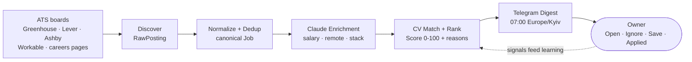
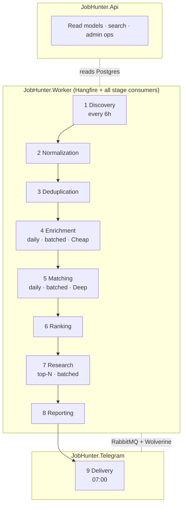
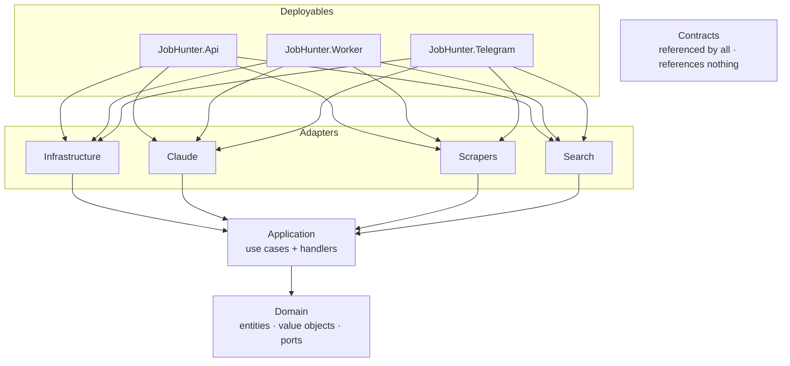
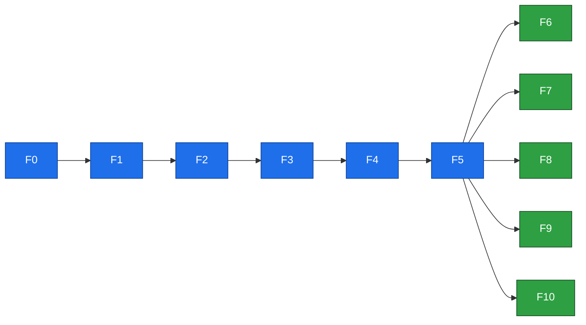
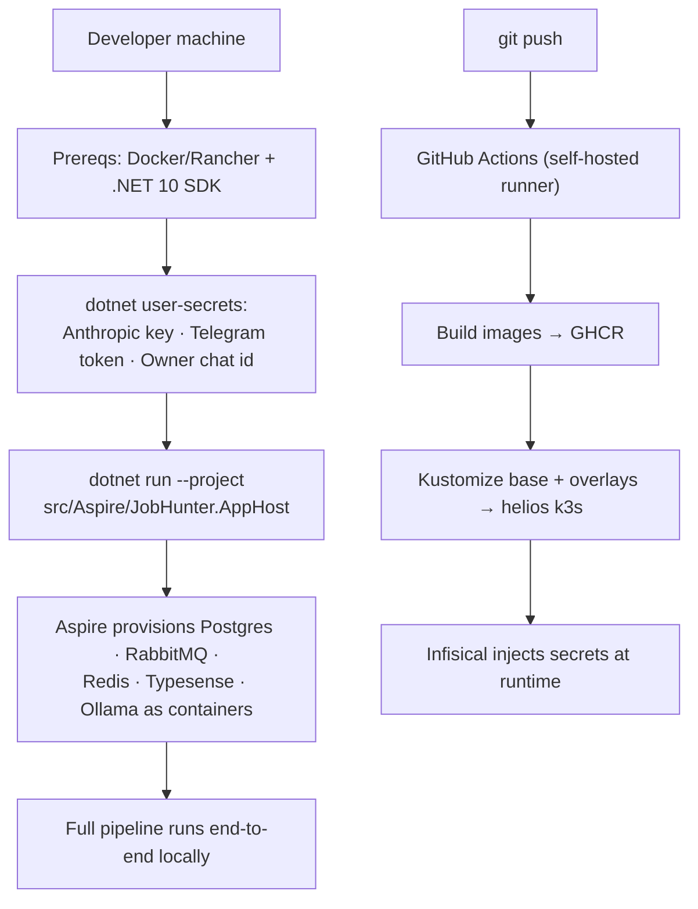
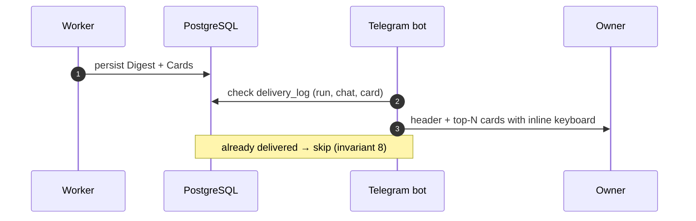
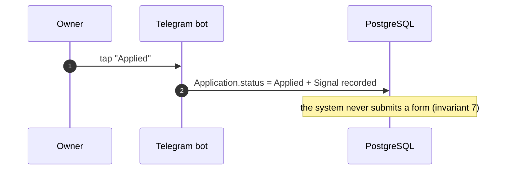
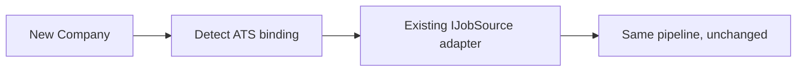
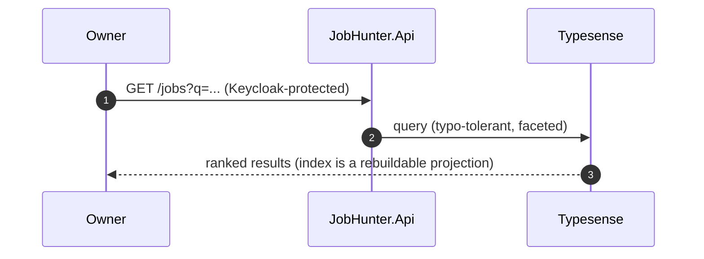

# JobHunter

**An AI job-intelligence platform for a single Owner** — it discovers engineering
jobs from ATS boards, ranks them against a CV with the Claude Message Batches API,
and delivers one Telegram digest at 07:00 Europe/Kyiv.

- Nine jobs worth reading each morning — ranked, explained, at about **$1 a day**.
- Also a portfolio artifact: the architecture, the tests and the docs are the deliverable.

```
🌅 Good morning.
127 new · 9 strong matches · avg 185k USD
🏆 Staff Backend Engineer — Snowflake · 95
   Kafka · Azure · distributed systems
9 cards below. 34 hidden (salary floor, timezone).
```

---

## The problem — why it exists

- **Senior job hunting is a high-noise search problem.** Reading 120 postings properly costs six hours a day, so nobody does it.
- **Aggregators optimise the wrong side.** Indeed and LinkedIn reward recruiter spend, not fit.
- **The good roles appear first on a company's own Greenhouse or Ashby board** — hours before they syndicate, if ever.
- **Batch inference changed the economics.** Analysing 150 jobs a day with a capable model went from "more expensive than the boards" to about a dollar.

---

## What it does — the 30-second version



- One ranked, explained, nine-item morning digest at a bounded, observable cost.
- Every intermediate artifact is durable; every stage is resumable.

---

## The pipeline in depth — nine stages, three deployables



| Stage | In one line |
|---|---|
| Discovery | Fetch each Company's board politely; store every payload as an immutable RawPosting. |
| Normalization | Parse a RawPosting into a canonical Job (title, locations, remote policy, salary). |
| Deduplication | Same vacancy on three boards → one Job, keyed by Fingerprint; others become aliases. |
| Enrichment | Claude (Cheap tier) adds salary estimate, remote/contractor flags, timezone, stack, reasons. |
| Matching | Claude (Deep tier) scores (Job + Enrichment + Profile): fit, missing skills, interview odds. |
| Ranking | Compute the final Score = f(match, preference weights, freshness). We compute this, not Claude. |
| Research | For top-N Companies, build a dossier — every claim citing a source URL. |
| Reporting | Assemble the Digest: counts, market note, ordered Cards. |
| Delivery | Render and send to Telegram at 07:00; idempotent per (run, chat, card). |

---

## Architecture — dependency direction



- **Every external dependency sits behind a port** in `Domain/Abstractions`.
- `IJobSource` · `ILlmBatchClient` · `INotifier` · `ISearchIndex` · `IResearchFetcher` · `IClock` · `IIdGenerator`.
- Adding an ATS provider is a new class in `JobHunter.Scrapers`, not a change to the pipeline. Enforced by `JobHunter.ArchitectureTests`.

---

## The tech stack

| Concern | Technology | ADR |
|---|---|---|
| Language / runtime | .NET 10, C#, `net10.0`, warnings-as-errors | — |
| Topology | Modular monolith, 3 deployables, 9 logical stages | ADR-0001 |
| Messaging | RabbitMQ + Wolverine, EF Core transactional outbox/inbox | ADR-0002, ADR-0007 |
| Store | PostgreSQL — EF Core writes/migrations, Dapper reads | ADR-0003 |
| Scheduling | Hangfire on PostgreSQL | ADR-0004 |
| LLM | Anthropic Message Batches API, two-tier cascade, cost ceiling | ADR-0005 |
| Output | Schema-bound structured output, tolerant parsing | ADR-0006 |
| Search | Typesense, rebuildable projection | ADR-0008 |
| Ingestion | ATS-first; no LinkedIn / aggregators | ADR-0009 |
| Auth | Keycloak OIDC (API) + chat-id allowlist (bot) | ADR-0014 |
| Local dev | .NET Aspire — one command, never for deploy | ADR-0013 |
| Deployment | Kustomize + GHCR + GitHub Actions on helios k3s | ADR-0010 |
| Secrets | Infisical at runtime | ADR-0011 |
| Telemetry | OpenTelemetry → Grafana Alloy → Grafana Cloud | ADR-0012 |
| Keys / time / money | UUID v7, `timestamptz` UTC, `numeric` money | ADR-0015 |

---

## The features (F0–F10)

| ID | Name | Delivers |
|---|---|---|
| F0 | Platform Foundation | Solution, layers, DB, bus, scheduler, telemetry, CI/CD — the scaffolding. |
| F1 | ATS Job Discovery | Company registry, ATS detection, polite fetching, immutable RawPostings. |
| F2 | Normalization & Dedup | Canonical Job per real vacancy; Fingerprint dedup, aliases not merges. |
| F3 | Claude Batch Enrichment | The resumable Run + Batch lifecycle; an Enrichment per new Job. |
| F4 | CV Matching & Ranking | Match score, missing skills, interview odds; the final ranked Score. |
| F5 | Daily Digest & Telegram | The product: one 07:00 message with four one-tap actions. |
| F6 | Application Tracking | Hiring pipeline as a state machine, timeline, notes, reminders. |
| F7 | Preference Learning | Turns Signals into explainable weights that reorder tomorrow's digest. |
| F8 | Company Research Agent | Auto dossier per top Company — every claim with a source URL. |
| F9 | Search & Public API | Typesense search + documented, Keycloak-protected HTTP API. |
| F10 | Telegram Command Interface | 22 pull-side commands in the same card language as the digest. |



Blue = critical path to the first shippable digest (M4). Green = additive, compounding features (M5).

---

## The invariants — the guarantees

| # | Guarantee in plain language |
|---|---|
| 1 | A RawPosting is immutable — re-fetching creates a new row, never edits one. |
| 2 | One Fingerprint, one Job — duplicates merge into the earliest-seen Job. |
| 3 | Every Enrichment and Match belongs to exactly one Job and one Run — re-runs supersede, never duplicate. |
| 4 | Every Score is explainable — a Card without at least one reason is never delivered. |
| 5 | Every CompanyResearch claim cites a URL — an uncited claim is dropped, not shown. |
| 6 | A Run never exceeds its cost ceiling — checked **before** each Batch submission. |
| 7 | The platform never applies to a job — `Applied` is a status the Owner sets. |
| 8 | Delivery is idempotent — one (run, chat, card) delivered at most once. |
| 9 | Single Owner — no registration, no tenant column, no role model. |
| 10 | Robots, `Retry-After` and per-host rate budgets are honoured — no anti-bot circumvention. |
| 11 | Preference learning never hard-filters silently — every suppression has a recorded, reported reason. |
| 12 | Secrets never enter the repo, the image layers, or the logs. |

**Plus, above all of these:** the CV crosses exactly one boundary (the F4 match prompt) — never a log, span, index or notification — and coverage is CI-enforced at **> 90%** line and branch.

---

## How to set it up



**Local development**
1. Install Docker/Rancher Desktop and the .NET 10 SDK.
2. Set the three secrets via `dotnet user-secrets` on the AppHost (Anthropic key, Telegram bot token, Owner chat id).
3. `dotnet run --project src/Aspire/JobHunter.AppHost` — Aspire wires up all backing services.
4. Without an Anthropic key the pipeline still runs end-to-end against local Ollama; only enrichment/matching quality degrades.

**Deployment** — Kustomize base + overlays, images to GHCR, GitHub Actions on a self-hosted runner deploying to the helios k3s cluster. Secrets come from Infisical at runtime; none in git or image layers.

---

## A day in the life

**The 07:00 digest lands**



**The Owner marks a job "Applied"**



**A new ATS company is added**



**The Owner searches past jobs**



---

## What makes it interesting

- **Modular monolith, real boundaries.** Nine message-driven stages, three deployables — split later is a manifest change, not a rewrite.
- **The resumable Run.** A five-hour asynchronous batch survives process restarts with zero duplicate spend and zero duplicate delivery.
- **Test-first, > 90% coverage**, CI-enforced on both line and branch.
- **Fixture-driven, zero-network adapter tests** — five ATS adapters and four LLM outputs tested against recorded payloads.
- **The guarantees are enforced, not aspirational** — the CV-leakage sentinel suite, the dedup "zero false merges" corpus, and the cost-ceiling test that asserts the LLM client is never even called.
