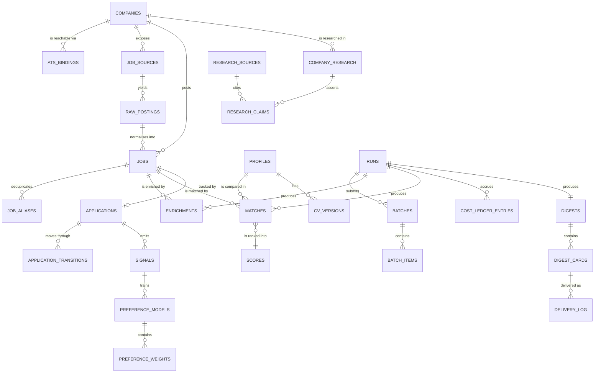

# Global data model

> **Feature `data-model.md` files are normative for the tables they own.** This global model is a
> *reconciled roll-up* of the feature models — a navigation aid, not a competing schema. Where they
> differ, the feature model wins and this global model is regenerated to match.
>
> Conventions ([[../00-overview/adr/0015-uuidv7-keys-and-timestamptz|ADR-0015]]): `uuid` primary
> keys generated as UUID v7 · all timestamps `timestamptz` stored UTC · money `numeric(12,2)` with
> an explicit ISO-4217 currency column · no business defaults, no CHECK constraints, no triggers —
> invariants live in code · snake_case tables and columns · EF Core owns migrations, Dapper never writes.

---

## 1. Ownership map

| Schema area | Tables | Owned by |
|---|---|---|
| Companies | `companies`, `ats_bindings` | [[../features/f1-ats-job-discovery/index\|F1]] |
| Sources & raw | `job_sources`, `raw_postings`, `source_fetch_log` | [[../features/f1-ats-job-discovery/index\|F1]] |
| Jobs | `jobs`, `job_aliases`, `job_technologies` | [[../features/f2-normalization-dedup/index\|F2]] |
| Profile | `profiles`, `cv_versions` | [[../features/f4-cv-matching-ranking/index\|F4]] |
| Intelligence | `enrichments`, `matches`, `scores` | [[../features/f3-claude-batch-enrichment/index\|F3]] / [[../features/f4-cv-matching-ranking/index\|F4]] |
| Pipeline | `runs`, `batches`, `batch_items`, `cost_ledger_entries` | [[../features/f3-claude-batch-enrichment/index\|F3]] |
| Reporting | `digests`, `digest_cards`, `delivery_log` | [[../features/f5-daily-digest-telegram/index\|F5]] |
| Applications | `applications`, `application_transitions`, `application_notes` | [[../features/f6-application-tracking/index\|F6]] |
| Preferences | `signals`, `preference_models`, `preference_weights`, `suppression_overrides` | [[../features/f7-preference-learning/index\|F7]] |
| Research | `company_research`, `research_sources`, `research_claims` | [[../features/f8-company-research-agent/index\|F8]] |
| Commands | `command_invocations` | [[../features/f10-telegram-commands/index\|F10]] |
| Infrastructure | `wolverine_incoming_envelopes`, `wolverine_outgoing_envelopes` (Wolverine), `hangfire.*` (Hangfire) | framework-managed |

**One owner per table.** The owning feature is the only one allowed to define or alter its columns.
A feature may **write** a table owned by another feature only where explicitly whitelisted below;
every such write is an intentional, reviewed seam:

- **F2 → `raw_postings`** (delete only): the 90-day retention prune (F2 T09). Owner F1 acknowledges.
- **F3 → `companies.stage`**: enrichment may set a company's pipeline stage. Owner F1 acknowledges.
- **F8 → `companies.stage`, `companies.employee_band`**: research synthesis writes firmographics.
  Owner F1 acknowledges.

---

## 2. Entity relationships



---

## 3. Core tables

### `companies` — F1

| Column | Type | Constraints | Notes |
|---|---|---|---|
| `id` | uuid | PK | UUID v7 |
| `canonical_domain` | text | NOT NULL, UNIQUE | `stripe.com` — the identity of a Company ([[../CONTEXT]] §1) |
| `display_name` | text | NOT NULL | |
| `source` | text | NOT NULL | `Curated`, `DirectoryCrawl`, `Manual` — provenance, drives ADR-F1-0001 revert |
| `careers_url` | text | NULL | |
| `hq_country` | char(2) | NULL | ISO-3166-1 alpha-2 |
| `stage` | text | NULL | `Seed`, `SeriesA`…`Public`, `Bootstrapped`, `Unknown` — set by F3, not at discovery |
| `employee_band` | text | NULL | `1-10`…`5000+` |
| `is_active` | boolean | NOT NULL | false quarantines the company from discovery |
| `first_seen_at` / `last_seen_at` | timestamptz | NOT NULL | |

**Access patterns:** "all active companies with a confident binding" (Discovery fan-out, every 6 h) → `idx_companies_active`.
**Constraints:** `canonical_domain` is the natural key; a company that changes ATS keeps its id.

### `ats_bindings` — F1

| Column | Type | Constraints | Notes |
|---|---|---|---|
| `id` | uuid | PK | |
| `company_id` | uuid | NOT NULL, FK → `companies` | |
| `ats_kind` | text | NOT NULL | `Greenhouse`, `Lever`, `Ashby`, `Workable`, `CareersPage` |
| `board_token` | text | NOT NULL | the ATS-specific board slug |
| `confidence` | numeric(3,2) | NOT NULL | 0.00–1.00; Discovery requires ≥ 0.80 |
| `evidence` | jsonb | NOT NULL | how it was detected — URL probed, status, matched pattern |
| `detected_at` | timestamptz | NOT NULL | |
| `retired_at` | timestamptz | NULL | set when a company migrates ATS |

**Constraints:** unique `(company_id, ats_kind, board_token)` where `retired_at IS NULL`.

### `raw_postings` — F1

Immutable ([[../CONTEXT]] invariant 1). The highest-volume table.

| Column | Type | Constraints | Notes |
|---|---|---|---|
| `id` | uuid | PK | |
| `source_id` | uuid | NOT NULL, FK → `job_sources` | |
| `external_id` | text | NOT NULL | the ATS's own posting id |
| `content_hash` | char(64) | NOT NULL | sha256 of the normalised payload — the fetch-level idempotency key |
| `payload` | jsonb | NOT NULL | verbatim |
| `fetched_at` | timestamptz | NOT NULL | |
| `last_seen_at` | timestamptz | NOT NULL | bumped on an unchanged re-fetch; the closure sweep keys on it |
| `http_status` | smallint | NOT NULL | |

**Constraints:** unique `(source_id, external_id, content_hash)` — a re-fetch of unchanged content
inserts nothing and only bumps `last_seen_at` (`ON CONFLICT … DO UPDATE SET last_seen_at`).
**Retention:** 90 days, then pruned ([[../ARCHITECTURE-OPEN-DECISIONS|O3]]).

### `jobs` — F2

The canonical vacancy.

| Column | Type | Constraints | Notes |
|---|---|---|---|
| `id` | uuid | PK | |
| `company_id` | uuid | NOT NULL, FK → `companies` | |
| `origin_raw_posting_id` | uuid | NOT NULL, FK → `raw_postings` | the posting that created this Job |
| `fingerprint` | char(64) | NOT NULL, UNIQUE | `sha256(domain ‖ normalisedTitle ‖ locationSet)` — invariant 2 |
| `fingerprint_version` | smallint | NOT NULL | bumped when the fingerprint algorithm changes |
| `title` | text | NOT NULL | as published |
| `normalised_title` | text | NOT NULL | lowercased, seniority-canonicalised |
| `seniority` | text | NULL | `Junior`…`Staff`, `Principal` |
| `description` | text | NOT NULL | plain text, HTML stripped |
| `apply_url` | text | NOT NULL | |
| `locations` | jsonb | NOT NULL | array of `{country, region, city}` |
| `remote_policy` | text | NOT NULL | `Onsite`, `Hybrid`, `Remote`, `RemoteRegional`, `Unknown` |
| `employment_type` | text | NOT NULL | `FullTime`, `Contract`, `PartTime`, `Internship`, `Unknown` |
| `salary_min` / `salary_max` | numeric(12,2) | NULL | as published, never inferred |
| `salary_currency` | char(3) | NULL | |
| `salary_period` | text | NULL | `Year`, `Month`, `Day`, `Hour` |
| `salary_raw` | text | NULL | the original string when unparseable |
| `posted_at` | timestamptz | NULL | |
| `posted_at_granularity` | text | NOT NULL | `Exact` or `Day` — how precise `posted_at` is |
| `is_tier2` | boolean | NOT NULL DEFAULT false | JSON-LD career-page origin, lower confidence |
| `first_seen_at` / `last_seen_at` | timestamptz | NOT NULL | |
| `closed_at` | timestamptz | NULL | set when the posting disappears from its board |
| `status` | text | NOT NULL | `Live`, `Closed`, `Quarantined` |

**Access patterns:** "Jobs discovered since the previous Run cut-off" → `idx_jobs_first_seen`;
"live Jobs for a company" → `idx_jobs_company_status`.

### `job_aliases` — F2

| Column | Type | Constraints |
|---|---|---|
| `job_id` | uuid | NOT NULL, FK → `jobs` |
| `raw_posting_id` | uuid | NOT NULL, FK → `raw_postings` |
| `source_id` | uuid | NOT NULL, FK → `job_sources` |
| `first_seen_at` | timestamptz | NOT NULL |
| `last_seen_at` | timestamptz | NOT NULL |

PK `(job_id, raw_posting_id)`. The audit trail behind invariant 2 — every duplicate that merged in.
Per-alias `last_seen_at` is what the closure sweep keys on.

### `runs` — F3

| Column | Type | Constraints | Notes |
|---|---|---|---|
| `id` | uuid | PK | |
| `state` | text | NOT NULL | `Created`, `Enriching`, `Matching`, `Ranking`, `Researching`, `Reporting`, `Delivered`, `Failed`, `CostAborted` |
| `cutoff_from` / `cutoff_to` | timestamptz | NOT NULL | the discovery window this Run covers |
| `ceiling_usd` | numeric(8,4) | NOT NULL | invariant 6 |
| `spent_usd` | numeric(8,4) | NOT NULL DEFAULT 0 | denormalised sum of `cost_ledger_entries` |
| `jobs_in_scope` | integer | NOT NULL DEFAULT 0 | |
| `jobs_carried_over` | integer | NOT NULL DEFAULT 0 | jobs deferred from a partial prior Run (AC-09) |
| `started_at` / `finished_at` | timestamptz | | |
| `failure_reason` | text | NULL | plain language, surfaced in the digest footer |

**Access patterns:** "resume any non-terminal Run on startup" → `idx_runs_state`; "latest delivered Run" → `idx_runs_state_finished`.

### `batches` / `batch_items` — F3

| `batches` column | Type | Notes |
|---|---|---|
| `id` | uuid | PK |
| `run_id` | uuid | FK → `runs` |
| `stage` | text | `Enrichment`, `Matching`, `Research`, `Synthesis` |
| `tier` | text | `Cheap`, `Deep` |
| `provider_batch_id` | text | the Anthropic batch id — **the resumability anchor** |
| `item_count` | integer | number of items submitted in the batch |
| `state` | text | `Submitted`, `InProgress`, `Completed`, `Failed`, `Expired` |
| `submitted_at` / `completed_at` | timestamptz | |
| `poll_attempts` | integer | |
| `input_tokens` / `output_tokens` | integer | |
| `prompt_version` | text | the `PromptVersion` that produced it ([[../00-overview/adr/0006-structured-output-contract\|ADR-0006]]) |

`batch_items` carries `(batch_id, custom_id, job_id, state, raw_result jsonb, parse_error text,
retry_count integer)` — one row per item so a malformed item is isolated, retained and retryable;
`retry_count` enforces the once-only retry (AC-08).

**Constraints:** unique `(run_id, stage, tier)` — a stage submits exactly one batch per Run, which is
what makes restart-safe resubmission impossible by construction.

### `enrichments` — F3

| Column | Type | Notes |
|---|---|---|
| `id` | uuid | PK |
| `job_id` / `run_id` | uuid | FK |
| `salary_min` / `salary_max` / `salary_currency` / `salary_period` | | model **estimate**, distinct from `jobs.salary_*` which is as-published |
| `salary_confidence` | numeric(3,2) | 0.00–1.00; F4's salary rule keys on `≥ 0.8` |
| `is_remote` / `is_contractor_friendly` | boolean | |
| `timezone_band` | text | `EMEA`, `AMER`, `APAC`, `Global`, `Unknown` |
| `ai_usage` | text | `None`, `Low`, `Medium`, `High` |
| `company_stage` | text | fed back onto `companies.stage` |
| `technologies` | jsonb | normalised against a known-tech vocabulary |
| `reasons` | jsonb | non-empty string array — invariant 4 |
| `prompt_version` | text | |

**Constraints:** unique `(job_id, run_id)` — invariant 3.

### `matches` — F4

`(id, job_id, run_id, profile_id, cv_version_id, match_score smallint, interview_probability numeric(3,2),
missing_skills jsonb, salary_expectation_min/max/currency, reasons jsonb, prompt_version)`.
Unique `(job_id, run_id, profile_id)`.

### `scores` — F4

`(job_id, run_id, final_score numeric(5,2), match_component, preference_component, freshness_component,
suppressed boolean, suppression_reason text, computed_at)`. PK `(job_id, run_id)`.
`suppression_reason` is what makes invariant 11 enforceable.

### `digests` / `digest_cards` / `delivery_log` — F5

`digests`: `(id, run_id UNIQUE, total_new_jobs, strong_matches, avg_salary_usd, narrative text,
generated_at)`.

`digest_cards`: `(id, digest_id, job_id, rank smallint, score numeric(5,2), reasons jsonb, card_key text,
apply_url_verified boolean)`. Unique `(digest_id, job_id)`.

`delivery_log`: `(id, run_id, chat_id bigint, card_key text, telegram_message_id bigint, delivered_at)`.
**Unique `(run_id, chat_id, card_key)` — this constraint *is* invariant 8.**

### `applications` / `application_transitions` — F6

`applications`: `(id, job_id UNIQUE, status text, applied_at, last_activity_at, next_action_at, archived boolean,
posting_closed boolean, last_reminder_condition text, last_reminder_at timestamptz, created_at timestamptz)`.
`application_transitions`: `(id, application_id, from_status, to_status, occurred_at, source text)` where
`source` is `Telegram`, `Api` or `System`. Legal transitions are a code table, not a DB constraint.

### `signals` / `preference_models` / `preference_weights` — F7

`signals`: `(id, job_id, kind text, occurred_at, job_facts jsonb)`. `job_facts` snapshots salary,
country, stage, technologies and timezone **at the moment of the action**, so a later Job edit cannot
retroactively change what the model learned.

`preference_models`: `(id, version integer, is_active boolean, fitted_at, signal_count, notes text)`.
`preference_weights`: `(id, model_id, dimension text, key text, weight numeric(5,4), supporting_signal_ids jsonb)` —
`supporting_signal_ids` is what makes invariant 11's explainability requirement real.

### `company_research` / `research_sources` / `research_claims` — F8

`company_research`: `(id, company_id, run_id, summary text, generated_at, prompt_version)`.
`research_sources`: `(id, research_id, url text NOT NULL, title text, fetched_at, http_status smallint)` —
the fetched pages a claim can cite.
`research_claims`: `(id, research_id, category text, claim text, source_id uuid NOT NULL FK → research_sources, observed_at)`
where `category` ∈ `Funding`, `EngineeringBlog`, `OpenSource`, `Reviews`, `News`, `Layoffs`, `Stack`,
`InterviewProcess`. **`source_id uuid NOT NULL FK` is invariant 5** — an uncited claim is unrepresentable.

### `command_invocations` — F10

`command_invocations`: `(id, chat_id bigint, command text, arguments text, capability text, invoked_at,
outcome text)` — the audit trail of every Telegram command dispatched through F10's registry.

---

## 4. Indexes

| Index | Columns | Serves |
|---|---|---|
| `idx_companies_active` | `companies(is_active) WHERE is_active` | Discovery fan-out |
| `idx_ats_bindings_active` | `ats_bindings(company_id) WHERE retired_at IS NULL` | resolve a Company's live board |
| `uq_raw_postings_dedup` | `raw_postings(source_id, external_id, content_hash)` | fetch-level idempotency |
| `idx_raw_postings_fetched` | `raw_postings(fetched_at)` | retention pruning |
| `uq_jobs_fingerprint` | `jobs(fingerprint)` | invariant 2 |
| `idx_jobs_first_seen` | `jobs(first_seen_at) WHERE status = 'Live'` | "new since last Run" |
| `idx_jobs_company_status` | `jobs(company_id, status)` | company drill-down |
| `idx_runs_state` | `runs(state) WHERE state NOT IN ('Delivered','Failed','CostAborted')` | resume on startup |
| `uq_batches_run_stage_tier` | `batches(run_id, stage, tier)` | no double submission |
| `uq_enrichments_job_run` | `enrichments(job_id, run_id)` | invariant 3 |
| `uq_matches_job_run_profile` | `matches(job_id, run_id, profile_id)` | invariant 3 |
| `idx_scores_run_final` | `scores(run_id, final_score DESC) WHERE NOT suppressed` | the digest query |
| `uq_delivery_log` | `delivery_log(run_id, chat_id, card_key)` | invariant 8 |
| `idx_signals_occurred` | `signals(occurred_at DESC)` | preference fitting window |
| `uq_preference_models_active` | `preference_models(is_active) WHERE is_active` | exactly one active model |
| `idx_research_company_generated` | `company_research(company_id, generated_at DESC)` | latest dossier |

---

## 5. EF Core sketch

```csharp
public sealed class JobHunterDbContext(DbContextOptions<JobHunterDbContext> options)
    : DbContext(options)
{
    public DbSet<Company> Companies => Set<Company>();
    public DbSet<Job> Jobs => Set<Job>();
    public DbSet<RawPosting> RawPostings => Set<RawPosting>();
    public DbSet<Run> Runs => Set<Run>();
    public DbSet<Batch> Batches => Set<Batch>();
    public DbSet<Enrichment> Enrichments => Set<Enrichment>();
    public DbSet<Match> Matches => Set<Match>();
    public DbSet<Application> Applications => Set<Application>();
    public DbSet<Signal> Signals => Set<Signal>();

    protected override void OnModelCreating(ModelBuilder b)
    {
        b.HasDefaultSchema("public");
        b.ApplyConfigurationsFromAssembly(typeof(JobHunterDbContext).Assembly);
        b.UseIdentityAlwaysColumns();   // no implicit sequences on uuid keys
    }
}

internal sealed class JobConfiguration : IEntityTypeConfiguration<Job>
{
    public void Configure(EntityTypeBuilder<Job> b)
    {
        b.ToTable("jobs");
        b.HasKey(j => j.Id);
        b.Property(j => j.Id).HasColumnName("id").ValueGeneratedNever();  // UUID v7 from code
        b.Property(j => j.Fingerprint).HasColumnName("fingerprint").HasMaxLength(64).IsRequired();
        b.HasIndex(j => j.Fingerprint).IsUnique().HasDatabaseName("uq_jobs_fingerprint");

        b.OwnsOne(j => j.Salary, s =>
        {
            s.Property(x => x.Min).HasColumnName("salary_min").HasPrecision(12, 2);
            s.Property(x => x.Max).HasColumnName("salary_max").HasPrecision(12, 2);
            s.Property(x => x.Currency).HasColumnName("salary_currency").HasMaxLength(3);
            s.Property(x => x.Period).HasColumnName("salary_period").HasConversion<string>();
        });

        b.Property(j => j.Locations).HasColumnName("locations").HasColumnType("jsonb");
        b.Property(j => j.RemotePolicy).HasColumnName("remote_policy").HasConversion<string>();
        b.HasIndex(j => new { j.CompanyId, j.Status }).HasDatabaseName("idx_jobs_company_status");
    }
}
```

Enums are persisted as `text` via `HasConversion<string>()`, never as ordinals — a reordered enum
must not silently reinterpret existing rows.

---

## 6. Notes for the feature chain

- **F1** creates `companies`, `ats_bindings`, `job_sources`, `raw_postings`, `source_fetch_log`.
- **F2** creates `jobs`, `job_aliases`, `job_technologies` and consumes `raw_postings`.
- **F3** creates `runs`, `batches`, `batch_items`, `cost_ledger_entries`, `enrichments`.
- **F4** creates `profiles`, `cv_versions`, `matches`, `scores`.
- **F5** creates `digests`, `digest_cards`, `delivery_log`.
- **F6** creates `applications`, `application_transitions`, `application_notes`.
- **F7** creates `signals`, `preference_models`, `preference_weights`, `suppression_overrides`.
- **F8** creates `company_research`, `research_sources`, `research_claims`.
- **F9** creates no tables — it reads, and projects into Typesense.
- **F10** creates `command_invocations`.

Each feature's migration is additive. A feature alters a table it does not own only through the
whitelisted cross-owner writes named in §1; every other change to someone else's table is a task in
*that* feature.

---

## Related

- [[event-catalog]] · [[../00-overview/sad]] §5, §8 · [[../CONTEXT]]
- [[../00-overview/adr/0003-postgresql-efcore-dapper|ADR-0003]] · [[../00-overview/adr/0015-uuidv7-keys-and-timestamptz|ADR-0015]]
