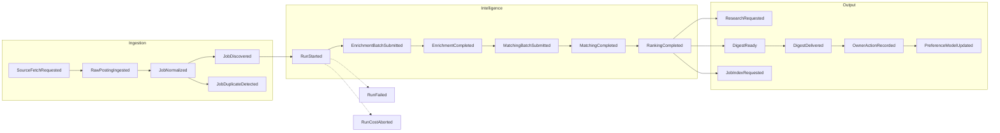

# Event catalog

> Every message that crosses a stage boundary. All live in `JobHunter.Contracts`, are `record`
> types, are named in the past tense, and carry no behaviour.
> Transport and delivery guarantees: [[../00-overview/adr/0002-rabbitmq-wolverine-transport|ADR-0002]],
> [[../00-overview/adr/0007-transactional-outbox|ADR-0007]].

---

## 1. Rules

1. **Past tense, always.** `JobDiscovered`, not `DiscoverJob`. A command that is not yet a fact does
   not belong on the bus — it is a method call.
2. **Versioned by type name.** A breaking change creates `JobDiscoveredV2`; the old handler stays
   until the queue drains. Never mutate a shipped contract's meaning.
3. **Ids, not payloads.** Events carry `JobId`, `RunId` and the few fields a consumer needs to
   decide *whether* to act. The consumer reads the rest from PostgreSQL. This keeps messages small
   and keeps PostgreSQL the single source of truth.
4. **Every event carries `RunId` where a Run exists** and `OccurredAt` always — these become the
   trace and log correlation keys.
5. **Every consumer is idempotent**, keyed as listed in the table below. At-least-once delivery is
   assumed, never worked around.
6. **Queue name** = `{MessageType.FullName}.jobhunter-worker`, auto-provisioned, one dead-letter
   queue per stage.

---

## 2. The pipeline



---

## 3. Catalog

| Event | Published by | Consumed by | Idempotency key | Payload |
|---|---|---|---|---|
| `SourceFetchRequested` | Hangfire (6-hourly) | `DiscoveryHandler` | `(SourceId, WindowStart)` | `SourceId`, `CompanyId`, `AtsKind`, `WindowStart` |
| `RawPostingIngested` | `DiscoveryHandler` | `NormalizationHandler` | `ContentHash` | `RawPostingId`, `SourceId`, `CompanyId`, `ContentHash`, `OccurredAt` |
| `JobNormalized` | `NormalizationHandler` | `DeduplicationHandler` | `RawPostingId` | `JobId` (candidate), `RawPostingId`, `CompanyId`, `Fingerprint` |
| `JobDiscovered` | `DeduplicationHandler` | `RunOrchestrator`, `SearchIndexer` | `JobId` | `JobId`, `CompanyId`, `Title`, `FirstSeenAt` |
| `JobDuplicateDetected` | `DeduplicationHandler` | `MetricsHandler` | `(JobId, RawPostingId)` | `CanonicalJobId`, `DuplicateRawPostingId`, `SourceId` |
| `JobClosed` | `DiscoveryHandler` | `SearchIndexer`, `ApplicationHandler` | `(JobId, ClosedAt)` | `JobId`, `ClosedAt`, `Reason` |
| `RunStarted` | Hangfire (daily 02:00) | `EnrichmentHandler` | `RunId` | `RunId`, `CutoffFrom`, `CutoffTo`, `CeilingUsd` |
| `EnrichmentBatchSubmitted` | `EnrichmentHandler` | `BatchPoller` | `(RunId, Stage, Tier)` | `RunId`, `BatchId`, `ProviderBatchId`, `ItemCount` |
| `EnrichmentCompleted` | `BatchPoller` | `MatchingHandler` | `(RunId, Stage)` | `RunId`, `Succeeded`, `Failed`, `CostUsd` |
| `MatchingBatchSubmitted` | `MatchingHandler` | `BatchPoller` | `(RunId, Stage, Tier)` | `RunId`, `BatchId`, `ProviderBatchId`, `ItemCount` |
| `MatchingCompleted` | `BatchPoller` | `RankingHandler` | `(RunId, Stage)` | `RunId`, `Succeeded`, `Failed`, `CostUsd` |
| `RankingCompleted` | `RankingHandler` | `ReportingHandler`, `ResearchHandler`, `SearchIndexer` | `RunId` | `RunId`, `RankedCount`, `SuppressedCount`, `TopJobIds` |
| `ResearchRequested` | `RankingHandler` | `ResearchHandler` | `(RunId, CompanyId)` | `RunId`, `CompanyId`, `Reason` |
| `ResearchCompleted` | `ResearchHandler` | `ReportingHandler` | `(RunId, CompanyId)` | `RunId`, `CompanyId`, `ResearchId`, `ClaimCount` |
| `DigestReady` | `ReportingHandler` | `JobHunter.Telegram` | `RunId` | `RunId`, `DigestId`, `CardCount`, `GeneratedAt` |
| `DigestDelivered` | `DeliveryHandler` | `MetricsHandler` | `(RunId, ChatId)` | `RunId`, `ChatId`, `CardsDelivered`, `DeliveredAt` |
| `OwnerActionRecorded` | `JobHunter.Telegram` | `ApplicationHandler`, `SignalHandler` | `(JobId, Action, OccurredAt)` | `JobId`, `Action` (`Open`\|`Ignore`\|`Save`\|`Applied`), `ChatId`, `OccurredAt` |
| `ApplicationStatusChanged` | `ApplicationHandler` | `SignalHandler`, `SearchIndexer` | `(ApplicationId, ToStatus, OccurredAt)` | `ApplicationId`, `JobId`, `FromStatus`, `ToStatus` |
| `PreferenceModelUpdated` | `PreferenceLearner` | `RankingHandler` | `ModelVersion` | `ModelId`, `Version`, `SignalCount`, `FittedAt` |
| `JobIndexRequested` | `RankingHandler`, `JobClosed` | `SearchIndexer` | `(JobId, Revision)` | `JobId`, `Operation` (`Upsert`\|`Delete`) |
| `CvVersionActivated` | `ProfileHandler` | `RunOrchestrator` | `CvVersionId` | `ProfileId`, `CvVersionId`, `ActivatedAt` |
| `RunFailed` | `RunOrchestrator` | `JobHunter.Telegram`, `MetricsHandler` | `RunId` | `RunId`, `Stage`, `Reason`, `FailedAt` |
| `RunCostAborted` | `CostAccountant` | `ReportingHandler`, `JobHunter.Telegram` | `RunId` | `RunId`, `Stage`, `SpentUsd`, `CeilingUsd` |
| `SourceQuarantined` | `DiscoveryHandler` | `JobHunter.Telegram`, `MetricsHandler` | `(SourceId, QuarantinedAt)` | `SourceId`, `CompanyId`, `ConsecutiveFailures`, `LastStatus` |

---

## 4. Contract shape

```csharp
namespace JobHunter.Contracts.Pipeline;

/// <summary>A Job passed deduplication and is canonical. Stage 3 → Run scope.</summary>
public sealed record JobDiscovered(
    Guid JobId,
    Guid CompanyId,
    string Title,
    DateTimeOffset FirstSeenAt,
    DateTimeOffset OccurredAt);

/// <summary>An Anthropic batch was accepted. The poller owns it from here.</summary>
public sealed record EnrichmentBatchSubmitted(
    Guid RunId,
    Guid BatchId,
    string ProviderBatchId,
    int ItemCount,
    DateTimeOffset OccurredAt);
```

Serialisation is `System.Text.Json` with a source-generated context in `JobHunter.Contracts`, so no
reflection at runtime and a compile-time error on an unserialisable member.

---

## 5. Failure handling per stage

| Condition | Policy |
|---|---|
| Transient HTTP failure fetching a source | 3 retries, exponential backoff, then `SourceQuarantined` — the Run continues |
| Malformed ATS payload | Log, record in `source_fetch_log`, skip the item, continue the batch |
| Malformed LLM item | Record `batch_items.parse_error`, retry once next Run at cheap tier — never fails the Run ([[../00-overview/adr/0006-structured-output-contract\|ADR-0006]]) |
| Batch still `InProgress` past the deadline | Deliver a partial digest at 07:00 with an explicit note; the Batch keeps polling for tomorrow |
| Cost estimate exceeds the remaining ceiling | `RunCostAborted`; reduced digest; **never** silent truncation (invariant 6) |
| Handler throws unexpectedly | 3 Wolverine retries, then dead-letter the message and publish `RunFailed`; the Owner is notified |
| Telegram send fails | Retry with backoff; `delivery_log` prevents duplicates on retry (invariant 8) |
| Typesense unavailable | Index operations are best-effort and re-queued; the digest never depends on the index |

---

## Related

- [[data-model]] · [[../00-overview/sad]] §6 · [[../CONTEXT]] §2
- [[../00-overview/adr/0002-rabbitmq-wolverine-transport|ADR-0002]] · [[../00-overview/adr/0007-transactional-outbox|ADR-0007]]
