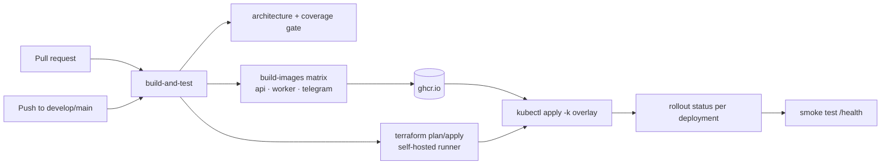

# CI/CD

> Build → test → containerise → push → Terraform → deploy → smoke test.
> Pattern and tooling mirror the sibling `overflow` project
> ([[../00-overview/adr/0010-kustomize-ghcr-selfhosted-runner|ADR-0010]]).

---

## 1. Branch and environment mapping

| Branch | Environment | Namespace | Host | Approval |
|---|---|---|---|---|
| `develop` | staging | `apps-staging` | `jobhunter-staging.devoverflow.org` | none |
| `main` | production | `apps-production` | `jobhunter.devoverflow.org` | GitHub Environment `production` |
| pull request | none | — | — | build + test only |

> **Status:** only the `develop` → staging path is implemented today. `.github/workflows/ci-cd.yml`
> carries a single `deploy-staging` job gated on `refs/heads/develop`, and its header states that
> production deployment is out of scope for F0. The `main` → production row and the smoke test below
> are **planned, not yet implemented (F5-gated)**.

---

## 2. Pipeline



### `build-and-test`

Hosted `ubuntu-latest` runner — Docker is available for Testcontainers.

```yaml
- uses: actions/setup-dotnet@v4
  with: { dotnet-version: '10.0.x' }
- run: dotnet restore JobHunter.slnx
- run: dotnet build JobHunter.slnx --no-restore -c Release   # TreatWarningsAsErrors=true
- run: dotnet test JobHunter.slnx --no-build -c Release --collect:"XPlat Code Coverage" --settings coverage.runsettings
- run: kubectl kustomize k8s/overlays/staging > /dev/null    # manifests must at least render
```

The `dotnet test` step only *collects* coverage (`--collect:"XPlat Code Coverage"`); it does not run
the Coverlet MSBuild `<Threshold>` in `tests/Directory.Build.props`, which is a local-only
convenience. The > 90% line+branch gate is a dedicated **Enforce coverage gate** step: it installs
`dotnet-reportgenerator-globaltool`, merges the per-assembly cobertura reports, and runs a short
Python snippet that fails the build if line or branch coverage is below 90%.

### `build-images`

Matrix over `[Api, Worker, Telegram]`. The service name is lowercased for the image tag, because
`src/JobHunter.<Service>/Dockerfile` is PascalCase but GHCR image names must be lowercase.

```yaml
- uses: docker/login-action@v3
  with: { registry: ghcr.io, username: ${{ github.actor }}, password: ${{ secrets.GITHUB_TOKEN }} }
- name: Lowercase the service name
  run: echo "SERVICE_LC=$(echo '${{ matrix.service }}' | tr '[:upper:]' '[:lower:]')" >> "$GITHUB_ENV"
- uses: docker/build-push-action@v7
  with:
    context: .
    file: src/JobHunter.${{ matrix.service }}/Dockerfile
    push: true
    tags: |
      ghcr.io/${{ env.OWNER_LC }}/jobhunter-${{ env.SERVICE_LC }}:${{ github.sha }}
      ${{ github.ref == 'refs/heads/main' && format('ghcr.io/{0}/jobhunter-{1}:latest', env.OWNER_LC, env.SERVICE_LC) || '' }}
    cache-from: type=gha
    cache-to: type=gha,mode=max
```

**Tagging:** every image is tagged with the commit SHA; `:latest` only from `main`. Overlays
reference the SHA, never `:latest` — a rollback is `kubectl set image` with the previous SHA.

### `terraform`

Runs on the **self-hosted `helios` runner**, because the Kubernetes API is not publicly reachable.

```yaml
runs-on: [self-hosted, helios]
env:
  ARM_CLIENT_ID:       ${{ secrets.ARM_CLIENT_ID }}
  ARM_CLIENT_SECRET:   ${{ secrets.ARM_CLIENT_SECRET }}
  ARM_TENANT_ID:       ${{ secrets.ARM_TENANT_ID }}
  ARM_SUBSCRIPTION_ID: ${{ secrets.ARM_SUBSCRIPTION_ID }}
  TF_VAR_pg_password:      ${{ secrets.PG_PASSWORD }}
  TF_VAR_rabbit_password:  ${{ secrets.RABBIT_PASSWORD }}
  TF_VAR_redis_password:   ${{ secrets.REDIS_PASSWORD }}
  TF_VAR_typesense_api_key: ${{ secrets.TYPESENSE_API_KEY }}
steps:
  - run: terraform init
    working-directory: terraform
  - run: terraform plan -detailed-exitcode -out=tfplan
    working-directory: terraform
    continue-on-error: true
    id: plan
  - run: terraform apply -auto-approve tfplan          # only when exitcode == 2 (changes present)
    if: steps.plan.outputs.exitcode == '2'
    working-directory: terraform
```

Terraform creates the databases, the RabbitMQ vhost bootstrap and the `jobhunter-infra-config`
ConfigMap — see [[deployment]] §3.

### `deploy-<env>`

```yaml
runs-on: [self-hosted, helios]
steps:
  - name: Registry pull secret
    run: |
      kubectl create secret docker-registry ghcr-pull-secret \
        --docker-server=ghcr.io --docker-username=${{ github.actor }} \
        --docker-password=${{ secrets.GITHUB_TOKEN }} -n $NAMESPACE \
        --dry-run=client -o yaml | kubectl apply -f -

  - name: Substitute placeholders
    run: |
      sed -i "s|GITHUB_USERNAME|${OWNER_LC}|g"           k8s/overlays/$ENV/kustomization.yaml
      sed -i "s|SHA_REPLACED_BY_CICD|${{ github.sha }}|g" k8s/overlays/$ENV/kustomization.yaml
      sed -i "s|INFISICAL_CLIENT_ID_PLACEHOLDER|${{ secrets.INFISICAL_CLIENT_ID }}|g"         k8s/base/infisical/secret.yaml
      sed -i "s|INFISICAL_CLIENT_SECRET_PLACEHOLDER|${{ secrets.INFISICAL_CLIENT_SECRET }}|g" k8s/base/infisical/secret.yaml
      sed -i "s|INFISICAL_PROJECT_ID_PLACEHOLDER|${{ secrets.INFISICAL_PROJECT_ID }}|g"       k8s/base/infisical/secret.yaml

  - name: Preview
    run: kubectl kustomize k8s/overlays/$ENV | head -120

  - name: Apply
    run: kubectl apply -k k8s/overlays/$ENV

  - name: Wait for rollout
    run: |
      for d in jobhunter-api jobhunter-worker jobhunter-telegram; do
        kubectl rollout status deployment/$d -n $NAMESPACE --timeout=8m
      done
```

Production is **planned, not yet implemented (F5-gated)**: it will add a smoke-test step in which an
ephemeral `curl` pod hits `jobhunter-api:8080/health` and the job fails if it does not return 200.

---

## 3. Required GitHub secrets

| Secret | Purpose |
|---|---|
| `ARM_CLIENT_ID` / `ARM_CLIENT_SECRET` / `ARM_TENANT_ID` / `ARM_SUBSCRIPTION_ID` | Azure Blob Terraform state backend |
| `INFISICAL_CLIENT_ID` / `INFISICAL_CLIENT_SECRET` / `INFISICAL_PROJECT_ID` | Runtime secret bootstrap ([[../00-overview/adr/0011-infisical-secrets\|ADR-0011]]) |
| `PG_PASSWORD` / `RABBIT_PASSWORD` / `REDIS_PASSWORD` / `TYPESENSE_API_KEY` | Shared helios infrastructure, for Terraform |
| `GITHUB_TOKEN` | GHCR push and the in-cluster pull secret (automatic) |

Application secrets — the Anthropic key, the Telegram token, the Keycloak client secret — are **not**
GitHub secrets. They live in Infisical and are fetched by the pod at startup.

Variables: `BASE_DOMAIN=devoverflow.org`, `OWNER_LC` (lowercased repository owner).

---

## 4. Rollback

```bash
# fastest: repoint to the previous image tag
kubectl set image deployment/jobhunter-worker \
  worker=ghcr.io/<owner>/jobhunter-worker:<previous-sha> -n apps-production
kubectl rollout status deployment/jobhunter-worker -n apps-production

# or let Kubernetes do it
kubectl rollout undo deployment/jobhunter-worker -n apps-production
```

**Migrations are not rolled back by this.** Every migration must be backward-compatible with the
previous image: additive columns, nullable first, backfill second, `NOT NULL` in a later release.
A migration that cannot satisfy that is split into two releases.

---

## 5. Runner requirements

The self-hosted runner is labelled `helios` and lives on the cluster node. It needs Terraform ≥ 1.5,
`kubectl`, Helm ≥ 3.0 and Docker. It is a single point of failure for deployment and is patched on
the same cadence as the node.

---

## Related

- [[deployment]] · [[../operations/infrastructure]] · [[testing-strategy]] §7
- [[../00-overview/adr/0010-kustomize-ghcr-selfhosted-runner|ADR-0010]] · [[../00-overview/adr/0011-infisical-secrets|ADR-0011]]
