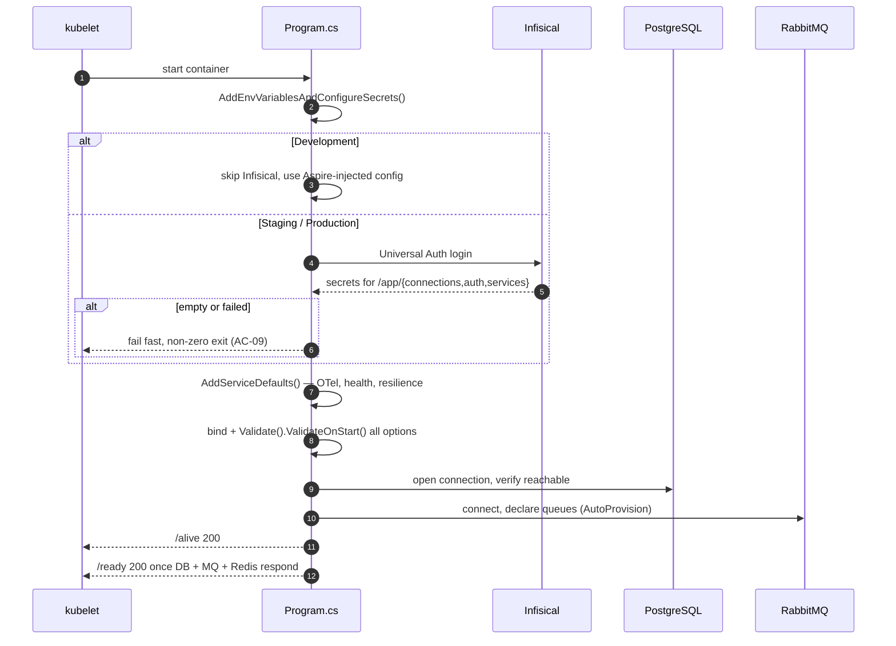
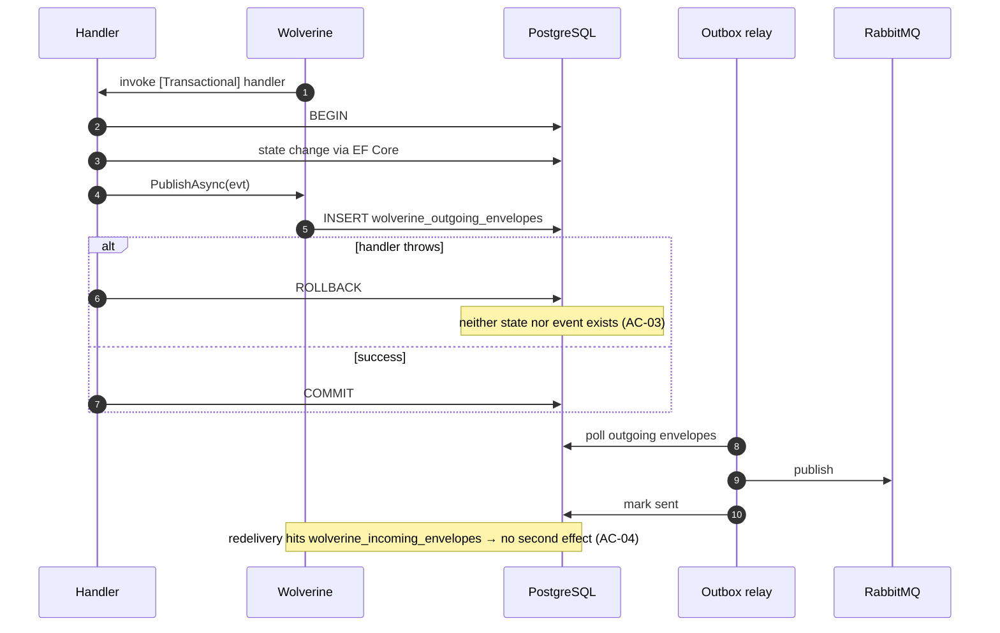
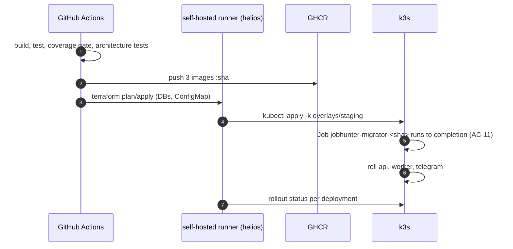

# SAD — F0 Platform Foundation

> Refines [[../../00-overview/sad|the system SAD]] §5 and §8 for the scaffolding layer.

## 1. Intent and quality goals

Establish the module boundaries, persistence, messaging, scheduling, telemetry and delivery pipeline
that F1–F9 consume without modification.

| # | Goal | Verification |
|---|---|---|
| QG-1 | **Zero wiring changes per later feature** — adding a handler, an aggregate or a job requires no edit to F0 files | Reviewed at each feature's completion |
| QG-2 | **Rules enforced by the build, not by review** | `JobHunter.ArchitectureTests` fails on violation |
| QG-3 | **Local and production share one code path** — only endpoints differ | Same `ServiceDefaults` in both |

## 2. Constraints

Inherits [[../../00-overview/sad]] §2 in full. F0-specific:

- `Directory.Build.props` sets `net10.0`, nullable, `TreatWarningsAsErrors` — no project overrides it.
- Central Package Management with transitive pinning; a project may not declare a version inline.
- The solution file is `.slnx`.
- Nothing outside `src/Aspire/` may reference the AppHost.

## 3. Context and scope

**In:** solution layout, `Directory.*.props`, `ServiceDefaults`, AppHost, `JobHunterDbContext` and
migrations, Wolverine + RabbitMQ + outbox, Hangfire, health endpoints, telemetry, the three
Dockerfiles, Kustomize base and overlays, Terraform, the CI/CD workflow, the test harness,
architecture tests.

**Out:** every domain table, every adapter to an external business service, every prompt.

## 4. Solution strategy

| # | Choice | Why |
|---|---|---|
| S1 | Ports live in `Domain/Abstractions`; adapters in `Infrastructure` | Makes 90% coverage achievable without network, and makes F1's five ATS adapters interchangeable |
| S2 | One `DependencyInjection.cs` per project, one extension method each | A host composes by calling four methods; new services register themselves inside their own project |
| S3 | Wolverine handler discovery by assembly scan over `JobHunter.Application` | A new handler is a new class — QG-1 |
| S4 | Migrations run as a pre-deploy Job, never at app startup | Three replicas racing `Migrate()` is a deadlock (AC-11) |
| S5 | `ServiceDefaults` is production code; the AppHost is not | [[../../00-overview/adr/0013-aspire-local-dev-only\|ADR-0013]] |
| S6 | Architecture tests ship in F0, not "later" | A rule added after the violations exist is a refactor, not a guard |

## 5. Building block view

```text
JobHunter.slnx
├─ src/
│  ├─ JobHunter.Domain/          Abstractions/ · Common/ (ValueObject, Entity, IClock)
│  ├─ JobHunter.Application/     Common/ (Result, Telemetry, behaviours) · DependencyInjection.cs
│  ├─ JobHunter.Contracts/       (empty in F0; events arrive with their features)
│  ├─ JobHunter.Infrastructure/  Persistence/ · Messaging/ · Caching/ · Http/ · Configuration/
│  ├─ JobHunter.Api/             Program.cs · Endpoints/ (health only) · Dockerfile
│  ├─ JobHunter.Worker/          Program.cs · Jobs/ · Cli/ (migrate, run-once, replay-dlq) · Dockerfile
│  ├─ JobHunter.Telegram/        Program.cs · Dockerfile          (empty host that starts healthy)
│  └─ Aspire/
│     ├─ JobHunter.AppHost/
│     └─ JobHunter.ServiceDefaults/
└─ tests/
   ├─ JobHunter.Domain.Tests/
   ├─ JobHunter.Application.Tests/
   ├─ JobHunter.Infrastructure.Tests/   (Testcontainers; TestDatabase lives here)
   └─ JobHunter.ArchitectureTests/
```

**Dependency rule.** `Hosts → Infrastructure → Application → Domain`; `Contracts` referenced by all,
references none. Asserted by T12.

## 6. Runtime view

### 6.1 Host startup



### 6.2 Transactional publish



### 6.3 Deploy



## 7. Deployment view

Three Deployments, one pre-deploy Job, one Service, one Ingress — see
[[../../engineering/deployment]]. F0's exit criterion is staging only.

## 8. Crosscutting concepts

| Concept | Convention | Defined in |
|---|---|---|
| Time | `IClock` / `SystemClock`; `DateTime.Now` banned by test | `Domain/Common/IClock.cs` |
| Ids | `Guid.CreateVersion7()` behind `IIdGenerator` | `Domain/Common` |
| Results | `Result<T>` and per-operation outcome enums | `Application/Common/Result.cs` |
| Options | `Bind().Validate().ValidateOnStart()`; each has `SectionName` | each `DependencyInjection.cs` |
| Telemetry | one `ActivitySource`, one `Meter`, both `internal static` | `Application/Common/Telemetry.cs` |
| Health | `/alive` (liveness), `/ready` (deps), `/health` (admin) | `ServiceDefaults` |
| Secrets | Infisical at startup, skipped in Development | `Infrastructure/Configuration` |

## 9. Architecture decisions

F0 makes none; it realises ADR-0001, 0002, 0003, 0004, 0007, 0010, 0011, 0012, 0013, 0015.

## 10. Quality requirements

**QG-1. Zero wiring changes per later feature**
- **When:** F1 adds five `IJobSource` adapters and a handler.
- **Then:** no file created by F0 is modified, other than adding a package version.
- **How verify:** reviewed at F1 completion; a modification requires a note in this SAD §11.

**QG-2. Rules enforced by the build**
- **When:** any PR is opened.
- **Then:** dependency direction, the Dapper-never-writes rule, the clock rule and the AppHost
  isolation rule are all asserted.
- **How verify:** `JobHunter.ArchitectureTests` — one test per rule, each with a deliberately
  violating fixture proving the test can fail.

**QG-3. One code path, two environments**
- **When:** the system runs locally and in staging.
- **Then:** the same `ServiceDefaults` executes; only endpoint values differ.
- **How verify:** no `#if DEBUG` and no environment branching in `ServiceDefaults`, asserted by review.

## 11. Risks and technical debt

| # | Item | Impact | Plan |
|---|---|---|---|
| D1 | Aspire is pre-1.0-ish; APIs shift between releases | Local dev breaks on upgrade | AppHost is isolated and excluded from tests; a break costs an hour, not a feature |
| D2 | The self-hosted runner is a single point of failure | No deploys while it is down | Accepted; manual `kubectl apply -k` is the documented fallback |
| D3 | Wolverine's outbox tables are framework-owned | An upgrade may migrate them | Pin the major version; read release notes before bumping |
| D4 | `TreatWarningsAsErrors` will block on a new analyzer in an SDK patch | CI red on an unrelated change | Pin the SDK in `global.json` |

**Accepted debt:** no HA, single worker replica, no GitOps, no staging/production config drift detection.

## 12. Glossary

No new terms. See [[../../CONTEXT]].
