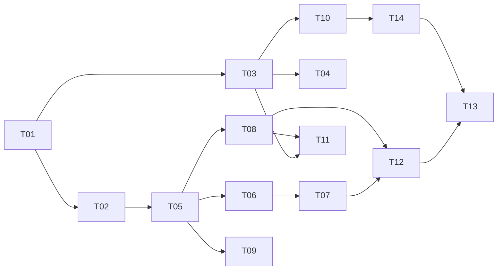

# Task tracker — F0 Platform Foundation

Epic: [[_epic|_epic]]. F0 ships no user-visible behaviour; its output is that F1–F9 are each a day per task.

Each task is one reviewable PR (≤500 LOC), ≤1 day. Owner: Viacheslav (solo).
Estimate legend: **S** ≈ 2 h · **M** ≈ half a day · **L** ≈ a full day.
Status: `pending` → `in_progress` → `in_review` → `done`.

| ID | Task | Layer | Deps | Est | Status |
|---|---|---|---|---|---|
| T01 | [[T01-solution-scaffold\|Solution scaffold, Directory.*.props, .slnx]] | build | — | M | pending |
| T02 | [[T02-domain-primitives\|Domain primitives: IClock, IIdGenerator, Result]] | domain | T01 | S | pending |
| T03 | [[T03-service-defaults\|ServiceDefaults: OpenTelemetry, health, resilience]] | platform | T01 | M | pending |
| T04 | [[T04-aspire-apphost\|Aspire AppHost]] | platform | T03 | M | pending |
| T05 | [[T05-dbcontext-migrations\|JobHunterDbContext, configuration convention, first migration]] | infra/db | T02 | M | pending |
| T06 | [[T06-test-harness\|Testcontainers harness (TestDatabase)]] | tests | T05 | M | pending |
| T07 | [[T07-persistence-conventions\|Repository and Dapper query conventions]] | infra/db | T06 | S | pending |
| T08 | [[T08-wolverine-outbox\|Wolverine + RabbitMQ + transactional outbox]] | infra/messaging | T05 | L | pending |
| T09 | [[T09-hangfire\|Hangfire on PostgreSQL]] | infra/jobs | T05 | M | pending |
| T10 | [[T10-configuration-secrets\|Configuration, options validation, Infisical]] | infra/config | T03 | M | pending |
| T11 | [[T11-telemetry-correlation\|Telemetry primitives and correlation]] | platform | T03, T08 | M | pending |
| T12 | [[T12-architecture-tests\|Architecture tests]] | tests | T07, T08 | M | pending |
| T13 | [[T13-ci-pipeline\|CI pipeline: build, test, images, deploy to staging]] | ci | T12, T14 | L | pending |
| T14 | [[T14-k8s-terraform\|Dockerfiles, Kustomize base and overlays, Terraform]] | deploy | T10 | L | pending |
| T15 | [[T15-backup-job\|Nightly pg_dump backup to Azure Blob]] | ops | T14 | M | pending |
| T16 | [[T16-replay-dlq\|replay-dlq CLI]] | ops | T08 | M | pending |

**16 tasks · 2×S + 11×M + 3×L ≈ 9.0 person-days** (the original 14 tasks sum to 8.0; T15–T16 add ≈1.0).

## Dependency graph

## DoR / DoD

- **DoR:** the feature's PRD, SAD, data-model and test-plan are accepted
  ([[../../../IMPLEMENTATION-READINESS|readiness]]); the task's own ACs and ADR links resolve.
- **DoD (every task):** code compiles with zero warnings; unit tests pass; the coverage gate stays green; any migration applies on a clean database; any handler has an idempotency test; the tracker row is updated in the same PR.

See [[../../../IMPLEMENTATION-READINESS]] §4 for the full per-task checklist.
