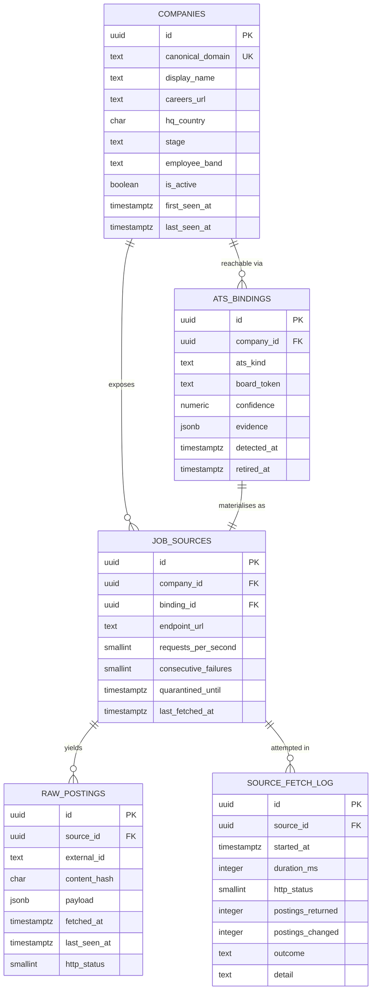

# Data model — f1-ats-job-discovery

> **Owns:** `companies`, `ats_bindings`, `job_sources`, `raw_postings`, `source_fetch_log`
> **References (owned elsewhere, do not redefine):** `jobs` (F2).
> Conventions: [[../../architecture/data-model]] §top.

## ER diagram

## Entities

### `companies`

The identity of a hiring organisation. Keyed by canonical domain so a rebrand, an ATS migration or a
name change never orphans its jobs.

| Column | Type | Constraints | Notes |
|---|---|---|---|
| `id` | uuid | PK | UUID v7 |
| `canonical_domain` | text | NOT NULL, UNIQUE | lowercased, `www.` and scheme stripped, public suffix aware |
| `display_name` | text | NOT NULL | |
| `careers_url` | text | NULL | a detection hint, not authoritative |
| `hq_country` | char(2) | NULL | ISO-3166-1 alpha-2 |
| `stage` | text | NULL | set by F3, not at discovery |
| `employee_band` | text | NULL | set by F8 |
| `is_active` | boolean | NOT NULL DEFAULT true | false excludes from discovery |
| `source` | text | NOT NULL | `Curated`, `DirectoryCrawl`, `Manual` — provenance of the registry entry |
| `first_seen_at` / `last_seen_at` | timestamptz | NOT NULL | |

**Access patterns:** "active companies with a confident, non-quarantined binding" — the cycle
fan-out query, every 6 h.
**Constraints:** `canonical_domain` is the natural key. Detection never creates a company; it only
binds an existing one.

### `ats_bindings`

Where a company's jobs actually live, plus the evidence for believing it.

| Column | Type | Constraints | Notes |
|---|---|---|---|
| `id` | uuid | PK | |
| `company_id` | uuid | NOT NULL, FK → `companies` | |
| `ats_kind` | text | NOT NULL | `Greenhouse`, `Lever`, `Ashby`, `Workable`, `CareersPage` |
| `board_token` | text | NOT NULL | provider-specific board slug |
| `confidence` | numeric(3,2) | NOT NULL | ≥ 0.80 required for discovery |
| `evidence` | jsonb | NOT NULL | probes attempted, statuses, posting counts, matched patterns |
| `detected_at` | timestamptz | NOT NULL | |
| `retired_at` | timestamptz | NULL | set on ATS migration (AC-05); rows are never deleted |

**Constraints:** unique `(company_id, ats_kind, board_token)` where `retired_at IS NULL`.
Retirement rather than deletion is what makes an ATS migration auditable.

### `job_sources`

A binding made operational: the concrete endpoint, its budget and its health.

| Column | Type | Constraints | Notes |
|---|---|---|---|
| `id` | uuid | PK | |
| `company_id` / `binding_id` | uuid | NOT NULL, FK | |
| `endpoint_url` | text | NOT NULL | derived from kind + token, stored so it is greppable |
| `requests_per_second` | smallint | NOT NULL DEFAULT 1 | per-source override of the host default |
| `consecutive_failures` | smallint | NOT NULL DEFAULT 0 | reset to 0 on success |
| `quarantined_until` | timestamptz | NULL | set at 2 consecutive failures (AC-08) |
| `last_fetched_at` | timestamptz | NULL | |

### `raw_postings`

**Immutable** ([[../../CONTEXT]] invariant 1). The highest-volume table in the system.

| Column | Type | Constraints | Notes |
|---|---|---|---|
| `id` | uuid | PK | |
| `source_id` | uuid | NOT NULL, FK → `job_sources` | |
| `external_id` | text | NOT NULL | provider's own posting id |
| `content_hash` | char(64) | NOT NULL | sha256 over the payload with volatile fields stripped |
| `payload` | jsonb | NOT NULL | verbatim — never edited |
| `fetched_at` | timestamptz | NOT NULL | first time this exact content was seen |
| `last_seen_at` | timestamptz | NOT NULL | bumped on every unchanged re-fetch (AC-02) |
| `http_status` | smallint | NOT NULL | |

**Constraints:** unique `(source_id, external_id, content_hash)`. Insert is
`ON CONFLICT (…) DO UPDATE SET last_seen_at = excluded.last_seen_at` — one statement that both
deduplicates and refreshes liveness, with no read-then-write race.
**Immutability:** the repository exposes no update path for `payload`; asserted by test (QG-3).
**Retention:** 90 days, pruned by a weekly job ([[../../ARCHITECTURE-OPEN-DECISIONS|O3]]).

### `source_fetch_log`

Every attempt, successful or not (AC-11). This is what makes source health answerable from stored
data rather than from log retention.

| Column | Type | Notes |
|---|---|---|
| `id` | uuid | PK |
| `source_id` | uuid | FK → `job_sources` |
| `started_at` / `duration_ms` | | |
| `http_status` | smallint | 0 for transport failures |
| `postings_returned` / `postings_changed` | integer | the ratio is the unchanged-content metric |
| `outcome` | text | `Success`, `RateLimited`, `RobotsDenied`, `HttpError`, `TransportError`, `ParseError`, `Quarantined` |
| `detail` | text | one line, no payload, no secrets |

**Retention:** 180 days — longer than raw payloads, because trend analysis outlives the data.

## Indexes

| Index | Columns | Serves |
|---|---|---|
| `uq_companies_domain` | `companies(canonical_domain)` | natural key |
| `idx_companies_active` | `companies(is_active) WHERE is_active` | cycle fan-out |
| `uq_ats_bindings_live` | `ats_bindings(company_id, ats_kind, board_token) WHERE retired_at IS NULL` | one live binding per provider |
| `idx_job_sources_dispatch` | `job_sources(quarantined_until, last_fetched_at) WHERE quarantined_until IS NULL` | "which sources are due" |
| `uq_raw_postings_dedup` | `raw_postings(source_id, external_id, content_hash)` | AC-02 |
| `idx_raw_postings_fetched` | `raw_postings(fetched_at)` | retention pruning |
| `idx_raw_postings_source_seen` | `raw_postings(source_id, last_seen_at DESC)` | "what is still live on this board" |
| `idx_fetch_log_source_started` | `source_fetch_log(source_id, started_at DESC)` | source health queries |

## Handoffs / interfaces

- **Produces** `RawPostingIngested` — consumed by F2 normalisation.
- **Produces** `SourceQuarantined` — consumed by the Telegram notifier and the digest footer (AC-09).
- **Consumed by** F2, which reads `raw_postings.payload` and writes `jobs`. F2 never writes to any
  F1 table.
- **Consumed by** F8, which reads `companies` for research targets.

## Related

[[../../architecture/data-model]] · [[../../architecture/event-catalog]] · [[sad]] §5 · [[test-plan]]
