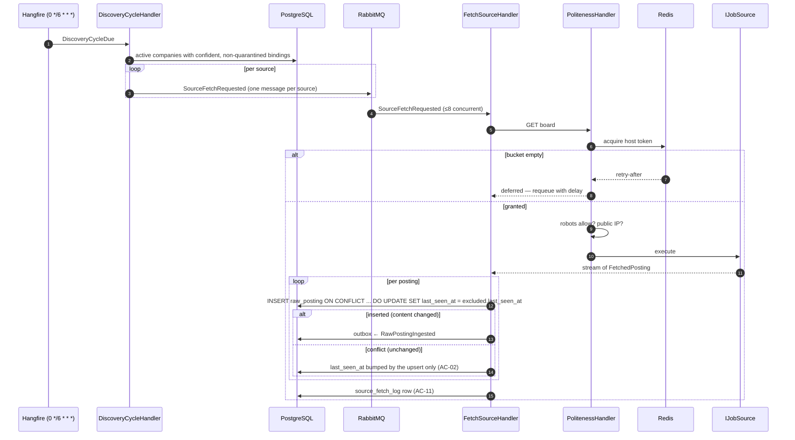

# SAD — F1 ATS Job Discovery

> Refines [[../../00-overview/sad|the system SAD]] §6.1 for stage 1.

## 1. Intent and quality goals

Acquire the raw material. Keep acquisition isolated from interpretation, and keep every third-party
provider isolated from every other.

| # | Goal | Verification |
|---|---|---|
| QG-1 | **Isolated failure domains** — one broken provider degrades one provider | Fault-injection test per adapter |
| QG-2 | **Polite by construction** — it is not possible to bypass the rate budget by adding an adapter | Rate limiting lives in the shared HTTP handler, not in adapters |
| QG-3 | **Nothing is lost** — every payload retained verbatim, every attempt recorded | Immutability test; `source_fetch_log` completeness |

## 2. Constraints

Inherits system SAD §2. F1-specific:

- Tier-1 providers only in MVP: Greenhouse, Lever, Ashby, Workable
  ([[../../00-overview/adr/0009-ats-first-no-linkedin|ADR-0009]]).
- No authentication to any provider — all endpoints used are public and unauthenticated.
- Fetches go through one shared `HttpClient` pipeline; an adapter cannot construct its own.
- Raw payloads are immutable ([[../../CONTEXT]] invariant 1).

## 3. Context and scope

| External system | Shape | Failure handling |
|---|---|---|
| Greenhouse job boards | `boards-api.greenhouse.io/v1/boards/{token}/jobs?content=true` | Adapter-isolated; quarantine after 2 |
| Lever postings | `api.lever.co/v0/postings/{token}?mode=json` | as above |
| Ashby job board | `api.ashbyhq.com/posting-api/job-board/{token}` | as above |
| Workable | `apply.workable.com/api/v1/widget/accounts/{token}` | as above |
| Company career pages | `schema.org/JobPosting` JSON-LD | Best-effort, lowest confidence, never blocks |
| ATS public directories | for registry expansion | Weekly, advisory only |

**In:** registry, binding detection, scheduling, fetching, rate limiting, quarantine, raw storage,
fetch logging.
**Out:** normalisation, dedup, enrichment, anything that reads a description's meaning.

## 4. Solution strategy

| # | Choice | Why |
|---|---|---|
| S1 | One `IJobSource` port; one adapter per provider | Adding a provider is a class; QG-1 |
| S2 | Rate limiting, robots and SSRF guards in a shared `DelegatingHandler` | An adapter physically cannot be rude; QG-2 |
| S3 | Content hash at the fetch boundary, before any parsing | Cheapest possible dedup; unchanged content costs one hash |
| S4 | Detection is evidence-based and records its probe trail | AC-03 forbids guessing; the evidence is what makes a wrong binding debuggable |
| S5 | Quarantine, not retry-harder | A provider returning 429 twice wants us to stop, not to try again faster |
| S6 | Discovery publishes one event per *changed* posting | Downstream volume reflects genuine change, not fetch cadence |

## 5. Building block view

```text
JobHunter.Domain/Companies/       Company · AtsBinding · AtsKind · CanonicalDomain · BindingConfidence
JobHunter.Domain/Jobs/            RawPosting · ContentHash
JobHunter.Domain/Abstractions/    IJobSource · IAtsDetector · IRobotsPolicy · IRateLimiter

JobHunter.Application/Discovery/  DiscoveryCycleHandler · FetchSourceHandler · DetectBindingHandler
                                  QuarantineService · CompanyRegistryService

JobHunter.Scrapers/               GreenhouseJobSource · LeverJobSource · AshbyJobSource
                                  WorkableJobSource · JsonLdCareersPageJobSource
                                  AtsProbeDetector · Fixtures/ (recorded responses)

JobHunter.Infrastructure/Http/    PolitenessHandler (rate limit + robots + SSRF + UA)
JobHunter.Infrastructure/Caching/ RedisTokenBucket · RobotsCache
JobHunter.Infrastructure/Persistence/ CompanyRepository · RawPostingRepository · SourceFetchLog
```

`IJobSource` is deliberately narrow:

```csharp
public interface IJobSource
{
    AtsKind Kind { get; }
    IAsyncEnumerable<FetchedPosting> FetchAsync(AtsBinding binding, CancellationToken ct);
}

public sealed record FetchedPosting(string ExternalId, string RawPayload, string ContentHash);
```

`IAsyncEnumerable` matters: a board with 400 postings streams rather than materialising, so the
10 MB cap is enforceable and memory is bounded.

## 6. Runtime view

### 6.1 Discovery cycle



### 6.2 Binding detection and ATS migration

```mermaid
sequenceDiagram
  autonumber
  participant H as Hangfire (weekly)
  participant D as DetectBindingHandler
  participant DB as PostgreSQL
  participant P as AtsProbeDetector

  H->>D: DetectBindingsDue
  D->>DB: companies with no binding, or binding older than 7 days
  loop per company
    D->>P: probe candidates for canonical_domain
    P->>P: derive tokens from domain, careers URL, known patterns
    P-->>D: candidates with evidence
    alt exactly one candidate returns postings
      D->>DB: upsert binding, confidence 0.95, evidence recorded
      opt an older binding exists and now returns nothing
        D->>DB: retire old binding (AC-05)
      end
    else several candidates
      D->>DB: record Ambiguous with all candidates; company stays inactive (AC-04)
    else none
      D->>DB: record NoBoardFound with the probes attempted (AC-03)
    end
  end
```

### 6.3 Failure and quarantine

```mermaid
sequenceDiagram
  autonumber
  participant F as FetchSourceHandler
  participant S as Provider
  participant DB as PostgreSQL
  participant T as Telegram

  F->>S: GET board
  alt 429 or 503 with Retry-After
    S-->>F: Retry-After: 120
    F->>DB: log attempt; schedule retry ≥120 s (AC-07)
  else 4xx/5xx without guidance
    S-->>F: 500
    F->>DB: consecutive_failures += 1
    alt consecutive_failures >= 2
      F->>DB: quarantined_until = now + 24h
      F->>T: notify once (AC-08)
    end
  else transport failure
    F->>F: 3 retries, exponential backoff, then treat as above
  end
  Note over F,DB: other sources in the same cycle are unaffected (QG-1)
```

## 7. Deployment view

Runs entirely inside `jobhunter-worker`. No new deployable, no ingress. Egress to the public
internet through the cluster's existing NAT. Redis holds the token buckets so the budget survives a
pod restart.

**Monitoring:** `jobhunter.jobs.discovered`, `jobhunter.source.failures{ats_kind,reason}`,
`jobhunter.discovery.cycle_duration`, `jobhunter.raw_postings.unchanged_ratio`.
Alerts and responses: [[../../operations/runbooks|R4]].

## 8. Crosscutting concepts

| Concept | Convention |
|---|---|
| User-Agent | `JobHunter/1.0 (+https://github.com/<owner>/jobhunter; contact@…)` — set once in `PolitenessHandler` |
| Robots | Parsed and cached 24 h per host; a disallowed path is never fetched (AC-06) |
| Rate budget | Redis token bucket keyed `{env}:jobhunter:ratelimit:{host}`, default 1 req/s |
| SSRF | Resolved address must be public; private and link-local refused |
| Content hash | `sha256` over the payload with volatile fields (timestamps, tracking ids) stripped |
| Idempotency | `(source_id, external_id, content_hash)` unique — the whole of AC-02 |
| Concurrency | `Parallel.ForEachAsync`, degree 8, configurable |

## 9. Architecture decisions

| # | Title | Status |
|---|---|---|
| [[../../00-overview/adr/0009-ats-first-no-linkedin\|ADR-0009]] | ATS-first ingestion | Accepted |
| [[adr/0001-company-registry-seeding\|F1-0001]] | Curated seed plus directory expansion | Accepted |
| [[adr/0002-immutable-raw-postings\|F1-0002]] | Immutable raw postings with content-hash dedup | Accepted |

## 10. Quality requirements

**QG-1. Isolated failure domains**
- **When:** one provider returns malformed payloads or 500s for an entire cycle.
- **Then:** every other provider's inventory is unaffected, the failure is visible in metrics, and
  the digest reports degraded coverage.
- **How verify:** fault-injection test per adapter asserting other sources' counts are unchanged.

**QG-2. Polite by construction**
- **When:** a new adapter is added by a developer who has not read this document.
- **Then:** it still identifies itself, respects robots, respects `Retry-After` and consumes the
  host budget — because it cannot construct its own `HttpClient`.
- **How verify:** architecture test asserting no type in `JobHunter.Scrapers` instantiates
  `HttpClient` or `SocketsHttpHandler` directly.

**QG-3. Nothing is lost**
- **When:** normalisation improves six months from now.
- **Then:** history can be reprocessed from stored payloads without re-fetching a single provider.
- **How verify:** immutability test (no `UPDATE` path to `raw_postings.payload`); a reprocess
  command that rebuilds Jobs from raw storage alone.

## 11. Risks and technical debt

| # | Item | Impact | Plan |
|---|---|---|---|
| D1 | Provider JSON shapes change without notice | Silent inventory loss | Weekly contract tests against live endpoints, alert-only; schema-drift assertion on every consumed field |
| D2 | Registry coverage caps the product | Invisible companies | Weekly expansion crawl; the digest reports registry size so shrinkage is visible |
| D3 | Board tokens are guessed from the domain | Wrong company's jobs attributed | Detection requires a successful fetch as evidence; confidence recorded; ambiguity blocks activation |
| D4 | `raw_postings` growth (~800 rows/day + payloads) | Storage | 90-day retention ([[../../ARCHITECTURE-OPEN-DECISIONS\|O3]]); payload compression if it exceeds 5 GB |
| D5 | Career-page JSON-LD is inconsistent in the wild | Low-quality Tier-2 data | Lowest confidence; Tier-2 postings are marked and can be excluded from ranking |

**Accepted debt:** no priority tiering (all companies fetched at the same cadence); no incremental
fetch (providers rarely support it); no per-company cadence tuning.

## 12. Glossary

No new terms. `Company`, `ATS`, `ATS Binding`, `Source`, `RawPosting`, `Fingerprint` are defined in
[[../../CONTEXT]] §1.
