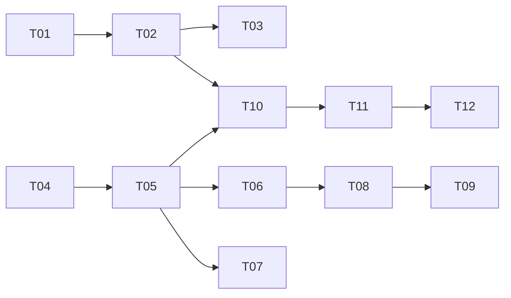

# Task tracker — F1 ATS Job Discovery

Epic: [[_epic|_epic]]. Acquisition only — F1 never interprets what it fetches.

Each task is one reviewable PR (≤500 LOC), ≤1 day. Owner: Viacheslav (solo).
Estimate legend: **S** ≈ 2 h · **M** ≈ half a day · **L** ≈ a full day.
Status: `pending` → `in_progress` → `in_review` → `done`.

| ID | Task | Layer | Deps | Est | Status |
|---|---|---|---|---|---|
| T01 | [[T01-domain-company-binding\|Domain: Company, AtsBinding, CanonicalDomain]] | domain | — | M | pending |
| T02 | [[T02-registry-persistence\|Migration and repositories for registry tables]] | infra/db | T01 | M | pending |
| T03 | [[T03-registry-seeding\|Company registry seeding and expansion]] | app | T02 | M | pending |
| T04 | [[T04-politeness-handler\|PolitenessHandler: rate limit, robots, SSRF, user-agent]] | infra/http | — | L | pending |
| T05 | [[T05-ijobsource-greenhouse\|IJobSource port and Greenhouse adapter]] | scrapers | T04 | M | pending |
| T06 | [[T06-lever-ashby-workable\|Lever, Ashby and Workable adapters]] | scrapers | T05 | L | pending |
| T07 | [[T07-jsonld-careers-adapter\|JSON-LD career-page adapter (Tier 2)]] | scrapers | T05 | M | pending |
| T08 | [[T08-binding-detection\|ATS binding detection]] | app | T06 | L | pending |
| T09 | [[T09-binding-redetection\|Binding re-detection and ATS migration]] | app | T08 | M | pending |
| T10 | [[T10-discovery-cycle\|Discovery cycle handler and fan-out]] | app | T02, T05 | M | pending |
| T11 | [[T11-raw-ingestion-dedup\|Raw posting ingestion with content-hash dedup]] | app | T10 | M | pending |
| T12 | [[T12-quarantine-logging\|Quarantine, fetch logging and degraded reporting]] | app | T11 | M | pending |

**12 tasks · 0×S + 9×M + 3×L ≈ 7.5 person-days.**

## Dependency graph

## DoR / DoD

- **DoR:** the feature's PRD, SAD, data-model and test-plan are accepted
  ([[../../../IMPLEMENTATION-READINESS|readiness]]); the task's own ACs and ADR links resolve.
- **DoD (every task):** code compiles with zero warnings; adapter changes ship with fixtures; the coverage gate stays green; migrations apply on a clean database; the handler has an idempotency test; the tracker row is updated in the same PR.

See [[../../../IMPLEMENTATION-READINESS]] §4 for the full per-task checklist.
