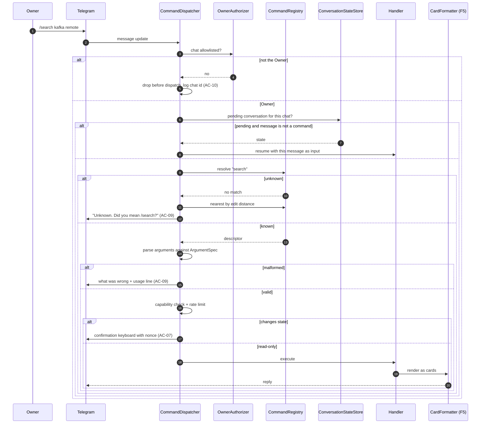
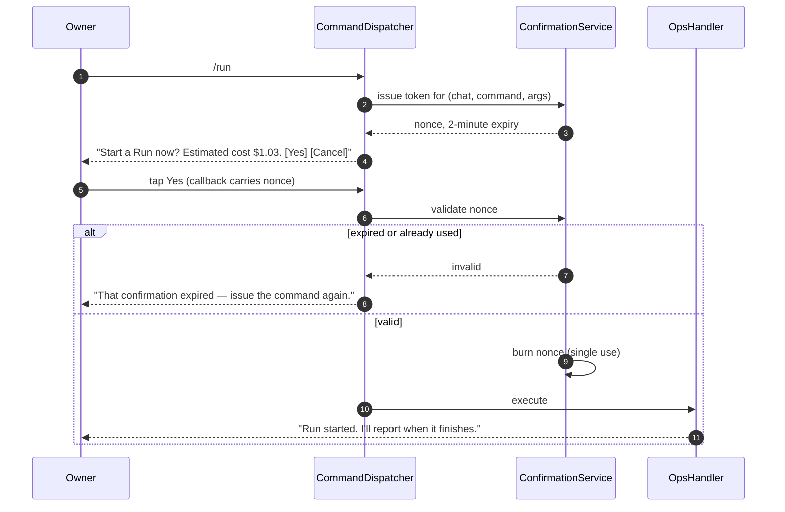

# SAD — F10 Telegram Command Interface

> Extends [[../f5-daily-digest-telegram/sad|F5]]'s host. F10 adds no new deployable and no new
> inbound surface — it is a dispatch layer over read models other features already own.

## 1. Intent and quality goals

Make the whole system reachable from one chat, in one visual grammar, without letting the surface
grow unsafely.

| # | Goal | Verification |
|---|---|---|
| QG-1 | **The catalogue is the single source of truth** — the client menu, the help text, the authorization checks and the docs all derive from one registry | Conformance test: registry ↔ menu ↔ contract doc |
| QG-2 | **A command cannot ship unsafe** — undeclared capability or undeclared state-change fails the build | Registry convention test with a proven-red fixture |
| QG-3 | **One visual grammar** — every command answers in the digest's card language | Rendering corpus shared with F5 |

## 2. Constraints

- Chat-id allowlist before dispatch ([[../../00-overview/adr/0014-keycloak-api-telegram-allowlist|ADR-0014]]).
- Single long-poll consumer — `jobhunter-telegram` stays at one replica ([[../f5-daily-digest-telegram/sad|F5 SAD]] §7).
- Telegram's 64-byte `callback_data` cap applies to every confirmation payload.
- **No CV content is reachable through any command**, including `/cv` — the F4 boundary holds.
- No LLM in the command path ([[adr/0002-no-conversational-fallback|ADR-F10-0002]]).

## 3. Context and scope

**In:** the command registry, argument parsing, dispatch, conversation state for multi-step commands,
confirmation flow for state-changing commands, the BotFather menu sync, unknown-command handling,
rate limiting, invocation audit.

**Out:** the read models themselves (F5–F9 own them), the digest and its delivery (F5), any new
capability not already exposed by an existing service.

| Consumes | From |
|---|---|
| Digest rendering, card formatter, escaper | [[../f5-daily-digest-telegram/index\|F5]] |
| Applications, transitions, notes | [[../f6-application-tracking/index\|F6]] |
| Preference model, weights, suppressions | [[../f7-preference-learning/index\|F7]] |
| Company dossiers | [[../f8-company-research-agent/index\|F8]] |
| Search, job detail, run status, cost ledger | [[../f9-search-and-api/index\|F9]] |

## 4. Solution strategy

| # | Choice | Why |
|---|---|---|
| S1 | **A declarative registry**: each command is a record with name, description, arguments, capability, state-changing flag and handler | One place defines the surface; the menu, help, authorization and docs all derive from it ([[adr/0001-declarative-command-registry\|ADR-F10-0001]]) |
| S2 | Commands call the **same query services the API uses**, never the database directly | The chat and the API cannot disagree about what a saved job is |
| S3 | Multi-step commands hold a short-lived per-chat state with a 5-minute timeout | `/note` with no text awaiting the note, `/research` awaiting a company. Bounded so a forgotten command never wedges the chat (AC-08) |
| S4 | State-changing commands require a confirmation tap carrying a nonce | AC-07. A destructive action needs an intent that a fat thumb cannot supply, and a stale confirmation must not replay |
| S5 | The BotFather menu is **generated** from the registry at startup | QG-1. A hand-maintained menu drifts within a month |
| S6 | Unknown commands are matched by edit distance against the registry | AC-09. "Did you mean `/pipeline`?" is worth more than "unknown command" |
| S7 | Rendering is delegated wholly to F5's formatter | QG-3, and it means a layout fix lands everywhere at once |

## 5. Building block view

```text
JobHunter.Domain/Commands/       CommandDescriptor · CommandCapability · ArgumentSpec
                                 ConversationState · ConfirmationToken
JobHunter.Application/Commands/  CommandRegistry · ArgumentParser · ConfirmationService
                                 ConversationStateStore · CommandRateLimiter
JobHunter.Telegram/
  Commands/CommandDispatcher.cs          allowlist → parse → authorize → dispatch
  Commands/Handlers/                     one handler per command group
    DigestCommands · SearchCommands · PipelineCommands
    CompanyCommands · PreferenceCommands · OpsCommands · MetaCommands
  Commands/BotMenuSynchroniser.cs        registry → setMyCommands at startup
  Formatting/                            (F5's, reused unchanged)
```

The descriptor is the whole design:

```csharp
public sealed record CommandDescriptor(
    string Name,                       // "pipeline" — no slash
    string Summary,                    // one line, shown in the client menu
    IReadOnlyList<ArgumentSpec> Args,
    CommandCapability Capability,      // Standard | Sensitive (per-command sensitivity, not a role)
    bool ChangesState,                 // true ⇒ confirmation required
    string ContractAnchor);            // heading in contracts/command-catalogue.md
```

`ContractAnchor` is what makes QG-1 enforceable in both directions: the conformance test asserts every
descriptor has a section in the contract document, and every section in the document has a descriptor.
A command documented but not built, or built but not documented, fails the build.

## 6. Runtime view

### 6.1 Dispatch



### 6.2 Multi-step command

```mermaid
sequenceDiagram
  autonumber
  participant Ow as Owner
  participant D as CommandDispatcher
  participant S as ConversationStateStore
  participant H as NoteHandler

  Ow->>D: /note
  D->>H: execute with no argument
  H->>S: store state{command: note, awaiting: text, expires: +5m}
  H-->>Ow: "Which application? Reply with the note; /cancel to stop."
  Ow->>D: free text
  D->>S: pending state found
  S-->>D: note, awaiting text
  D->>H: resume(text)
  H->>S: clear state
  H-->>Ow: "Noted on Stripe · Staff Backend Engineer."

  Note over S: a state older than 5 minutes is swept and<br/>the Owner is told it expired (AC-08)
```

### 6.3 Confirmation for a state-changing command



## 7. Deployment view

Runs inside `jobhunter-telegram`. No new deployable, no ingress, no new secret. Conversation state
lives in Redis under `{env}:jobhunter:convstate:{chat_id}` with a native TTL, so an expiry needs no
sweeper and a pod restart cannot leave a chat wedged.

**Monitoring:** `jobhunter.command.invocations{command,outcome}`, `jobhunter.command.duration`,
`jobhunter.command.unknown`, `jobhunter.command.throttled`.

## 8. Crosscutting concepts

| Concept | Convention |
|---|---|
| Naming | Lowercase, one word, verb-or-noun as reads best (`/saved`, `/research`) — no underscores, no camelCase |
| Arguments | Positional and forgiving: `/company stripe`, `/company Stripe`, `/company stripe.com` all resolve |
| Missing argument | Never an error — enter the multi-step flow and ask |
| Rendering | Always F5's card formatter; commands never format text themselves |
| Escaping | Every dynamic value through `MarkdownV2Escaper`; the architecture test from F5 T06 covers this code too |
| Confirmation | Required iff `ChangesState`; nonce is single-use with a 2-minute expiry |
| Conversation state | Redis, 5-minute TTL, cleared by completion or `/cancel` |
| Rate limit | 20 commands/minute per chat, then one throttle message until the window clears |
| Audit | Every invocation recorded with command, outcome and duration — never with argument content |

## 9. Architecture decisions

| # | Title | Status |
|---|---|---|
| [[adr/0001-declarative-command-registry\|F10-0001]] | Declarative command registry | Accepted |
| [[adr/0002-no-conversational-fallback\|F10-0002]] | No LLM in the command path | Accepted |

## 10. Quality requirements

**QG-1. The catalogue is the single source of truth**
- **When:** a command is added, renamed or removed.
- **Then:** the client menu, the help output, the authorization check and
  [[contracts/command-catalogue|the contract document]] all reflect it without a second edit.
- **How verify:** a conformance test asserting a bijection between registry descriptors and contract
  headings, plus a menu-sync test comparing what the registry produces to what would be registered.

**QG-2. A command cannot ship unsafe**
- **When:** a descriptor omits its capability, or a state-changing command omits its confirmation.
- **Then:** the build fails naming the command.
- **How verify:** registry convention test, with a deliberately non-compliant fixture proving it can
  go red.

**QG-3. One visual grammar**
- **When:** any command produces output.
- **Then:** it uses F5's card formatter, so a layout change lands everywhere at once.
- **How verify:** architecture test asserting no handler constructs message text directly; snapshots
  live in the shared rendering corpus.

## 11. Risks and technical debt

| # | Item | Impact | Plan |
|---|---|---|---|
| D1 | 22 commands is a lot to remember | The surface goes unused | Generated client menu, `/help` grouped by theme, edit-distance suggestions; per-command usage metrics flag dead commands for removal |
| D2 | Command surface tempts feature creep toward chat | Sets an expectation the product cannot meet | [[adr/0002-no-conversational-fallback\|ADR-F10-0002]] is explicit; unknown input gets a suggestion, never an answer |
| D3 | Multi-step state is a small state machine in a chat | Wedged conversations | Redis TTL rather than a sweeper, `/cancel` always available, and any command resets pending state |
| D4 | Commands duplicate F9 endpoints | Two surfaces drifting | Both call the same query services (S2); a divergence is a test failure, not a discovery |
| D5 | `/run` and `/reindex` are operator actions in a consumer surface | Fat-finger risk | Confirmation with the effect and estimated cost named; nonce single-use |

**Accepted debt:** no inline mode, no group chats, no localisation, no per-command help beyond one
line plus a usage string.

## 12. Glossary

No new domain terms. `Digest`, `Card`, `Application`, `PreferenceModel`, `CompanyResearch` are in
[[../../CONTEXT]] §1.
