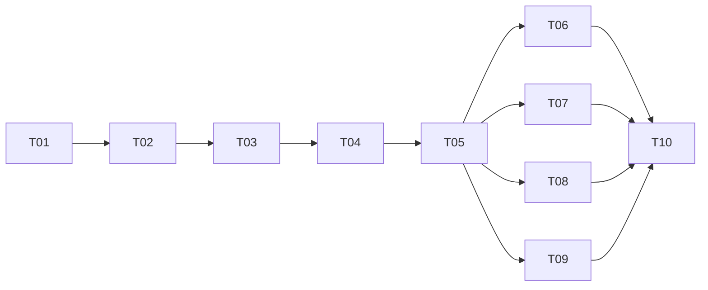

# Task tracker — F10 Telegram Command Interface

Epic: [[_epic|_epic]]. A surface, not new behaviour — every command answers from a query service another feature already owns.

Each task is one reviewable PR (≤500 LOC), ≤1 day. Owner: Viacheslav (solo).
Estimate legend: **S** ≈ 2 h · **M** ≈ half a day · **L** ≈ a full day.
Status: `pending` → `in_progress` → `in_review` → `done`.

| ID | Task | Layer | Deps | Est | Status |
|---|---|---|---|---|---|
| T01 | [[T01-command-registry\|CommandDescriptor, registry and argument spec]] | domain/app | — | M | pending |
| T02 | [[T02-argument-parser\|Argument parser]] | app | T01 | M | pending |
| T03 | [[T03-dispatcher\|Dispatcher: allowlist, resolution, capability, rate limit]] | telegram | T02 | M | pending |
| T04 | [[T04-conversation-state\|Conversation state and cancellation]] | app | T03 | M | pending |
| T05 | [[T05-confirmation-flow\|Confirmation flow for state-changing commands]] | app/telegram | T04 | M | pending |
| T06 | [[T06-digest-discovery-commands\|Digest and discovery commands]] | telegram | T05 | M | pending |
| T07 | [[T07-pipeline-company-commands\|Pipeline and company commands]] | telegram | T05 | M | pending |
| T08 | [[T08-preference-commands\|Profile and preference commands]] | telegram | T05 | M | pending |
| T09 | [[T09-ops-commands\|Operations commands]] | telegram | T05 | M | pending |
| T10 | [[T10-menu-help-conformance\|Menu sync, help, suggestions and conformance suite]] | telegram/tests | T06, T07, T08, T09 | L | pending |

**10 tasks · 0×S + 9×M + 1×L ≈ 5.5 person-days.**

## Dependency graph

## DoR / DoD

- **DoR:** the feature's PRD, SAD, data-model and test-plan are accepted
  ([[../../../IMPLEMENTATION-READINESS|readiness]]); the task's own ACs and ADR links resolve.
- **DoD (every task):** code compiles with zero warnings; the conformance suite is green in both directions; every command declares a capability; output goes through F5's formatter; the coverage gate stays green; the tracker row is updated in the same PR.

See [[../../../IMPLEMENTATION-READINESS]] §4 for the full per-task checklist.
