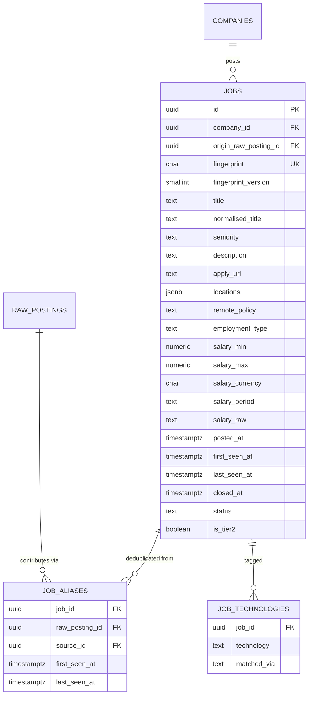

# Data model — f2-normalization-dedup

> **Owns:** `jobs`, `job_aliases`, `job_technologies`
> **References (do not redefine):** `companies`, `raw_postings`, `job_sources` (F1).

## ER diagram

## Entities

### `jobs`

The canonical vacancy. One row per real opening ([[../../CONTEXT]] invariant 2).

| Column | Type | Constraints | Notes |
|---|---|---|---|
| `id` | uuid | PK | UUID v7; stable across reprocessing (AC-09) |
| `company_id` | uuid | NOT NULL, FK | |
| `origin_raw_posting_id` | uuid | NOT NULL, FK | the posting that first created this job |
| `fingerprint` | char(64) | NOT NULL, UNIQUE | the uniqueness arbiter |
| `fingerprint_version` | smallint | NOT NULL | bumped when the algorithm changes (SAD §11 D3) |
| `title` | text | NOT NULL | **as published** — never modified, this is what the Owner reads |
| `normalised_title` | text | NOT NULL | comparison form only, never displayed |
| `seniority` | text | NULL | `Junior`, `Mid`, `Senior`, `Staff`, `Principal`, `Lead`, `Manager` |
| `description` | text | NOT NULL | HTML stripped to plain text at the boundary |
| `apply_url` | text | NOT NULL | |
| `locations` | jsonb | NOT NULL | `[{country, region, city}]`; empty array is legal for fully remote |
| `remote_policy` | text | NOT NULL | `Onsite`, `Hybrid`, `Remote`, `RemoteRegional`, `Unknown` |
| `employment_type` | text | NOT NULL | `FullTime`, `Contract`, `PartTime`, `Internship`, `Unknown` |
| `salary_min` / `salary_max` | numeric(12,2) | NULL | **as published only** — never inferred here |
| `salary_currency` | char(3) | NULL | ISO-4217 |
| `salary_period` | text | NULL | `Year`, `Month`, `Day`, `Hour` |
| `salary_raw` | text | NULL | retained when unparseable, so nothing is lost to a parser gap |
| `posted_at` | timestamptz | NULL | |
| `posted_at_granularity` | text | NOT NULL | `Exact` or `Day` — Workable publishes date only |
| `first_seen_at` / `last_seen_at` | timestamptz | NOT NULL | |
| `closed_at` | timestamptz | NULL | |
| `status` | text | NOT NULL | `Live`, `Closed` |
| `is_tier2` | boolean | NOT NULL DEFAULT false | JSON-LD career-page origin, lower confidence |

**Access patterns:**
- "jobs discovered since the previous Run cut-off" → `idx_jobs_first_seen` (partial on `Live`).
- "live jobs for a company" → `idx_jobs_company_status`.
- "jobs to close" → `idx_jobs_last_seen` (partial on `Live`).

**Constraints:** `fingerprint` unique — enforced by the database, not by application logic, so
concurrent consumers cannot both insert (SAD §6.1). `title` and `normalised_title` are separate
columns on purpose: normalising for comparison must never change what the Owner sees (AC-05).

### `job_aliases`

The provenance trail (AC-08). Every raw posting that ever contributed to a job.

| Column | Type | Constraints |
|---|---|---|
| `job_id` | uuid | NOT NULL, FK → `jobs` |
| `raw_posting_id` | uuid | NOT NULL, FK → `raw_postings` |
| `source_id` | uuid | NOT NULL, FK → `job_sources` |
| `first_seen_at` / `last_seen_at` | timestamptz | NOT NULL |

PK `(job_id, raw_posting_id)`. Rows are never deleted — this table is the evidence for diagnosing a
suspected bad merge, and deleting it would destroy exactly the thing needed.

`last_seen_at` per alias is what drives closure: a job is closed when *every* alias has gone stale,
not when one has.

### `job_technologies`

| Column | Type | Notes |
|---|---|---|
| `job_id` | uuid | FK → `jobs` |
| `technology` | text | canonical name from the vocabulary (`C#`, not `c-sharp` or `csharp`) |
| `matched_via` | text | `Title`, `Description`, `Vocabulary` — how the match was made |

PK `(job_id, technology)`. Populated by vocabulary matching only; F3 later adds model-extracted
technologies to `enrichments.technologies` and does **not** write here, so the deterministic set
stays separable from the inferred one.

## Indexes

| Index | Columns | Serves |
|---|---|---|
| `uq_jobs_fingerprint` | `jobs(fingerprint)` | invariant 2; the concurrency arbiter |
| `idx_jobs_first_seen` | `jobs(first_seen_at) WHERE status='Live'` | "new since last Run" |
| `idx_jobs_company_status` | `jobs(company_id, status)` | company drill-down |
| `idx_jobs_last_seen` | `jobs(last_seen_at) WHERE status='Live'` | closure sweep |
| `idx_jobs_normalised_title_trgm` | GIN trigram on `jobs(normalised_title)` | near-duplicate grouping (AC-10) |
| `idx_job_aliases_raw` | `job_aliases(raw_posting_id)` | "which job did this posting become" |
| `idx_job_technologies_tech` | `job_technologies(technology)` | technology facets |

The trigram index requires `pg_trgm`, enabled in the F2 migration.

## Handoffs / interfaces

- **Consumes** `RawPostingIngested` (F1) and reads `raw_postings.payload` — read-only, always.
- **Produces** `JobDiscovered` → F3 enrichment, F9 indexing.
- **Produces** `JobDuplicateDetected` → metrics only.
- **Produces** `JobClosed` → F6 application tracking, F9 index removal.
- `jobs` is read by F3, F4, F5, F6, F7 and F9; none of them write to it except F3, which sets
  `companies.stage` (a different table) and writes `enrichments`.

## Related

[[../../architecture/data-model]] · [[sad]] §8 · [[adr/0001-conservative-fingerprint|ADR-F2-0001]]
