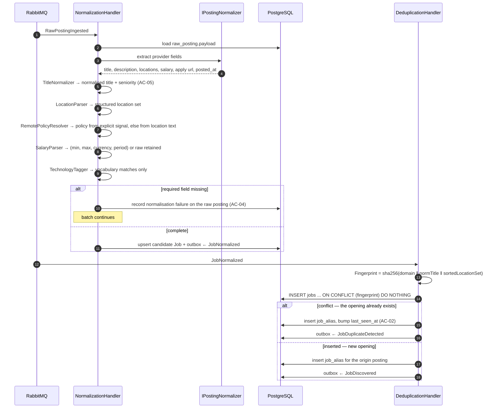
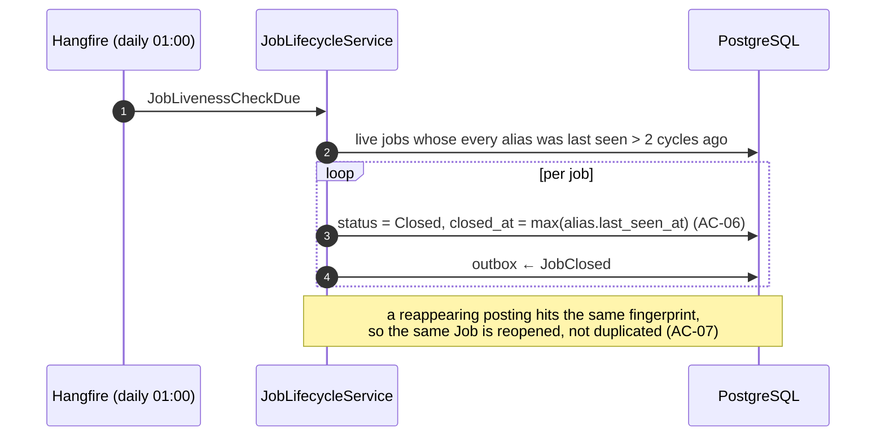

# SAD — F2 Normalization & Deduplication

> Refines [[../../00-overview/sad|the system SAD]] §6.1 for stages 2 and 3.

## 1. Intent and quality goals

Produce one comparable record per real opening, and be certain before merging.

| # | Goal | Verification |
|---|---|---|
| QG-1 | **Zero false merges** — a distinct opening is never hidden | Labelled dedup corpus; the test fails on a single false merge |
| QG-2 | **Deterministic and reproducible** — same input, same fingerprint, forever | Fingerprint stability test with frozen expected values |
| QG-3 | **Reprocessable offline** — improvements apply to history without re-fetching | Reprocess command over stored payloads, zero network |

QG-1 outranks recall. The asymmetry is deliberate: a duplicate costs one tap, a false merge costs an
opportunity the Owner never learns existed.

## 2. Constraints

- Fingerprint inputs are exactly `(canonical company domain, normalised title, normalised location set)`
  — nothing derived from the description, which is too variable ([[../../CONTEXT]] §1).
- The fingerprint must be stable across releases. Changing it is a migration with a full re-fingerprint,
  never a silent redefinition.
- F2 reads `raw_postings` and writes `jobs`; it never writes an F1 table.
- Technology extraction here is vocabulary matching only. Prose comprehension is F3's job.

## 3. Context and scope

**In:** parsing per provider into canonical fields, title normalisation and seniority extraction,
location parsing, remote-policy resolution, salary structuring, vocabulary-based technology tagging,
fingerprinting, alias recording, near-duplicate grouping, lifecycle and closure, reprocessing.

**Out:** enrichment, matching, ranking, search indexing, translation.

## 4. Solution strategy

| # | Choice | Why |
|---|---|---|
| S1 | Two stages, two handlers: `Normalization` then `Deduplication` | Normalisation is per-posting and parallelisable; dedup needs the fingerprint and a uniqueness decision. Separating them keeps each idempotent on a different key |
| S2 | Exact fingerprint, unique index enforces uniqueness | The database is the arbiter, not application logic — no race between concurrent consumers ([[adr/0001-conservative-fingerprint\|ADR-F2-0001]]) |
| S3 | Aliases recorded, never discarded | AC-08; also the evidence for diagnosing a suspected bad merge |
| S4 | Near-duplicates grouped for display, never merged | QG-1. Grouping is reversible; merging is not |
| S5 | Normalisation is a pure function of the payload | Makes QG-3 free — reprocessing is calling the same function again |
| S6 | Closure is derived from `last_seen_at`, not from a delete event | Providers do not announce removals; absence is the only signal |

## 5. Building block view

```text
JobHunter.Domain/Jobs/         Job · Fingerprint · JobStatus · SalaryRange · RemotePolicy
                               Seniority · LocationSet · EmploymentType
JobHunter.Application/Normalization/   NormalizationHandler · IPostingNormalizer
                                       TitleNormalizer · LocationParser · SalaryParser
                                       RemotePolicyResolver · TechnologyTagger
JobHunter.Application/Deduplication/   DeduplicationHandler · FingerprintCalculator
                                       NearDuplicateGrouper · JobLifecycleService
JobHunter.Infrastructure/Persistence/  JobRepository · JobAliasRepository · LiveJobsQuery
```

`IPostingNormalizer` has one implementation per `AtsKind`; the shared normalisers (title, location,
salary, remote) are provider-agnostic and applied after provider-specific field extraction. That
split is what keeps five providers from becoming five copies of the same title logic.

## 6. Runtime view

### 6.1 Normalise → deduplicate



The `ON CONFLICT (fingerprint) DO NOTHING` is the whole of the concurrency design: two consumers
racing on the same opening produce one row and one alias each, with no lock and no read-then-write.

### 6.2 Lifecycle and closure



## 7. Deployment view

Runs in `jobhunter-worker`. No new deployable. Two queues (`JobNormalized`, `RawPostingIngested`)
with their own dead-letter queues.

**Monitoring:** `jobhunter.jobs.discovered`, `jobhunter.jobs.deduplicated`,
`jobhunter.normalization.failures{ats_kind,reason}`, `jobhunter.jobs.closed`.
The ratio `deduplicated ÷ (discovered + deduplicated)` is the dedup rate, expected 10–20%; a sharp
move in either direction is the first symptom of a fingerprint regression.

## 8. Crosscutting concepts

| Concept | Convention |
|---|---|
| Fingerprint | `sha256(lower(domain) ‖ '\x1f' ‖ normalisedTitle ‖ '\x1f' ‖ sortedLocationKeys)`; unit separator prevents boundary collisions |
| Title normalisation | lowercase → strip decoration in brackets and after separators → canonicalise seniority → collapse whitespace |
| Location key | `country:region:city`, lowercased, empty segments preserved so `US::` and `US:CA:` differ |
| Remote policy | explicit provider signal wins; otherwise inferred from location text; never guessed from the description |
| Salary | parsed to `(min, max, currency, period)`; unparseable is `NULL` with `salary_raw` retained — never coerced |
| Idempotency | Normalisation on `raw_posting_id`; deduplication on `fingerprint` |
| Determinism | No clock, no randomness, no culture-sensitive comparison in any normaliser — asserted by test |

## 9. Architecture decisions

| # | Title | Status |
|---|---|---|
| [[adr/0001-conservative-fingerprint\|F2-0001]] | Conservative exact fingerprint; group, never merge, on uncertainty | Accepted |

## 10. Quality requirements

**QG-1. Zero false merges**
- **When:** the labelled dedup corpus is processed.
- **Then:** no pair labelled *distinct* shares a fingerprint. A single false merge fails the build.
- **How verify:** corpus test with ≥ 200 labelled pairs, including adversarial near-misses
  (same title, adjacent cities; same title, contract vs permanent; same company, two teams).

**QG-2. Deterministic and reproducible**
- **When:** the same payload is normalised on any machine, in any culture, at any time.
- **Then:** the fingerprint is byte-identical.
- **How verify:** frozen expected fingerprints for 50 payloads, asserted under `tr-TR` culture (the
  dotless-i trap) and with a clock offset.

**QG-3. Reprocessable offline**
- **When:** a normalisation rule improves.
- **Then:** history is recomputed from stored payloads with no provider contact and stable job ids.
- **How verify:** reprocess command asserted to make zero HTTP calls and to preserve ids for
  unchanged fingerprints.

## 11. Risks and technical debt

| # | Item | Impact | Plan |
|---|---|---|---|
| D1 | Fingerprint is coarse for multi-location roles | A genuinely distinct regional posting could merge | Location set is part of the key, sorted; a differing set is a differing job. Corpus covers this explicitly |
| D2 | Title normalisation is rule-based and English-only | Non-English titles normalise poorly | Accepted for MVP; non-English postings are tagged and down-weighted rather than mis-merged |
| D3 | Changing the fingerprint definition invalidates history | Mass re-dedup | Fingerprint version stored on the job; a change is a migration task with an explicit re-fingerprint step |
| D4 | Two consecutive missed cycles may close a job during a provider outage | A live job disappears from the digest | Closure requires the *source* to be healthy; a quarantined source suspends closure for its jobs |

**Accepted debt:** no translation, no cross-provider description reconciliation (the first-seen
description wins), no automatic merge of near-duplicates.

## 12. Glossary

No new terms. `Job`, `Fingerprint`, `RawPosting` are in [[../../CONTEXT]] §1.
