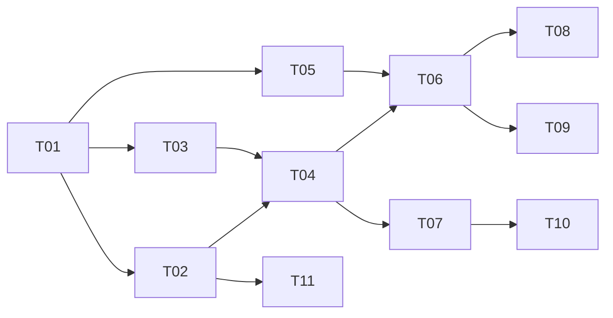

# Task tracker — F2 Normalization & Deduplication

Epic: [[_epic|_epic]]. Zero false merges is the property this feature exists to have; everything else is negotiable.

> Tasks T10–T11 added from the [[../../../reviews/career-alignment-tuning-backlog|career-alignment tuning backlog]] (career-goal alignment).

Each task is one reviewable PR (≤500 LOC), ≤1 day. Owner: Viacheslav (solo).
Estimate legend: **S** ≈ 2 h · **M** ≈ half a day · **L** ≈ a full day.
Status: `pending` → `in_progress` → `in_review` → `done`.

| ID | Task | Layer | Deps | Est | Status |
|---|---|---|---|---|---|
| T01 | [[T01-domain-job\|Domain: Job, Fingerprint, SalaryRange, LocationSet]] | domain | — | M | done |
| T02 | [[T02-title-normalization\|Title normalisation and seniority extraction]] | app | T01 | M | done |
| T03 | [[T03-location-salary-parsing\|Location, remote policy and salary parsing]] | app | T01 | L | done |
| T04 | [[T04-normalization-handler\|Per-provider normalizers and the normalisation handler]] | app | T02, T03 | M | done |
| T05 | [[T05-jobs-persistence\|Migration and repositories for jobs and aliases]] | infra/db | T01 | M | done |
| T06 | [[T06-fingerprint-dedup\|Fingerprint calculation and the deduplication handler]] | app | T04, T05 | L | done |
| T07 | [[T07-technology-tagging\|Technology vocabulary tagging]] | app | T04 | S | done |
| T08 | [[T08-lifecycle-grouping\|Job lifecycle: closure and reopening]] | app | T06 | M | done |
| T09 | [[T09-reprocessing\|Reprocessing and retention]] | app | T06 | M | done |
| T10 | [[T10-target-stack-vocabulary\|Extend the technology vocabulary with target-stack coverage]] | app | T07 | M | done |
| T11 | [[T11-title-tiers-config\|Encode Tier-1/2/3 target titles as a reference config]] | app | T02 | S | done |

**11 tasks total: 9 core (T01–T09) + 2 tuning (T10–T11) ≈ 6 person-days.** The 9 core tasks are
1×S + 6×M + 2×L ≈ 5.25 person-days.
`NearDuplicateGrouper` (formerly bundled in T08) is **relocated to F5** digest assembly per
[[../adr/0001-conservative-fingerprint|ADR-F2-0001]]; the estimate is unchanged.

**Career-alignment tuning tasks (T10–T11): 1×M + 1×S ≈ 0.75 person-day.** Added from the
[[../../../reviews/career-alignment-tuning-backlog|career-alignment tuning backlog]] (TUNE-07, TUNE-12);
they audit and extend the technology vocabulary for target-stack coverage and commit a `title-tiers.yaml`
reference config consumed later by the F3 RoleFamily classifier and F4 Profile goal fields.

## Dependency graph

## DoR / DoD

- **DoR:** the feature's PRD, SAD, data-model and test-plan are accepted
  ([[../../../IMPLEMENTATION-READINESS|readiness]]); the task's own ACs and ADR links resolve.
- **DoD (every task):** code compiles with zero warnings; the dedup corpus stays at zero false merges; the coverage gate stays green; migrations apply on a clean database; the handler has an idempotency test; the tracker row is updated in the same PR.

See [[../../../IMPLEMENTATION-READINESS]] §4 for the full per-task checklist.
