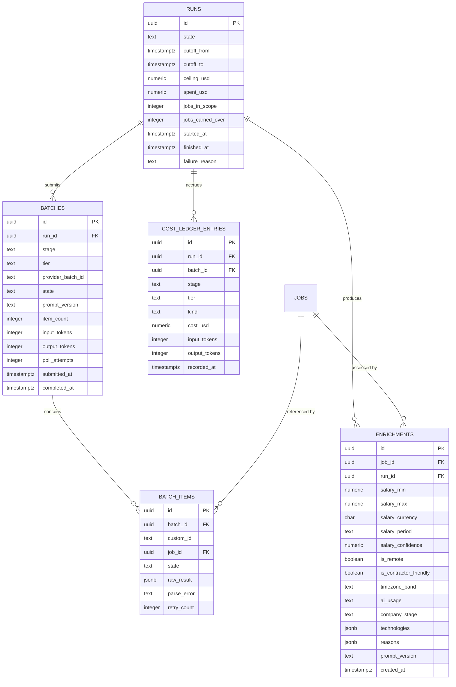

# Data model — f3-claude-batch-enrichment

> **Owns:** `runs`, `batches`, `batch_items`, `cost_ledger_entries`, `enrichments`
> **References (do not redefine):** `jobs`, `companies` (F1/F2).
> **Shared:** `runs`, `batches`, `batch_items` and `cost_ledger_entries` are written by F4, F5 and F8
> as well. F3 owns their schema; the others add rows with a different `stage` value.

## ER diagram

## Entities

### `runs`

One day's intelligence work as a durable aggregate ([[adr/0001-run-as-resumable-state-machine|ADR-F3-0001]]).

| Column | Type | Constraints | Notes |
|---|---|---|---|
| `id` | uuid | PK | |
| `state` | text | NOT NULL | `Created`, `Enriching`, `Matching`, `Ranking`, `Researching`, `Reporting`, `Delivered`, `Failed`, `CostAborted` |
| `cutoff_from` / `cutoff_to` | timestamptz | NOT NULL | the discovery window; `cutoff_from` is the previous Run's `cutoff_to`, so a skipped day is caught up rather than lost |
| `ceiling_usd` | numeric(8,4) | NOT NULL | snapshotted at creation, so changing the config mid-Run cannot retroactively authorise spend |
| `spent_usd` | numeric(8,4) | NOT NULL DEFAULT 0 | denormalised sum of the ledger; the ledger is authoritative |
| `jobs_in_scope` | integer | NOT NULL DEFAULT 0 | |
| `jobs_carried_over` | integer | NOT NULL DEFAULT 0 | items whose batch did not complete before the deadline (AC-09) |
| `started_at` / `finished_at` | timestamptz | | |
| `failure_reason` | text | NULL | plain language; surfaced in the digest footer |

**Access patterns:** "non-terminal Runs to resume on startup" → `idx_runs_resumable`;
"the latest delivered Run" → `idx_runs_delivered`.
**Constraints:** at most one non-terminal Run at a time — a partial unique index, which is what
prevents two Runs racing after a botched restart.

### `batches`

| Column | Type | Constraints | Notes |
|---|---|---|---|
| `id` | uuid | PK | |
| `run_id` | uuid | NOT NULL, FK | |
| `stage` | text | NOT NULL | `Enrichment`, `Matching`, `Research`, `Synthesis` |
| `tier` | text | NOT NULL | `Cheap`, `Deep` |
| `provider_batch_id` | text | NOT NULL | **the resumability anchor** — persisted immediately on submit |
| `state` | text | NOT NULL | `Submitted`, `InProgress`, `Completed`, `Failed`, `Expired` |
| `prompt_version` | text | NOT NULL | (AC-11) |
| `item_count` | integer | NOT NULL | |
| `input_tokens` / `output_tokens` | integer | NULL until retrieved | as reported by the provider |
| `poll_attempts` | integer | NOT NULL DEFAULT 0 | a flat counter over time means the poller has stopped ([[../../operations/runbooks\|R2]]) |
| `submitted_at` / `completed_at` | timestamptz | | |

**Constraints:** **unique `(run_id, stage, tier)`.** This one index is what makes double submission
impossible rather than merely unlikely — a resumed Run that tried to resubmit would violate it and
fail loudly instead of paying twice.

### `batch_items`

One row per item, which is what makes per-item failure isolation possible (QG-3).

| Column | Type | Notes |
|---|---|---|
| `id` | uuid | PK |
| `batch_id` | uuid | FK |
| `custom_id` | text | the job id, so a result maps back with no lookup table |
| `job_id` | uuid | FK → `jobs` |
| `state` | text | `Pending`, `Parsed`, `ParseFailed`, `ProviderError`, `Abandoned` |
| `raw_result` | jsonb | NULL | retained **only for failed items**, 30 days — a successful item's parsed form *is* the enrichment |
| `parse_error` | text | NULL | what was wrong, in one line |
| `retry_count` | smallint | 0, 1, or abandoned (AC-08) |

**Constraints:** unique `(batch_id, custom_id)`.

### `cost_ledger_entries`

Append-only. Two entries per batch: the estimate written **before** submission, and the actual
written on retrieval ([[adr/0002-pre-submission-cost-ceiling|ADR-F3-0002]]).

| Column | Type | Notes |
|---|---|---|
| `id` | uuid | PK |
| `run_id` / `batch_id` | uuid | FK |
| `stage` / `tier` | text | (AC-10) |
| `kind` | text | `Estimated` or `Actual` |
| `cost_usd` | numeric(8,4) | |
| `input_tokens` / `output_tokens` | integer | |
| `recorded_at` | timestamptz | |

The ceiling check sums `Estimated` for batches not yet retrieved plus `Actual` for those that have
been — never both for the same batch. Keeping both kinds rather than overwriting is what makes
estimate accuracy measurable (NFR: within 20%).

**Append-only:** no update path, no delete path. A correction is a compensating entry.

### `enrichments`

The Stage-4 output. Describes the **job**, never the fit.

| Column | Type | Notes |
|---|---|---|
| `id` | uuid | PK |
| `job_id` / `run_id` | uuid | FK |
| `salary_min` / `salary_max` / `salary_currency` / `salary_period` | | the model's **estimate**, deliberately separate from `jobs.salary_*` which is as-published |
| `salary_confidence` | numeric(3,2) | low confidence lets ranking discount an estimate rather than trust it equally |
| `is_remote` / `is_contractor_friendly` | boolean | |
| `timezone_band` | text | `EMEA`, `AMER`, `APAC`, `Global`, `Unknown` |
| `ai_usage` | text | `None`, `Low`, `Medium`, `High` |
| `company_stage` | text | fed back onto `companies.stage` |
| `technologies` | jsonb | model-extracted; kept separate from F2's deterministic `job_technologies` |
| `reasons` | jsonb | **non-empty string array — an enrichment with no reasons is rejected** ([[../../CONTEXT]] invariant 4, AC-02) |
| `prompt_version` | text | (AC-11) |
| `created_at` | timestamptz | |

**Constraints:** unique `(job_id, run_id)` — [[../../CONTEXT]] invariant 3, and the reason replay is
safe (AC-06).

## Indexes

| Index | Columns | Serves |
|---|---|---|
| `idx_runs_resumable` | `runs(state) WHERE state NOT IN ('Delivered','Failed','CostAborted')` | resume on startup |
| `uq_runs_single_active` | unique on `(true)` `WHERE state NOT IN (terminal)` | at most one live Run |
| `idx_runs_delivered` | `runs(finished_at DESC) WHERE state='Delivered'` | latest digest |
| `uq_batches_run_stage_tier` | `batches(run_id, stage, tier)` | no double submission |
| `idx_batches_pending` | `batches(state, submitted_at) WHERE state IN ('Submitted','InProgress')` | poller pick-up |
| `uq_batch_items` | `batch_items(batch_id, custom_id)` | per-item idempotency |
| `idx_batch_items_retry` | `batch_items(state, retry_count) WHERE state='ParseFailed'` | next-Run retry sweep |
| `idx_cost_ledger_run` | `cost_ledger_entries(run_id, stage, tier)` | cost attribution (AC-10) |
| `uq_enrichments_job_run` | `enrichments(job_id, run_id)` | invariant 3 |
| `idx_enrichments_job_latest` | `enrichments(job_id, created_at DESC)` | most recent assessment for a job |

## Handoffs / interfaces

- **Consumes** `JobDiscovered` (F2) to build the Run's scope.
- **Produces** `EnrichmentCompleted` → F4 matching.
- **Produces** `RunCostAborted` → F5 reporting and the Telegram notifier.
- **Provides to F4, F5, F8:** the `Run` aggregate, `ILlmBatchClient`, `CostAccountant`, the batch
  poller and the tolerant parser. They add rows with a different `stage`; they do not extend the schema.

## Related

[[../../architecture/data-model]] · [[sad]] §6 · [[contracts/enrichment-schema]] · [[adr/0001-run-as-resumable-state-machine|ADR-F3-0001]]
