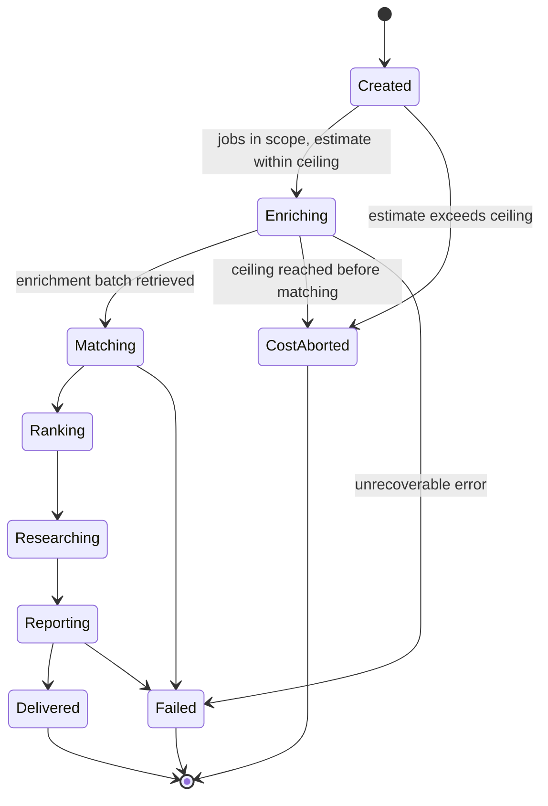

# SAD — F3 Claude Batch Enrichment

> Refines [[../../00-overview/sad|the system SAD]] §6.2. **The Run and Batch machinery defined here
> is reused unchanged by F4, F5 and F8** — this document is their upstream too.

## 1. Intent and quality goals

Own a day's intelligence work as a durable, resumable, cost-bounded state machine, and use it to
assess every new job.

| # | Goal | Verification |
|---|---|---|
| QG-1 | **Resumable at every point** — no interruption causes duplicate spend or lost work | Crash matrix: kill at each of 8 checkpoints, assert convergence |
| QG-2 | **Cost bounded before it is spent** — the ceiling is a precondition, not an alarm | Ceiling test asserts the client is never called |
| QG-3 | **One bad item costs one item** | Mixed-validity fixture: 147 stored, 3 recorded failed, Run completes |

## 2. Constraints

- Message Batches API only; zero synchronous model calls ([[../../00-overview/adr/0005-anthropic-message-batches-two-tier-cascade|ADR-0005]]).
- Output is schema-bound via tool-use, parsed per item, tolerant of failure ([[../../00-overview/adr/0006-structured-output-contract|ADR-0006]]).
- **The CV never enters an F3 prompt.** Enrichment describes the job, not the fit.
- One batch per `(run_id, stage, tier)`, enforced by a unique index — resubmission is impossible by construction.
- Every assessment is unique on `(job_id, run_id)` ([[../../CONTEXT]] invariant 3).

## 3. Context and scope

| External | Interaction | Failure |
|---|---|---|
| Anthropic Message Batches API | submit → poll → retrieve | Partial day; Run stays resumable |
| Ollama (helios) | cheap-tier fallback when the budget is exhausted or offline | Optional; absence degrades quality, not availability |

**In:** the Run aggregate and its state machine, the Batch lifecycle and poller, cost estimation and
the ledger, `ILlmBatchClient` and its Anthropic adapter, the enrichment prompt and schema, per-item
tolerant parsing, retry policy.
**Out:** matching (F4), ranking (F4/F7), digest synthesis (F5 — though it submits through this
machinery), research (F8 — likewise).

## 4. Solution strategy

| # | Choice | Why |
|---|---|---|
| S1 | The Run is an aggregate with an explicit state column, not an in-memory orchestration | A five-hour process cannot live in a call stack ([[adr/0001-run-as-resumable-state-machine\|ADR-F3-0001]]) |
| S2 | The provider's batch id is persisted **immediately on submit**, before anything else | It is the one fact that makes resumption possible; losing it means paying twice |
| S3 | Cost is estimated and recorded **before** submission | QG-2. An after-the-fact ledger cannot enforce a ceiling ([[adr/0002-pre-submission-cost-ceiling\|ADR-F3-0002]]) |
| S4 | One row per batch item, with its raw result and any parse error | QG-3, and it makes a parse failure inspectable a week later |
| S5 | Polling is a delayed job that re-enqueues itself, not a loop | Survives restart; backoff is scheduling, not sleeping |
| S6 | `ILlmBatchClient` is provider-agnostic; all Anthropic specifics live in the adapter | Fixture-driven tests with zero network, and Ollama becomes a second adapter rather than a fork |

## 5. Building block view

```text
JobHunter.Domain/Pipeline/     Run · RunState · Batch · BatchState · BatchItem
                               ModelTier · CostLedger · CostEstimate
JobHunter.Domain/Intelligence/ Enrichment · SalaryEstimate · TimezoneBand · AiUsageLevel
JobHunter.Domain/Abstractions/ ILlmBatchClient · ICostAccountant

JobHunter.Application/Enrichment/  RunOrchestrator · StartRunHandler
                                   EnrichmentSubmitHandler · BatchPollJob
                                   BatchResultProcessor · EnrichmentRetryPolicy

JobHunter.Claude/              AnthropicBatchClient · AnthropicOptions
                               Prompts/EnrichmentPrompt.cs (versioned raw strings)
                               Schemas/EnrichmentSchema.cs (generated from the record)
                               Parsing/TolerantJsonParser.cs
                               CostAccountant.cs · PricingTable.cs
                               Fixtures/ (recorded batch results)
```

The port is deliberately three methods — the whole asynchronous lifecycle and nothing else:

```csharp
public interface ILlmBatchClient
{
    Task<string> SubmitAsync(BatchSubmission submission, CancellationToken ct);
    Task<BatchStatus> GetStatusAsync(string providerBatchId, CancellationToken ct);
    IAsyncEnumerable<BatchResultItem> GetResultsAsync(string providerBatchId, CancellationToken ct);
}

public sealed record BatchSubmission(ModelTier Tier, string PromptVersion, IReadOnlyList<BatchRequestItem> Items);
public sealed record BatchRequestItem(string CustomId, string SystemPrompt, string UserContent, JsonSchema OutputSchema);
public sealed record BatchResultItem(string CustomId, string? RawJson, string? ProviderError, TokenUsage Usage);
```

`GetResultsAsync` streams because a 150-item result set arrives as JSONL and there is no reason to
hold it all in memory — and because streaming makes per-item failure isolation natural.

## 6. Runtime view

### 6.1 The Run state machine



Only `Delivered`, `Failed` and `CostAborted` are terminal. On startup the orchestrator loads every
non-terminal Run and re-enters at its current state — that single behaviour is the whole of QG-1.

`CostAborted` is terminal *for the cost path*, but hitting the ceiling still owes the Owner a digest.
The Run does not resume through `Reporting`: on cost-abort it emits `RunCostAborted`, and F5 consumes
that event to send the degraded/aborted digest **synchronously in that same flow**. The reporting
obligation is discharged by the `RunCostAborted` handler (F5), not by a state transition — silence
would be worse than a reduced digest.

### 6.2 Submit, poll, retrieve

```mermaid
sequenceDiagram
  autonumber
  participant H as Hangfire (0 2 * * *)
  participant O as RunOrchestrator
  participant DB as PostgreSQL
  participant C as CostAccountant
  participant A as ILlmBatchClient
  participant P as BatchPollJob

  H->>O: StartDailyRun
  O->>DB: create Run{Created, ceiling}
  O->>DB: jobs discovered since previous cutoff_to
  O->>C: Estimate(jobs, Cheap, promptVersion)
  alt estimate + spent > ceiling
    O->>DB: Run.state = CostAborted, reason recorded
    O->>DB: outbox ← RunCostAborted
    Note over O: client never called (QG-2, AC-03)
  else within ceiling
    O->>DB: cost_ledger_entry (estimated) — BEFORE submit (AC-04)
    O->>A: SubmitAsync(150 items, Cheap)
    A-->>O: providerBatchId
    O->>DB: batch{Submitted, providerBatchId} — persisted immediately (S2)
    O->>DB: Run.state = Enriching
    O->>P: schedule poll in 2 min
  end

  loop until ended, backoff 2→15 min, cap 6 h
    P->>A: GetStatusAsync
    alt in_progress
      A-->>P: in_progress
      P->>DB: poll_attempts += 1
      P->>P: re-enqueue with backoff (S5)
    else ended
      A-->>P: ended
    end
  end

  P->>A: GetResultsAsync (streamed)
  loop per item
    alt parses and validates
      P->>DB: upsert enrichment (job_id, run_id) — unique, so replay is safe (AC-06)
      P->>DB: batch_item.state = Parsed
    else malformed or no reasons
      P->>DB: batch_item{ParseFailed, raw_result, parse_error} (AC-02, AC-07)
    end
  end
  P->>DB: cost_ledger_entry (actual, from reported usage)
  P->>DB: batch.state = Completed; Run.state = Matching
  P->>DB: outbox ← EnrichmentCompleted
```

### 6.3 Deadline and carry-over

```mermaid
sequenceDiagram
  autonumber
  participant H as Hangfire (06:45)
  participant O as RunOrchestrator
  participant DB as PostgreSQL

  H->>O: DeliveryDeadlineApproaching
  O->>DB: batches still Submitted or InProgress
  alt none outstanding
    O->>DB: proceed normally
  else outstanding
    O->>DB: mark Run partial; record carried-over job count
    O->>DB: outbox ← RankingCompleted (with what completed)
    Note over O,DB: 07:00 is never delayed (AC-09).<br/>The batch keeps polling; its results land in tomorrow's Run.
  end
```

## 7. Deployment view

Runs in `jobhunter-worker`. Requires outbound HTTPS to the Anthropic API and the API key from
Infisical. No ingress, no new deployable.

**Monitoring:** `jobhunter.run.duration`, `jobhunter.run.cost_usd`, `jobhunter.batch.latency`,
`jobhunter.llm.parse_failures{stage,prompt_version}`, and a Run-state gauge.
Alerts: Run stuck > 6 h, cost > 70% of ceiling, any `RunCostAborted`, parse failures > 5%.
Runbooks [[../../operations/runbooks|R2, R3, R5]].

## 8. Crosscutting concepts

| Concept | Convention |
|---|---|
| Idempotency | Enrichment on `(job_id, run_id)`; batch on `(run_id, stage, tier)`; item on `(batch_id, custom_id)` |
| `custom_id` | The job id, so a result maps back without a lookup table |
| Prompt versioning | `PromptVersion` constant per prompt; stamped on batch and enrichment (AC-11) |
| Pricing | Tier → model id → USD per million tokens, in configuration; a model upgrade is a config change |
| Estimation | Token count from the actual rendered prompt, not a heuristic — the estimate is accurate because it measures the real input |
| Backoff | 2 min doubling to 15 min, 6 h cap, jittered |
| Tolerant parsing | Schema validate → semantic validate → clamp → reject with reason. Never throw on a single item |
| Retry | A failed item retries once, next Run, cheap tier. Twice-failed is dropped and recorded |

## 9. Architecture decisions

| # | Title | Status |
|---|---|---|
| [[../../00-overview/adr/0005-anthropic-message-batches-two-tier-cascade\|ADR-0005]] | Batch API, two-tier cascade | Accepted |
| [[../../00-overview/adr/0006-structured-output-contract\|ADR-0006]] | Schema-bound output, tolerant parsing | Accepted |
| [[adr/0001-run-as-resumable-state-machine\|F3-0001]] | The Run as a durable resumable aggregate | Accepted |
| [[adr/0002-pre-submission-cost-ceiling\|F3-0002]] | Estimate and record cost before submitting | Accepted |

## 10. Quality requirements

**QG-1. Resumable at every point**
- **When:** the worker is killed at any of eight checkpoints — after Run creation, after the ledger
  entry, after submit but before the batch row commits, after the batch row, mid-poll, after status
  `ended` but before retrieval, mid-result-processing, after processing but before the state change.
- **Then:** restarting converges on the same enrichments, spends nothing further on the completed
  batch, and produces no duplicate rows.
- **How verify:** a crash-matrix integration test, one case per checkpoint, asserting final-state
  equality and a call counter on a fake client proving `SubmitAsync` was invoked exactly once.

**QG-2. Cost bounded before it is spent**
- **When:** a Run's remaining ceiling is below the estimated cost of the next batch.
- **Then:** `SubmitAsync` is **never called**, the Run is `CostAborted`, and a reduced digest still ships.
- **How verify:** a fake client whose `SubmitAsync` throws if invoked; the test passes only if it is
  not invoked. Asserting absence of a call is stronger than asserting a state.

**QG-3. One bad item costs one item**
- **When:** a batch result contains malformed, schema-violating and reasonless items among valid ones.
- **Then:** valid items are stored, each bad item is recorded with its error and raw content, and the
  Run reaches `Matching`.
- **How verify:** a mixed-validity fixture — 147 valid, 3 bad — asserting 147 enrichments, 3 failed
  items, and a completed Run.

## 11. Risks and technical debt

| # | Item | Impact | Plan |
|---|---|---|---|
| D1 | Batch SLA is up to 24 h; a slow day means an incomplete digest | Reduced digest | Partial-day policy (AC-09); carry-over is visible in the digest footer, not silent |
| D2 | Prompt changes silently shift quality | Undetected regression | `PromptVersion` on every row; golden fixtures gate prompt changes; nightly live-drift job |
| D3 | The pricing table goes stale after a provider change | Estimates drift, the ceiling loses meaning | Estimate-vs-actual is a tracked metric; > 20% drift is an alert |
| D4 | `batch_items.raw_result` retains model output indefinitely | Storage | Retained 30 days for failed items, 0 for succeeded (the enrichment *is* the parsed result) |
| D5 | A provider-side batch id lost between submit and commit means paying twice | Duplicate charge | The window is one statement wide; mitigated by listing recent provider batches on startup and reconciling before submitting |

**Accepted debt:** no escalation of ambiguous items to the deep tier; no prompt-eval tooling; no
cross-Run deduplication of identical job text.

## 12. Glossary

`Run`, `Batch`, `ModelTier`, `Enrichment`, `CostLedger` are defined in [[../../CONTEXT]] §1.
