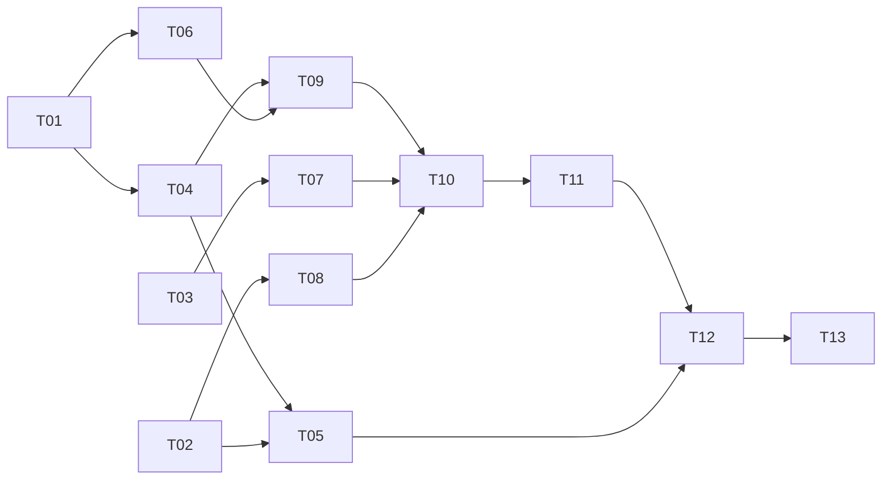

# Task tracker — F3 Claude Batch Enrichment

Epic: [[_epic|_epic]]. The Run and Batch machinery built here is reused unchanged by F4, F5 and F8.

Each task is one reviewable PR (≤500 LOC), ≤1 day. Owner: Viacheslav (solo).
Estimate legend: **S** ≈ 2 h · **M** ≈ half a day · **L** ≈ a full day.
Status: `pending` → `in_progress` → `in_review` → `done`.

| ID | Task | Layer | Deps | Est | Status |
|---|---|---|---|---|---|
| T01 | [[T01-domain-run-batch\|Domain: Run, RunState, Batch, BatchItem]] | domain | — | M | pending |
| T02 | [[T02-domain-enrichment\|Domain: Enrichment and its value objects]] | domain | — | S | pending |
| T03 | [[T03-llm-batch-port\|ILlmBatchClient port and fake implementation]] | domain | — | S | pending |
| T04 | [[T04-pipeline-persistence\|Migration and repositories for Run, Batch, Ledger]] | infra/db | T01 | M | pending |
| T05 | [[T05-enrichment-persistence\|Migration and repository for enrichments]] | infra/db | T02, T04 | S | pending |
| T06 | [[T06-cost-accountant\|CostAccountant, pricing table and token estimation]] | claude | T01 | M | pending |
| T07 | [[T07-anthropic-batch-client\|AnthropicBatchClient]] | claude | T03 | L | pending |
| T08 | [[T08-prompt-schema-parser\|Enrichment prompt, schema and tolerant parser]] | claude | T02 | L | pending |
| T09 | [[T09-run-orchestrator\|RunOrchestrator: start, scope, resume]] | app | T04, T06 | M | pending |
| T10 | [[T10-enrichment-submit\|Enrichment submission with the cost gate]] | app | T07, T08, T09 | M | pending |
| T11 | [[T11-batch-poller\|Batch poller with backoff and deadline]] | app | T10 | M | pending |
| T12 | [[T12-result-processing\|Result processing, per-item isolation and retry]] | app | T11, T05 | L | pending |
| T13 | [[T13-crash-matrix-golden\|Crash matrix, golden set and cost dashboards]] | tests | T12 | L | pending |

**13 tasks · 3×S + 6×M + 4×L ≈ 7.75 person-days.**

## Dependency graph

## DoR / DoD

- **DoR:** the feature's PRD, SAD, data-model and test-plan are accepted
  ([[../../../IMPLEMENTATION-READINESS|readiness]]); the task's own ACs and ADR links resolve.
- **DoD (every task):** code compiles with zero warnings; the crash matrix stays green; the ceiling test asserts the client is never called; prompt or schema changes ship updated golden fixtures; the coverage gate stays green; the tracker row is updated in the same PR.

See [[../../../IMPLEMENTATION-READINESS]] §4 for the full per-task checklist.
