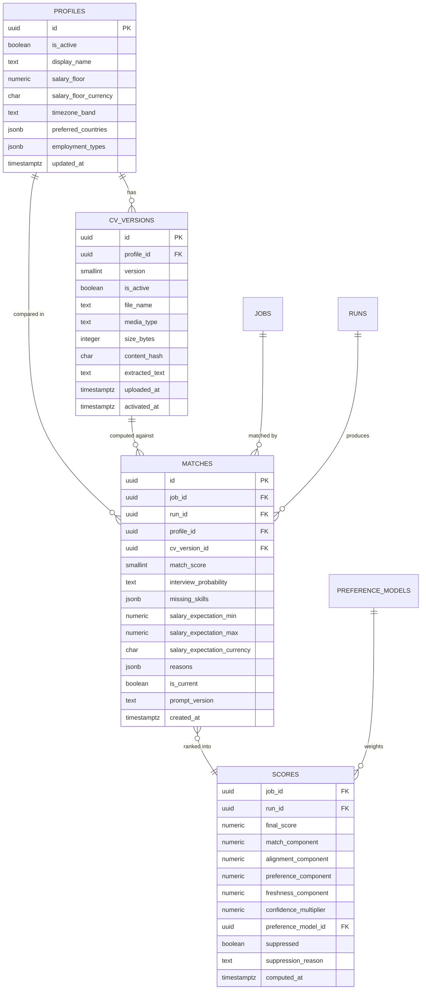

# Data model — f4-cv-matching-ranking

> **Owns:** `profiles`, `cv_versions`, `matches`, `scores`
> **References (do not redefine):** `jobs` (F2), `enrichments`, `runs`, `batches` (F3),
> `preference_models` (F7 — F4 reads the active one).

## ER diagram

## Entities

### `profiles`

The Owner's structured career facts. Exactly one is active.

| Column | Type | Constraints | Notes |
|---|---|---|---|
| `id` | uuid | PK | |
| `is_active` | boolean | NOT NULL | partial unique index enforces exactly one |
| `display_name` | text | NOT NULL | |
| `salary_floor` / `salary_floor_currency` | numeric(12,2) / char(3) | NULL | a down-weight, not a filter, until explicitly opted in ([[../../ARCHITECTURE-OPEN-DECISIONS\|O5]]) |
| `timezone_band` | text | NOT NULL | the Owner's own band, compared against the job's |
| `preferred_countries` | jsonb | NOT NULL | explicit preferences; F7 learns additional weights separately |
| `employment_types` | jsonb | NOT NULL | `[FullTime, Contract]` |
| `updated_at` | timestamptz | NOT NULL | |

The Profile holds **explicit** preferences the Owner stated. `preference_weights` (F7) holds
**learned** ones. Keeping them in different tables means a learned weight can never silently
overwrite something the Owner said outright.

> **Planned change (TUNE-05, F4 T16):** add `target_role_families jsonb`, `desired_ai_usage_floor text`
> and optional `target_titles jsonb` so the Owner's career *goal* (not just present facts) is encoded and
> fed to the match prompt. These are Profile facts, not CV text, so no new leakage surface. See the
> [[../../../reviews/career-alignment-tuning-backlog|tuning backlog]].

### `cv_versions`

Immutable. A new upload is a new row ([[adr/0002-cv-versioning-and-restaling|ADR-F4-0002]]).

| Column | Type | Constraints | Notes |
|---|---|---|---|
| `id` | uuid | PK | |
| `profile_id` | uuid | NOT NULL, FK | |
| `version` | smallint | NOT NULL | monotonic per profile |
| `is_active` | boolean | NOT NULL | partial unique index: one active per profile |
| `file_name` / `media_type` / `size_bytes` | | | media type is **sniffed**, not taken from the extension |
| `content_hash` | char(64) | NOT NULL | re-uploading identical content is a no-op, not a new version |
| `extracted_text` | text | NOT NULL | **the only column in the system holding CV content** |
| `uploaded_at` / `activated_at` | timestamptz | | |

**Security note.** `extracted_text` is the single storage location for CV content in the entire
schema. Nothing else — no index, no cache, no denormalised copy, no log table — may hold it. That
constraint is what makes the QG-2 leakage scan a meaningful test rather than a formality.

The original binary is **not** stored: text extraction happens once at upload, in-process, and the
file is discarded. Less data at rest, and no file to serve.

### `matches`

| Column | Type | Constraints | Notes |
|---|---|---|---|
| `id` | uuid | PK | |
| `job_id` / `run_id` / `profile_id` / `cv_version_id` | uuid | NOT NULL, FK | |
| `match_score` | smallint | NOT NULL | 0–100, the model's judgement — **not** the final ordering number |
| `interview_probability` | text | NOT NULL | `Low`, `Moderate`, `Good`, `Strong` — a band, not a percentage, until calibrated (SAD §11 D4) |
| `missing_skills` | jsonb | NOT NULL | may be empty; empty is meaningful |
| `salary_expectation_min` / `_max` / `_currency` | | NULL | what the Owner could plausibly ask for *this* role |
| `reasons` | jsonb | NOT NULL | **non-empty** — invariant 4, AC-02 |
| `is_current` | boolean | NOT NULL DEFAULT true | set false when its CV version is superseded (AC-08) |
| `prompt_version` | text | NOT NULL | |
| `created_at` | timestamptz | NOT NULL | |

**Constraints:** unique `(job_id, run_id, profile_id)` — invariant 3, and what makes replay safe.

`is_current` rather than deletion: a match made against an older CV remains the honest record of what
was true then. Marking it stale is information; deleting it destroys the ability to explain why
yesterday's digest said what it said.

### `scores`

The output of arithmetic, not of a model. Every component is stored (QG-1).

| Column | Type | Notes |
|---|---|---|
| `job_id` / `run_id` | uuid | PK together |
| `final_score` | numeric(5,2) | 0–100, the digest's ordering key |
| `match_component` | numeric(5,4) | normalised `match_score`, before weighting |
| `alignment_component` | numeric(5,4) | career alignment from `AiUsage` × `RoleFamily` tier (TUNE-01, T14) |
| `preference_component` | numeric(5,4) | from the active preference model |
| `freshness_component` | numeric(5,4) | exponential decay on age |
| `confidence_multiplier` | numeric(3,2) | 1.00 with an enrichment, 0.85 without (AC-09) |
| `preference_model_id` | uuid | FK — which model version produced the preference component |
| `suppressed` | boolean | |
| `suppression_reason` | text | NULL unless suppressed — invariant 11, AC-05 |
| `computed_at` | timestamptz | |

**Reconciliation is asserted, not assumed:** a test recomputes `final_score` from the five stored
components and the recorded weights, and fails if it does not match. A score that cannot be
reconstructed from its own components is a bug, not a rounding difference.

**A `scores` row may exist with no `matches` row.** A job excluded by the pre-match filter
([[adr/0003-pre-match-filter-and-cv-caching|ADR-F4-0003]]) never reaches the deep tier, so it has no
match, yet it still gets a `scores` row with `suppressed = true` and a rule reason (invariant 11,
AC-12). The ERD relationship is therefore `MATCHES }o--|| SCORES`, not a mandatory 1:1.

## Indexes

| Index | Columns | Serves |
|---|---|---|
| `uq_profiles_active` | `profiles(is_active) WHERE is_active` | exactly one active profile |
| `uq_cv_versions_active` | `cv_versions(profile_id, is_active) WHERE is_active` | exactly one active CV |
| `uq_cv_versions_hash` | `cv_versions(profile_id, content_hash)` | re-uploading identical content is a no-op |
| `uq_matches_job_run_profile` | `matches(job_id, run_id, profile_id)` | invariant 3 |
| `idx_matches_current` | `matches(job_id, created_at DESC) WHERE is_current` | latest current match for a job |
| `idx_matches_cv_version` | `matches(cv_version_id) WHERE is_current` | the re-staling sweep (AC-08) |
| `idx_scores_run_final` | `scores(run_id, final_score DESC) WHERE NOT suppressed` | **the digest query** |
| `idx_scores_suppressed` | `scores(run_id) WHERE suppressed` | the "what did I hide, and why" footer |

## Handoffs / interfaces

- **Consumes** `EnrichmentCompleted` (F3), `enrichments`, `jobs`, and the active `preference_models` (F7).
- **Produces** `MatchingCompleted` → ranking; `RankingCompleted` → F5 reporting, F8 research, F9 indexing.
- **Produces** `CvVersionActivated` → the re-match scheduler.
- `scores` is read by F5 (digest), F7 (suppression feedback) and F9 (search ordering).

## Related

[[../../architecture/data-model]] · [[sad]] §8 · [[contracts/match-schema]] ·
[[adr/0001-explainable-linear-scoring|ADR-F4-0001]]
