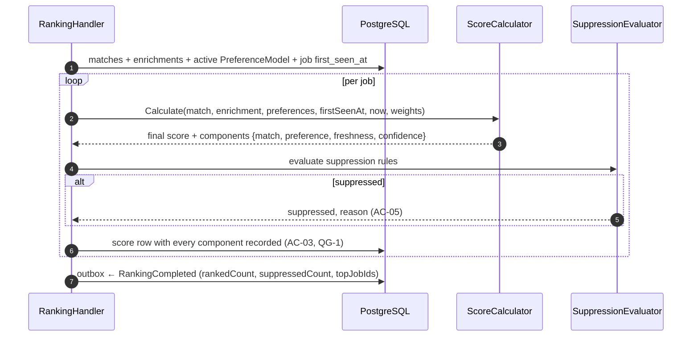
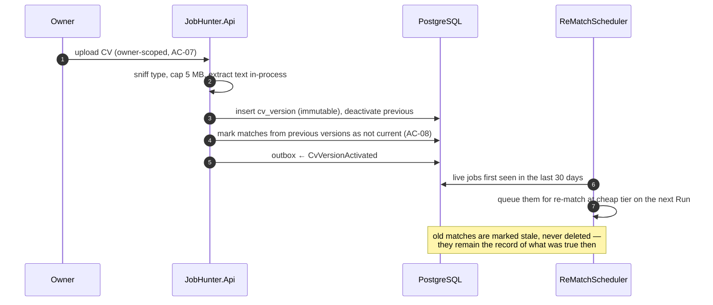

# SAD — F4 CV Matching & Ranking

> Refines [[../../00-overview/sad|the system SAD]] §6.2 and §6.3. Reuses the Run and Batch machinery
> from [[../f3-claude-batch-enrichment/sad|F3]] without extending it.

## 1. Intent and quality goals

Turn "here is a job" into "here is how well it fits you, why, and where it sits in today's order".

| # | Goal | Verification |
|---|---|---|
| QG-1 | **Every number is explainable** — a score decomposes into named components that sum to it | Assertion on every score row; a score whose components do not reconcile fails |
| QG-2 | **The CV crosses exactly one boundary** | Automated leakage scan over logs, spans, index documents and notifications |
| QG-3 | **Ranking is deterministic** — same inputs, same order, forever | Property test under varying culture, clock and enumeration order |
| QG-4 | **Cost scales with jobs worth judging, not jobs discovered** | Run cost < $0.60 for matching at 150 discovered; cache-hit and pre-filter assertions in CI |

## 2. Constraints

- Matching uses the **deep** tier; enrichment used cheap ([[../../00-overview/adr/0005-anthropic-message-batches-two-tier-cascade|ADR-0005]]).
- One active `Profile` and one active `CvVersion` at a time.
- The final Score is computed in code, never by the model ([[adr/0001-explainable-linear-scoring|ADR-F4-0001]]).
- Suppression records a reason and never deletes ([[../../CONTEXT]] invariant 11).
- Every match carries at least one reason ([[../../CONTEXT]] invariant 4).

## 3. Context and scope

**In:** profile and CV ingestion and versioning, text extraction, the matching batch, the match
schema and prompt, the ranking formula, suppression, re-staling on CV change.
**Out:** enrichment (F3), preference fitting (F7 — F4 only *consumes* the active model), digest
assembly (F5), search (F9).

| External | Interaction |
|---|---|
| Anthropic Batch API | one deep-tier batch per Run, via F3's `ILlmBatchClient` |
| — | no other external system; the CV never leaves this boundary |

## 4. Solution strategy

| # | Choice | Why |
|---|---|---|
| S1 | Matching is a separate stage and batch from enrichment | Different tier, different prompt, different data sensitivity. It also means enrichment can be cached and reasoned about without personal data anywhere near it |
| S2 | The model returns a **judgement**; the Score is arithmetic on top | QG-1 and QG-3. The order can be tuned, tested and explained without touching a prompt ([[adr/0001-explainable-linear-scoring\|ADR-F4-0001]]) |
| S3 | CV text is passed by value into exactly one prompt builder, never stored in a context object that travels | Makes QG-2 a structural property rather than a discipline |
| S4 | Suppression is a flag plus a reason on the score row, never a filter in a query | The Owner can always be told what was hidden and why ([[../../CONTEXT]] invariant 11) |
| S5 | CV versions are immutable; activating a new one re-stales rather than rewrites | [[adr/0002-cv-versioning-and-restaling\|ADR-F4-0002]] |
| S6 | A missing enrichment reduces confidence rather than skipping the job | AC-09. A job we know less about should rank lower, not vanish |
| S7 | A factual pre-match filter runs before the batch is built, and the CV prefix is prompt-cached | Matching is 73% of Run cost; both together cut it by ~72% without touching judgement quality ([[adr/0003-pre-match-filter-and-cv-caching\|ADR-F4-0003]]) |

## 5. Building block view

```text
JobHunter.Domain/Profiles/     Profile · CvVersion · CvDocument · SkillSet
JobHunter.Domain/Intelligence/ Match · MatchScore · InterviewProbability · Score · ScoreComponents

JobHunter.Application/Matching/  MatchingSubmitHandler · MatchResultProcessor
                                 CvActivationHandler · ReMatchScheduler
JobHunter.Application/Ranking/   RankingHandler · ScoreCalculator · SuppressionEvaluator

JobHunter.Claude/Prompts/MatchPrompt.cs        (versioned; the ONLY place CV text is rendered)
JobHunter.Claude/Schemas/MatchSchema.cs
JobHunter.Infrastructure/Persistence/          ProfileRepository · CvVersionRepository
                                               MatchRepository · ScoreRepository
JobHunter.Infrastructure/Cv/                   PdfTextExtractor · MarkdownTextExtractor
```

`ScoreCalculator` is a pure function with no dependencies at all:

```csharp
public static ScoreResult Calculate(
    MatchFacts match, EnrichmentFacts? enrichment, PreferenceModel preferences,
    DateTimeOffset firstSeenAt, DateTimeOffset now, RankingWeights weights);
```

No repository, no clock, no options object — every input is explicit. That signature is what makes
QG-3 provable rather than argued.

## 6. Runtime view

### 6.1 Matching

```mermaid
sequenceDiagram
  autonumber
  participant O as RunOrchestrator
  participant M as MatchingSubmitHandler
  participant DB as PostgreSQL
  participant C as CostAccountant
  participant A as ILlmBatchClient
  participant P as BatchPoller (F3)

  O->>M: EnrichmentCompleted
  M->>DB: jobs in Run scope + their enrichments + active CvVersion
  M->>C: Estimate(items, Deep, matchPromptVersion)
  alt would breach ceiling
    M->>DB: Run.state = CostAborted (invariant 6)
  else within ceiling
    M->>DB: ledger (Estimated) — before the call
    M->>A: SubmitAsync(items, Deep)
    Note over M,A: CV text is rendered here and nowhere else (QG-2)
    A-->>M: providerBatchId
    M->>DB: batch{Matching, Deep, Submitted}; Run.state = Matching
  end
  P->>A: poll → retrieve (F3 machinery, unchanged)
  loop per item
    alt valid and has reasons
      P->>DB: upsert match (job_id, run_id, profile_id)
    else invalid
      P->>DB: batch_item ParseFailed (AC-10)
    end
  end
  P->>DB: outbox ← MatchingCompleted
```

### 6.2 Ranking



### 6.3 CV activation and re-staling



## 7. Deployment view

Runs in `jobhunter-worker`, except CV upload which is an owner-scoped endpoint on `jobhunter-api`.
No new deployable.

**Monitoring:** `jobhunter.match.score_distribution`, `jobhunter.ranking.suppressed`,
`jobhunter.precision_at_10` (weekly, from Owner ratings), plus F3's cost and parse metrics with
`stage=Matching`.

## 8. Crosscutting concepts

| Concept | Convention |
|---|---|
| Ranking formula | `Score = 100 × (w_m·match + w_p·preference + w_f·freshness) × confidence`, weights summing to 1 |
| Default weights | `w_m = 0.60`, `w_p = 0.25`, `w_f = 0.15` — configuration, documented, not model-controlled |
| Freshness | `exp(-ageDays / 7)` — a job a week old scores ~0.37 on this component; recency matters but does not dominate |
| Confidence | `1.0` with an enrichment, `0.85` without (AC-09) — a multiplier, so uncertainty lowers rather than excludes |
| Suppression | `score < threshold` or a preference hard rule; always with a reason string |
| CV handling | passed by value into one prompt builder; never on a context object, never in a log scope, never in a span attribute |
| Idempotency | match on `(job_id, run_id, profile_id)`; score on `(job_id, run_id)` |
| Determinism | `ScoreCalculator` is static and pure; no clock, no culture, no ordering dependency |

## 9. Architecture decisions

| # | Title | Status |
|---|---|---|
| [[adr/0001-explainable-linear-scoring\|F4-0001]] | Transparent linear scoring, not a learned ranker | Accepted |
| [[adr/0002-cv-versioning-and-restaling\|F4-0002]] | Immutable CV versions; re-stale rather than rewrite | Accepted |

## 10. Quality requirements

**QG-1. Every number is explainable**
- **When:** any score is presented.
- **Then:** its components are stored, each is attributable to a named input, and they reconcile to
  the final value within floating-point tolerance.
- **How verify:** an assertion on every persisted score row; a score whose components do not
  reconcile fails the test rather than being rounded away.

**QG-2. The CV crosses exactly one boundary**
- **When:** a full Run executes with a realistic CV.
- **Then:** no distinctive CV phrase appears in any log line, span attribute, Typesense document,
  Telegram message or API response other than the CV retrieval endpoint.
- **How verify:** a leakage-scan suite that seeds the CV with unique sentinel tokens, runs a full
  pipeline, and greps every emitted artifact for them. **This is the feature's security gate.**

**QG-3. Ranking is deterministic**
- **When:** the same match, enrichment, preference model and timestamps are scored repeatedly, on
  any machine, in any culture, with inputs in any order.
- **Then:** the score is bit-identical and the ordering is stable.
- **How verify:** property test over 10 000 generated inputs, run under three cultures and with
  shuffled input ordering.

## 11. Risks and technical debt

| # | Item | Impact | Plan |
|---|---|---|---|
| D1 | Match quality is the product, and it is not directly assertable | Silent degradation | Golden ranking set with expected top-5 ordering; `precision@10` tracked weekly; prompt changes gated on the golden set |
| D2 | The weights are guesses until F7 has data | Sub-optimal ordering | Weights are configuration, documented and tunable without a deploy; F7 tunes the preference component only |
| D3 | The CV boundary depends on developer discipline in one prompt builder | Leak | Structural mitigation (pass by value, never on a context object) plus the automated sentinel scan |
| D4 | Interview probability is uncalibrated at launch | Misleading precision | Presented as a band (`Low`/`Moderate`/`Good`/`Strong`), not a percentage, until calibration data exists |
| D5 | Re-matching 30 days of jobs after a CV change is a cost spike | Ceiling breach on that day | Re-match runs at cheap tier and is ledgered like any other work, so the ceiling governs it |

**Accepted debt:** one profile only; no learned ranker; no per-job feedback loop tighter than the
weekly preference refit.

## 12. Glossary

`Profile`, `CV`, `Match`, `Score`, `PreferenceModel` are defined in [[../../CONTEXT]] §1.
