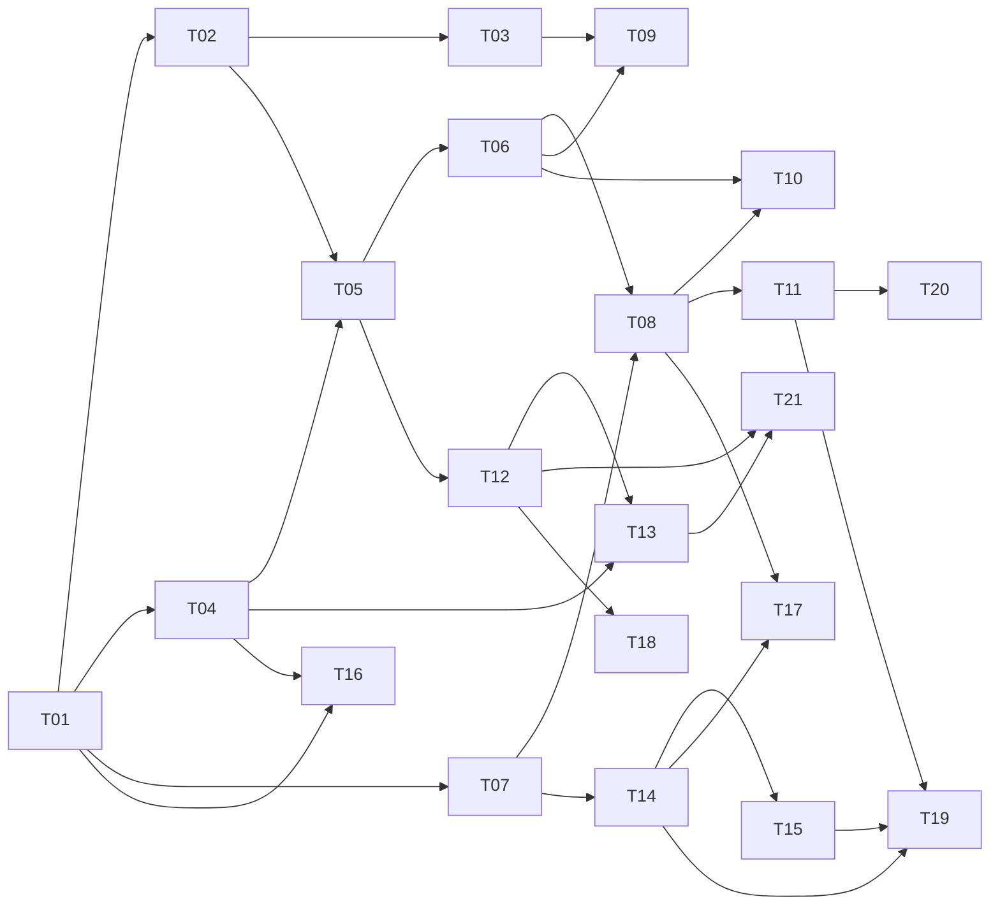

# Task tracker — F4 CV Matching & Ranking

Epic: [[_epic|_epic]]. The only feature that handles personal data. A security review is required before it ships.

> Tasks T14–T19 added from the [[../../../reviews/career-alignment-tuning-backlog|career-alignment tuning backlog]] (career-goal alignment).

Each task is one reviewable PR (≤500 LOC), ≤1 day. Owner: Viacheslav (solo).
Estimate legend: **S** ≈ 2 h · **M** ≈ half a day · **L** ≈ a full day.
Status: `pending` → `in_progress` → `in_review` → `done`.

| ID | Task | Layer | Deps | Est | Status |
|---|---|---|---|---|---|
| T01 | [[T01-domain-profile-match\|Domain: Profile, CvVersion, Match, Score]] | domain | — | M | done |
| T02 | [[T02-matching-persistence\|Migration and repositories for profiles, CVs, matches, scores]] | infra/db | T01 | M | done |
| T03 | [[T03-cv-upload-versioning\|CV upload, text extraction and versioning]] | app | T02 | M | done |
| T04 | [[T04-match-prompt-schema\|Match prompt, schema and parser]] | claude | T01 | L | done |
| T05 | [[T05-matching-submit\|Matching submission through the F3 Run machinery]] | app | T04, T02 | M | done |
| T06 | [[T06-match-result-processing\|Match result processing]] | app | T05 | M | done |
| T07 | [[T07-score-calculator\|ScoreCalculator]] | app | T01 | M | done |
| T08 | [[T08-ranking-suppression\|Ranking handler and suppression]] | app | T07, T06 | M | done |
| T09 | [[T09-cv-restaling\|CV activation, re-staling and re-match scheduling]] | app | T03, T06 | M | done |
| T10 | [[T10-leakage-suite\|CV leakage scan suite]] | tests | T06, T08 | L | done |
| T11 | [[T11-golden-ranking\|Golden ranking set (gate G10)]] | tests | T08 | L | done |
| T12 | [[T12-pre-match-filter\|Pre-match filter]] | app | T05 | M | done |
| T13 | [[T13-cv-prompt-caching\|CV prompt caching]] | claude | T04, T12 | M | done |
| T14 | [[T14-alignment-score-component\|Add an alignment score component]] | app | T07 | M | done |
| T15 | [[T15-anti-goal-downweight\|Down-weight anti-goal roles in the score]] | app | T14 | S | done |
| T16 | [[T16-owner-career-goal\|Encode the Owner's career goal in the Profile + match prompt]] | app | T01, T04 | M | pending |
| T17 | [[T17-negative-role-family-filter\|Negative role-family filter (ML-Researcher / Data-Scientist / Prompt-Engineer / CRUD)]] | app | T08, T14 | S | done |
| T18 | [[T18-founding-role-seniority-floor\|Soften the seniority-floor pre-match rule for early-stage/founding roles]] | app | T12 | S | done |
| T19 | [[T19-golden-target-family-slice\|Add a target-role-family slice to the golden ranking set]] | tests | T11, T14, T15 | M | done |
| T20 | [[T20-precision-at-10-loop\|Weekly precision@10 rating loop]] | app | T11, F5, F7-T03, F10 | M | pending |
| T21 | [[T21-regret-sampler\|Regret sampler, matching metrics and live cost measurement]] | app | T12, T13, F5 | M | pending |

**15 tasks · 12×M + 3×L ≈ 9 person-days.** T20 was split from T11: the golden set (the deterministic
gate) ships in T11; the weekly `precision@10` rating loop is T20, blocked on the `signals` table (F7 T03),
the digest (F5) and the Telegram command surface (F10). T21 was split from T13: the CV-prompt-caching
wire-up (the `cache_control` breakpoint and its zero-network assertions) ships in T13; the regret sampler,
the `prefiltered`/`regret` metrics and the live-API cost measurement are T21, blocked on the notifier
alert path (F5) and the opt-in weekly live suite.

**Career-alignment tuning tasks (T14–T19): 3×M + 3×S ≈ 2.25 person-days.** Added from the
[[../../../reviews/career-alignment-tuning-backlog|career-alignment tuning backlog]] (TUNE-01, TUNE-02,
TUNE-05, TUNE-06, TUNE-13, TUNE-14); they add the `alignment` component, anti-goal / negative-family
handling, the Owner career-goal Profile fields, a softened seniority floor, and a golden slice that
gates the change.

## Dependency graph

## DoR / DoD

- **DoR:** the feature's PRD, SAD, data-model and test-plan are accepted
  ([[../../../IMPLEMENTATION-READINESS|readiness]]); the task's own ACs and ADR links resolve.
- **DoD (every task):** code compiles with zero warnings; the CV leakage suite is green with no allowlist; the golden ranking set passes; every score reconciles from its components; the coverage gate stays green; the tracker row is updated in the same PR.

See [[../../../IMPLEMENTATION-READINESS]] §4 for the full per-task checklist.
