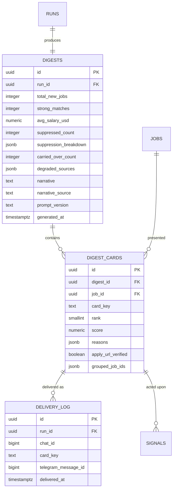

# Data model — f5-daily-digest-telegram

> **Owns:** `digests`, `digest_cards`, `delivery_log`
> **References (do not redefine):** `jobs` (F2), `scores`, `matches` (F4), `runs` (F3),
> `applications` (F6), `signals` (F7 — F5 writes rows, F7 owns the schema).

## ER diagram

## Entities

### `digests`

One per Run. Assembled and persisted **before** any message is sent, so delivery is a replay of
stored state rather than a recomputation (SAD §4 S2).

| Column | Type | Constraints | Notes |
|---|---|---|---|
| `id` | uuid | PK | |
| `run_id` | uuid | NOT NULL, FK, **UNIQUE** | one digest per Run |
| `mode` | text | NOT NULL | `Full` / `NothingNew` / `Partial` / `BudgetReached` — the degraded-day classification resolved at assembly and snapshotted, so delivery renders from stored state (T09, ADR-F5-0001) |
| `total_new_jobs` | integer | NOT NULL | |
| `strong_matches` | integer | NOT NULL | count above the strong threshold |
| `avg_salary_usd` | numeric(12,2) | NULL | null when too few jobs carry a salary to be meaningful — better absent than misleading |
| `suppressed_count` | integer | NOT NULL | (AC-07) |
| `suppression_breakdown` | jsonb | NOT NULL | `[{reason, count}]` — what makes [[../../DECISION-LOG\|D7]] real |
| `carried_over_count` | integer | NOT NULL DEFAULT 0 | items whose batch missed the deadline (AC-06) |
| `companies_checked` | integer | NOT NULL DEFAULT 0 | active companies scanned — shown only on a `NothingNew` day to state the scope (AC-05, T09) |
| `analysed_count` | integer | NOT NULL DEFAULT 0 | scores analysed before a budget abort — shown only on a `BudgetReached` day (AC-06, T09) |
| `degraded_sources` | jsonb | NOT NULL DEFAULT '[]' | quarantined sources, from F1 (AC-06) |
| `narrative` | text | NULL | model-generated market note |
| `narrative_source` | text | NOT NULL | `Model` or `Template` — records whether the fallback was used |
| `prompt_version` | text | NULL | |
| `generated_at` | timestamptz | NOT NULL | |

`narrative_source` exists so that "the digest read oddly on Tuesday" is answerable — a template
fallback is a different artifact from a model narrative and should be distinguishable after the fact.

### `digest_cards`

| Column | Type | Constraints | Notes |
|---|---|---|---|
| `id` | uuid | PK | |
| `digest_id` / `job_id` | uuid | NOT NULL, FK | |
| `card_key` | text | NOT NULL | `sha256(run_id ‖ job_id)` truncated to 16 hex — **deterministic**, so a replay computes the same key |
| `rank` | smallint | NOT NULL | 1-based presentation order |
| `score` | numeric(5,2) | NOT NULL | snapshotted from `scores`, so the card is stable even if scoring is re-run |
| `reasons` | jsonb | NOT NULL | **non-empty** — invariant 4, AC-02 |
| `apply_url_verified` | boolean | NOT NULL | false-verified cards are not delivered (AC-11) |
| `grouped_job_ids` | jsonb | NOT NULL, default `[]` | the near-duplicate jobs this card groups away (T13) — a same-opening posting collapsed onto this representative at assembly, kept queryable, never dropped |

**Constraints:** unique `(digest_id, job_id)` and unique `(digest_id, card_key)`.

The card key being a pure function of `(run_id, job_id)` rather than a random id is what makes
delivery idempotence work across a restart: a resumed delivery recomputes the same keys and can
therefore ask "which of these have I already sent".

### `delivery_log`

**The one table that enforces [[../../CONTEXT]] invariant 8.**

| Column | Type | Constraints |
|---|---|---|
| `id` | uuid | PK |
| `run_id` | uuid | NOT NULL, FK |
| `chat_id` | bigint | NOT NULL |
| `card_key` | text | NOT NULL |
| `telegram_message_id` | bigint | NULL — null for the header and footer |
| `delivered_at` | timestamptz | NOT NULL |

**Unique `(run_id, chat_id, card_key)`.** This single index is the entire idempotence mechanism
([[adr/0002-delivery-idempotence|ADR-F5-0002]]). A row is inserted **immediately after each successful
send**, not after the batch — so a crash after card 7 of 10 leaves exactly seven rows, and the resumed
delivery sends exactly three.

The header and footer use reserved card keys (`__header__`, `__footer__`) so they are covered by the
same mechanism rather than needing a special case.

**Append-only.** No update path, no delete path. Deleting a row would mean re-delivering, which is
precisely the failure the table exists to prevent.

## Indexes

| Index | Columns | Serves |
|---|---|---|
| `uq_digests_run` | `digests(run_id)` | one digest per Run |
| `uq_digest_cards_job` | `digest_cards(digest_id, job_id)` | no duplicate card |
| `uq_digest_cards_key` | `digest_cards(digest_id, card_key)` | key resolution from a callback |
| `idx_digest_cards_rank` | `digest_cards(digest_id, rank)` | ordered rendering |
| `uq_delivery_log` | `delivery_log(run_id, chat_id, card_key)` | **invariant 8** |
| `idx_delivery_log_run_chat` | `delivery_log(run_id, chat_id)` | "what have I already sent" on resume |

## Handoffs / interfaces

- **Consumes** `RankingCompleted` (F4), `scores`, `matches`, `jobs`, and F1's degraded-source summary.
- **Consumes** `RunCostAborted` (F3) → renders the reduced-digest warning.
- **Produces** `DigestReady` → the Telegram host; `DigestDelivered` → metrics.
- **Produces** `OwnerActionRecorded` → F6 application tracking, F7 signal capture.
- **Writes** `signals` rows (schema owned by F7) in the same transaction as the action (AC-08).

## Related

[[../../architecture/data-model]] · [[sad]] §6 · [[contracts/telegram-messages]] ·
[[adr/0002-delivery-idempotence|ADR-F5-0002]]
