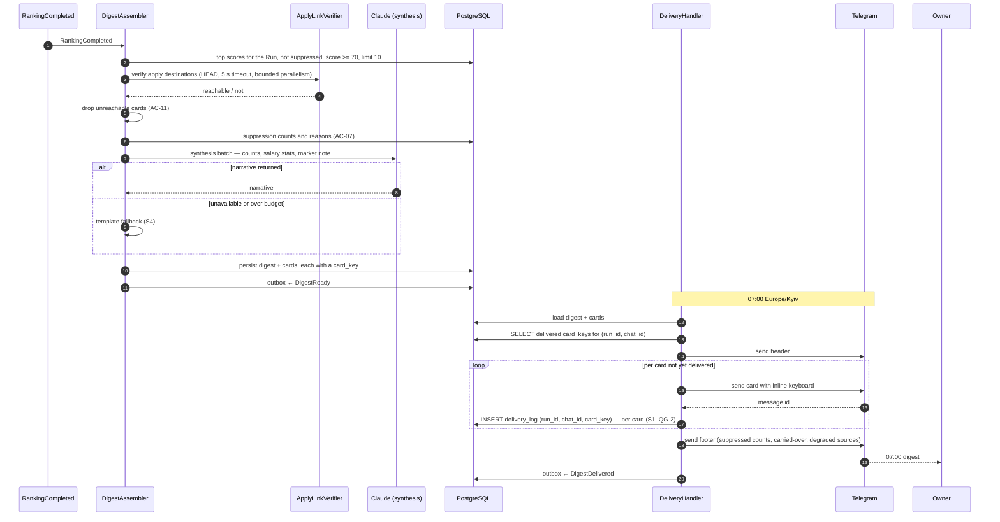
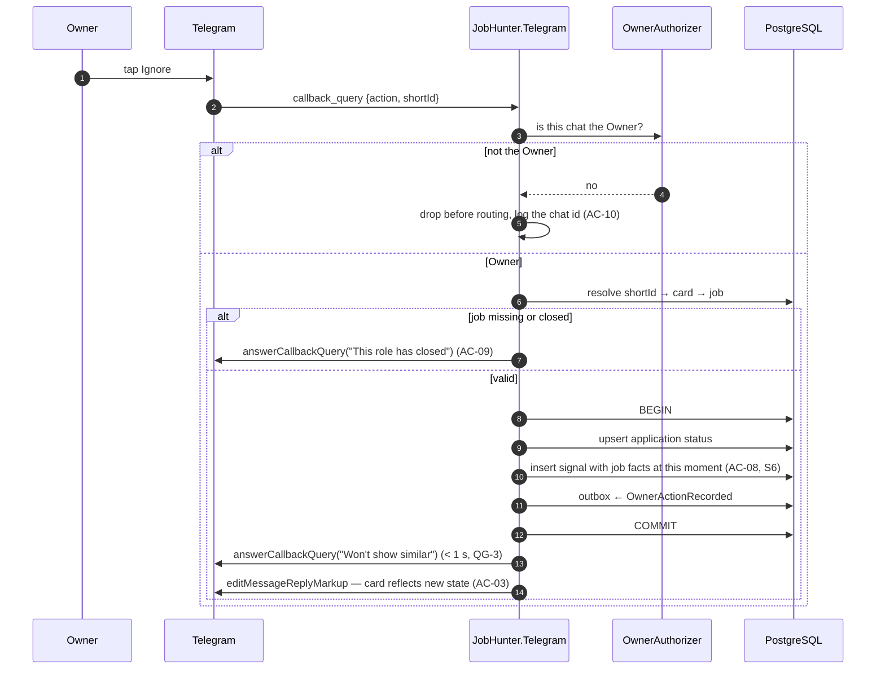
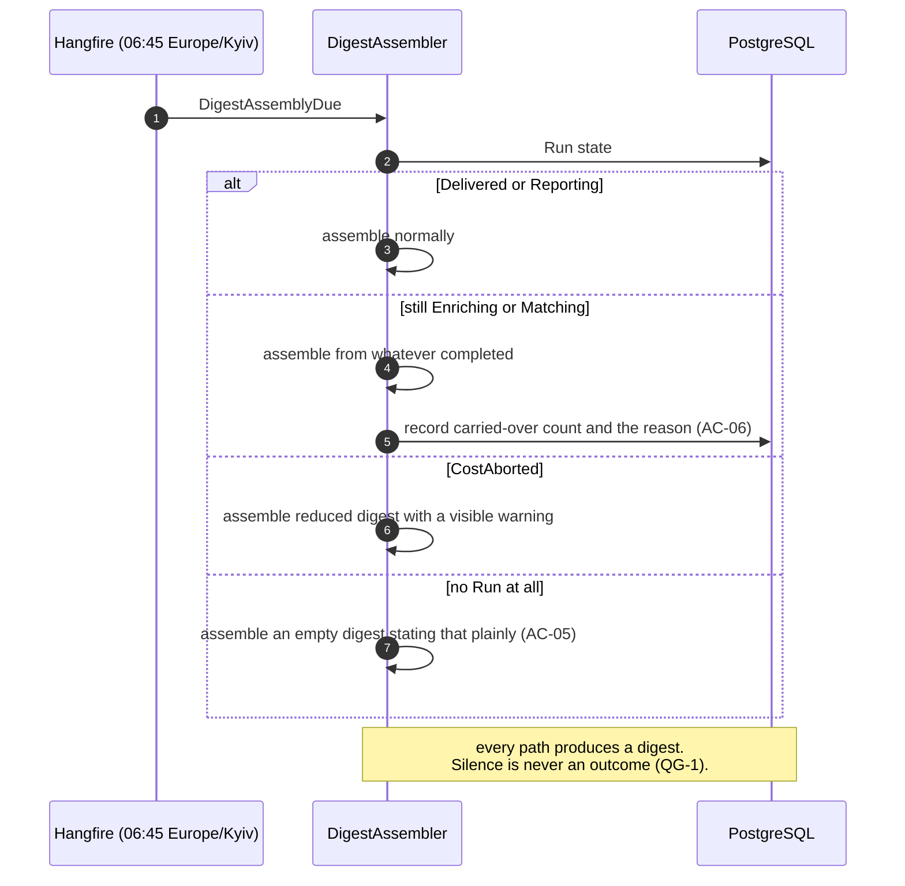

# SAD — F5 Daily Digest & Telegram Delivery

> Refines [[../../00-overview/sad|the system SAD]] §6.3. The only feature whose output a human sees.

## 1. Intent and quality goals

Turn a day of ranked jobs into one message sequence a half-awake person can triage in ninety seconds.

| # | Goal | Verification |
|---|---|---|
| QG-1 | **07:00, always** — a partial digest on time beats a complete one late | Schedule test across DST; partial-path integration test |
| QG-2 | **Exactly once** — no card is ever delivered twice | Unique delivery-log constraint; interrupted-delivery test |
| QG-3 | **Every tap acknowledged** — an action that appears to do nothing is a defect | Callback latency assertion; failure-path acknowledgement test |

## 2. Constraints

- Telegram long polling, single consumer — `jobhunter-telegram` runs one replica by design.
- Chat-id allowlist before routing ([[../../00-overview/adr/0014-keycloak-api-telegram-allowlist|ADR-0014]]).
- Callback payloads are capped at 64 bytes by Telegram, which forces a short signed identifier rather
  than a job id plus action name.
- Message text is MarkdownV2; every dynamic value must be escaped.
- No CV content in any message — the F4 boundary holds.
- Delivery idempotent on `(run_id, chat_id, card_key)` ([[../../CONTEXT]] invariant 8).

## 3. Context and scope

| External | Interaction | Failure |
|---|---|---|
| Telegram Bot API | outbound sends; inbound long-poll updates | Retry with backoff; the delivery log prevents duplicates on retry |
| Anthropic (via F3) | one deep-tier synthesis call for the narrative | Absent narrative degrades to a template; the digest still ships |

**In:** digest assembly, apply-link liveness verification, narrative synthesis, message rendering and
escaping, delivery with idempotence, callback handling, Signal capture, the command set.
**Out:** ranking (F4), application status transitions beyond the initial action (F6), preference
fitting (F7), search (F9 — F5 renders its results).

## 4. Solution strategy

| # | Choice | Why |
|---|---|---|
| S1 | The delivery log is written **per card, as it is sent**, not after the batch | QG-2. A crash mid-delivery must not re-send what already went ([[adr/0002-delivery-idempotence\|ADR-F5-0002]]) |
| S2 | The digest is assembled and persisted **before** any message is sent | Delivery becomes replayable from stored state rather than recomputed |
| S3 | 07:00 is a deadline, not a target: at 06:45 whatever is ready is used | QG-1 ([[adr/0001-never-delay-the-digest\|ADR-F5-0001]]) |
| S4 | The narrative is one deep-tier call, and it is optional | A provider outage must not cost the digest; a template fallback exists |
| S5 | Callback payload is `{action}:{shortId}` where `shortId` is a base64url-encoded 8-byte HMAC-truncated card key | Fits Telegram's 64-byte cap and is not forgeable |
| S6 | Signals are captured in the same transaction as the action | AC-08. Capture must not be a separate step that can fail independently |

## 5. Building block view

```text
JobHunter.Domain/Reporting/    Digest · DigestCard · CardKey · DeliveryRecord
JobHunter.Application/Reporting/  DigestAssembler · ApplyLinkVerifier
                                  NarrativeSynthesisHandler · SuppressionSummarizer
JobHunter.Application/Delivery/   DeliveryHandler · IDeliveryLog

JobHunter.Telegram/
  Program.cs                  single-replica host, long-poll hosted service
  Auth/OwnerAuthorizer.cs     chat-id allowlist, applied before routing
  Handlers/                   CommandRouter · DigestCommandHandler · SavedHandler
                              PipelineHandler · SearchHandler · CallbackHandler
  Formatting/                 DigestHeaderFormatter · CardFormatter · MarkdownV2Escaper
  Transport/                  TelegramNotifier (implements INotifier)

JobHunter.Claude/Prompts/DigestNarrativePrompt.cs
```

`INotifier` is a domain port, so the digest can be rendered and asserted without Telegram present:

```csharp
public interface INotifier
{
    Task<long> SendAsync(long chatId, RenderedMessage message, CancellationToken ct);
}
```

The rendering corpus tests run entirely against a fake notifier that captures `RenderedMessage`
values — which is what makes 200 layout cases fast enough to run on every PR.

## 6. Runtime view

### 6.1 Assembly and delivery



### 6.2 Action handling



### 6.3 The 06:45 deadline



## 7. Deployment view

`jobhunter-telegram`, **one replica**, `strategy: Recreate` — two long-poll consumers would each
receive half the updates, which presents as randomly-ignored taps and is miserable to diagnose. No
ingress; long polling is outbound only.

**Monitoring:** `jobhunter.digest.cards`, `jobhunter.digest.delivered_at`,
`jobhunter.callback.latency`, `jobhunter.delivery.failures`, `jobhunter.actions{kind}`.
The headline alert is *digest not delivered by 07:15* ([[../../operations/runbooks|R1]]).

## 8. Crosscutting concepts

| Concept | Convention |
|---|---|
| Card key | `sha256(run_id ‖ job_id)` truncated to 16 hex chars — stable, so a replay computes the same key |
| Short id | 8 bytes of HMAC over the card key, base64url — fits the 64-byte callback cap, not forgeable |
| Escaping | Every dynamic value passes `MarkdownV2Escaper`; an unescaped interpolation is an architecture-test failure |
| Message limits | 4096 characters; the formatter splits at a card boundary, never mid-card |
| Rate limits | 30 messages/second and 20/minute per chat; the sender paces and retries on 429 with the stated delay |
| Idempotence | `(run_id, chat_id, card_key)` unique — invariant 8 |
| Time | All schedules in `Europe/Kyiv`; DST asserted by test |
| Signals | Captured with the job's facts **at the moment of the action**, so a later edit cannot rewrite history |

## 9. Architecture decisions

| # | Title | Status |
|---|---|---|
| [[adr/0001-never-delay-the-digest\|F5-0001]] | 07:00 is a hard commitment; ship partial rather than late | Accepted |
| [[adr/0002-delivery-idempotence\|F5-0002]] | Per-card delivery log as the idempotence mechanism | Accepted |

## 10. Quality requirements

**QG-1. 07:00, always**
- **When:** any failure mode occurs — no jobs, an incomplete batch, a cost abort, an absent narrative,
  a provider outage.
- **Then:** a digest is delivered at 07:00 ±3 min stating plainly what happened.
- **How verify:** one integration test per failure mode, each asserting a digest was delivered and
  that its text names the condition. Plus a DST test asserting 07:00 local across the transition.

**QG-2. Exactly once**
- **When:** delivery is interrupted after N of M cards and retried.
- **Then:** exactly the remaining M−N are sent; the first N are not resent.
- **How verify:** integration test killing delivery mid-loop at several points, asserting the final
  message count equals M and that `delivery_log` holds M rows.

**QG-3. Every tap acknowledged**
- **When:** the Owner taps any action, including on a stale or closed job.
- **Then:** a visible acknowledgement appears within one second, and the card's state updates.
- **How verify:** callback latency assertion; a failure-path test asserting that an error still
  produces an acknowledgement rather than silence.

## 11. Risks and technical debt

| # | Item | Impact | Plan |
|---|---|---|---|
| D1 | Single-replica bot is a single point of failure | Missed digest | Liveness probe plus fast restart; the delivery log makes a restart safe. HA would need webhook mode and a shared consumer, deferred |
| D2 | MarkdownV2 escaping is easy to get subtly wrong | Malformed or unsent message | Every dynamic value goes through one escaper; an architecture test forbids raw interpolation; the rendering corpus includes hostile input |
| D3 | Apply-link verification adds latency and can produce false negatives | A live job dropped from the digest | 5 s timeout, bounded parallelism; only a definitive 404/410 drops a card — a timeout keeps it and flags it |
| D4 | Telegram rate limits during a large digest | Partial delivery | Paced sending; the delivery log makes the continuation exact |
| D5 | Callback payload cap forces indirection | A stale short id after a long time | Short ids resolve through the digest, which is retained; an unresolvable id produces a clear message rather than a silent no-op |

**Accepted debt:** no HA on the bot; no webhook mode; no rich media; no message editing beyond the
keyboard; English only.

## 12. Glossary

`Digest`, `Card`, `Signal` are defined in [[../../CONTEXT]] §1.
