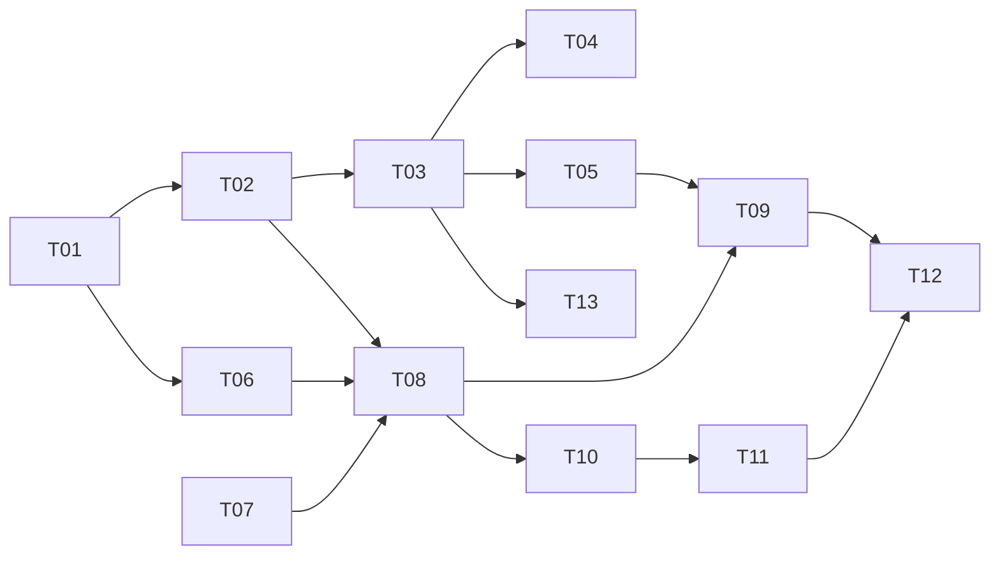

# Task tracker — F5 Daily Digest & Telegram Delivery

Epic: [[_epic|_epic]]. Milestone M4 — the first shippable release. This is the part the Owner actually experiences.

Each task is one reviewable PR (≤500 LOC), ≤1 day. Owner: Viacheslav (solo).
Estimate legend: **S** ≈ 2 h · **M** ≈ half a day · **L** ≈ a full day.
Status: `pending` → `in_progress` → `in_review` → `done`.

| ID | Task | Layer | Deps | Est | Status |
|---|---|---|---|---|---|
| T01 | [[T01-domain-digest\|Domain: Digest, DigestCard, CardKey]] | domain | — | S | done |
| T02 | [[T02-digest-persistence\|Migration and repositories for digests and delivery log]] | infra/db | T01 | S | done |
| T03 | [[T03-digest-assembler\|Digest assembler and suppression summary]] | app | T02 | M | done |
| T04 | [[T04-apply-link-verification\|Apply-link verification]] | app | T03 | S | done |
| T05 | [[T05-narrative-synthesis\|Narrative synthesis with template fallback]] | claude | T03 | M | done |
| T06 | [[T06-formatting-escaping\|MarkdownV2 escaping and formatters]] | telegram | T01 | M | done |
| T07 | [[T07-telegram-host-auth\|Telegram host, allowlist and long polling]] | telegram | — | M | done |
| T08 | [[T08-delivery-idempotence\|Delivery handler with per-card idempotence]] | app | T02, T06, T07 | L | done |
| T09 | [[T09-schedule-degraded\|Delivery scheduling and degraded-day variants]] | app | T08, T05 | M | done |
| T10 | [[T10-callback-actions\|Callback handling, actions and Signal capture]] | telegram | T08 | L | done |
| T11 | [[T11-command-set\|Command set]] | telegram | T10 | M | done |
| T12 | [[T12-rendering-corpus\|Rendering corpus and live smoke checklist]] | tests | T09, T11 | M | done |
| T13 | [[T13-near-duplicate-grouping\|Near-duplicate grouping at digest assembly]] | app | T03 | S | done |

**13 tasks · 4×S + 7×M + 2×L ≈ 6.5 person-days.** (T13 is the `NearDuplicateGrouper` relocated from
F2 per [[../../f2-normalization-dedup/adr/0001-conservative-fingerprint|ADR-F2-0001]], adding 0.25 to
the base 6.25.)

## Dependency graph

## DoR / DoD

- **DoR:** the feature's PRD, SAD, data-model and test-plan are accepted
  ([[../../../IMPLEMENTATION-READINESS|readiness]]); the task's own ACs and ADR links resolve.
- **DoD (every task):** code compiles with zero warnings; the rendering corpus and duplicate-delivery suites are green; every degraded path delivers a digest; the coverage gate stays green; the tracker row is updated in the same PR.

See [[../../../IMPLEMENTATION-READINESS]] §4 for the full per-task checklist.

## Delivered notes

- **T10** — the `Signal` domain type and the `signals` table it writes to are owned by F7 and were pulled
  forward (option (a) in the T10 implementation map): F7-T01 (domain) and F7-T02 (migration
  `20260806093258_F7AddSignalsAndPreferences`) are on `master`, so AC-08's "a Signal captured in the same
  transaction, carrying the job's facts at that moment" is truly satisfied rather than gated behind a stub.
  Card-action taps capture `Ignored` and `Saved` signals; `Open` is a URL button (no callback) and
  `Applied` is an F6 outcome kind needing an application id F5 lacks, so both return
  `RecordedElsewhere` and F5 writes no signal for them.
- **Known follow-up (T10):** the `Applied` tap's durable record is F6's `OwnerActionRecorded` event, which
  F5 does **not** publish — the Telegram host has no Wolverine outbox and F6 is not yet built. The
  `CallbackHandler` acknowledges `Applied` and updates the keyboard today; wiring the `OwnerActionRecorded`
  publication is deferred to F6.
- **T11** — the seven-command set ships behind the same singleton-routes / scope-acts split as the callback
  path (`ICommandDispatcher`/`ScopedCommandDispatcher` singleton opens a DI scope per command; `CommandRouter`
  and its handlers are scoped because a command reads the store). F5 implements `/start`, `/help`, `/digest`,
  `/saved` and `/stats`; `/pipeline` is a `PlaceholderCommandHandler` until F6 ships and `/search` reuses the
  F9 handler through `SearchCommandAdapter`. Every command renders through the digest's `CardFormatter`/`CardView`
  (AC-12) — no second layout — and the path is deterministic: no LLM (ADR-F10-0002) and no CV. `/saved`
  (`ISavedRolesQuery`) and `/stats` (`IWeeklyStatsQuery`) are Dapper read ports (architecture rule 4 — Dapper
  never writes); `/stats` keeps the week-window, precision and trend arithmetic in the handler against
  `IClock`, leaving only the counts to Postgres.
- **T12** — the rendering line is complete and the F5 ship-blocker is closed. The production
  `DigestRenderer : IDigestRenderer` (in `JobHunter.Telegram.Transport/Formatting`) both the 07:00 `DeliveryHandler` and
  `/digest` depend on now exists: it joins each card's display facts fresh through the `ICardDisplayQuery`
  read port (`CardDisplayQuery`, Dapper, architecture rule 4 — never writes), maps them onto the one shared
  `CardView`/`CardFormatter`, and emits the header, one message per card and the footer, each carrying the
  fixed four-button keyboard with the T10 HMAC short id. The rendering corpus is extended to 25 committed
  `.snapshot.txt` layouts (every header/card/footer variant, degraded day and hostile card in the contract);
  `MessageSplittingTests` proves the 4096-char boundary is respected just under, at and just over the limit —
  splitting is structural (one `RenderableMessage` per card, sent atomically) so a card is never fragmented;
  `HostileInputTests` asserts every row of the contract's escaping table (and the test-plan's extra rows —
  all-markup title, ZWJ, URL parentheses, flag emoji at the boundary) reaches output with no unescaped
  MarkdownV2 metacharacter. The whole corpus runs in well under a second (zero network, zero database). The
  manual [[../contracts/live-smoke-checklist|live-smoke checklist]] exists; its one-time execution against a
  real test chat (the four buttons in a real client) is the last M4 pre-release gate and is recorded in that
  doc's execution table.
