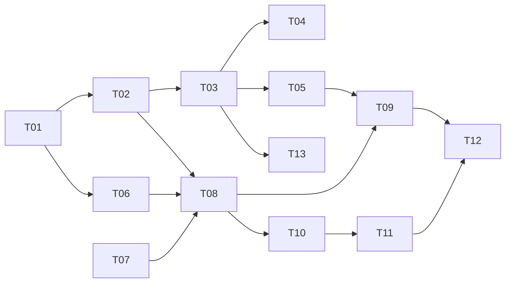

# Task tracker — F5 Daily Digest & Telegram Delivery

Epic: [[_epic|_epic]]. Milestone M4 — the first shippable release. This is the part the Owner actually experiences.

Each task is one reviewable PR (≤500 LOC), ≤1 day. Owner: Viacheslav (solo).
Estimate legend: **S** ≈ 2 h · **M** ≈ half a day · **L** ≈ a full day.
Status: `pending` → `in_progress` → `in_review` → `done`.

| ID | Task | Layer | Deps | Est | Status |
|---|---|---|---|---|---|
| T01 | [[T01-domain-digest\|Domain: Digest, DigestCard, CardKey]] | domain | — | S | done |
| T02 | [[T02-digest-persistence\|Migration and repositories for digests and delivery log]] | infra/db | T01 | S | done |
| T03 | [[T03-digest-assembler\|Digest assembler and suppression summary]] | app | T02 | M | done |
| T04 | [[T04-apply-link-verification\|Apply-link verification]] | app | T03 | S | done |
| T05 | [[T05-narrative-synthesis\|Narrative synthesis with template fallback]] | claude | T03 | M | done |
| T06 | [[T06-formatting-escaping\|MarkdownV2 escaping and formatters]] | telegram | T01 | M | done |
| T07 | [[T07-telegram-host-auth\|Telegram host, allowlist and long polling]] | telegram | — | M | done |
| T08 | [[T08-delivery-idempotence\|Delivery handler with per-card idempotence]] | app | T02, T06, T07 | L | done |
| T09 | [[T09-schedule-degraded\|Delivery scheduling and degraded-day variants]] | app | T08, T05 | M | done |
| T10 | [[T10-callback-actions\|Callback handling, actions and Signal capture]] | telegram | T08 | L | pending |
| T11 | [[T11-command-set\|Command set]] | telegram | T10 | M | pending |
| T12 | [[T12-rendering-corpus\|Rendering corpus and live smoke checklist]] | tests | T09, T11 | M | pending |
| T13 | [[T13-near-duplicate-grouping\|Near-duplicate grouping at digest assembly]] | app | T03 | S | done |

**13 tasks · 4×S + 7×M + 2×L ≈ 6.5 person-days.** (T13 is the `NearDuplicateGrouper` relocated from
F2 per [[../../f2-normalization-dedup/adr/0001-conservative-fingerprint|ADR-F2-0001]], adding 0.25 to
the base 6.25.)

## Dependency graph

## DoR / DoD

- **DoR:** the feature's PRD, SAD, data-model and test-plan are accepted
  ([[../../../IMPLEMENTATION-READINESS|readiness]]); the task's own ACs and ADR links resolve.
- **DoD (every task):** code compiles with zero warnings; the rendering corpus and duplicate-delivery suites are green; every degraded path delivers a digest; the coverage gate stays green; the tracker row is updated in the same PR.

See [[../../../IMPLEMENTATION-READINESS]] §4 for the full per-task checklist.
