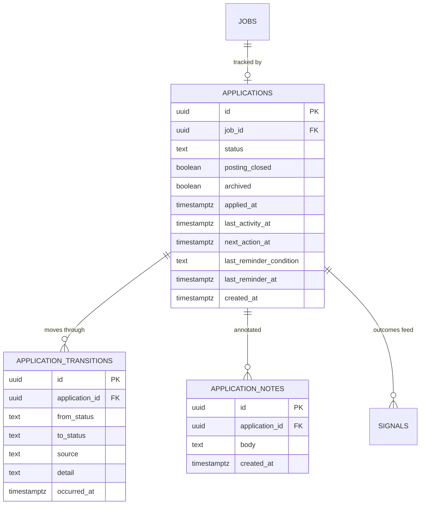

# Data model — f6-application-tracking

> **Owns:** `applications`, `application_transitions`, `application_notes`
> **References (do not redefine):** `jobs` (F2), `digest_cards` (F5), `signals` (F7).

## ER diagram

## Entities

### `applications`

One per job the Owner has engaged with. Created lazily on first action (SAD §4 S2) — 150 cards a day
with 8 actions would otherwise leave 142 empty rows daily.

| Column | Type | Constraints | Notes |
|---|---|---|---|
| `id` | uuid | PK | |
| `job_id` | uuid | NOT NULL, FK, **UNIQUE** | one application per job |
| `status` | text | NOT NULL | `New`, `Saved`, `Applied`, `Interview`, `Rejected`, `Offer`, `Ignored` |
| `posting_closed` | boolean | NOT NULL DEFAULT false | set by `JobClosed`; **the status is not changed** (AC-07) |
| `archived` | boolean | NOT NULL DEFAULT false | terminal applications after 180 days; hidden, never deleted |
| `applied_at` | timestamptz | NULL | set once, on first entry to `Applied` |
| `last_activity_at` | timestamptz | NOT NULL | any transition or note |
| `next_action_at` | timestamptz | NULL | **a column, not a computed value** (SAD §4 S6) — makes the sweep one indexed query |
| `last_reminder_condition` | text | NULL | which condition was last reminded, for suppression (QG-3) |
| `last_reminder_at` | timestamptz | NULL | |
| `created_at` | timestamptz | NOT NULL | |

`Ignored` is a status alongside the pipeline stages rather than a deletion — an ignored job is
preference evidence, and F7 needs it.

`posting_closed` being separate from `status` is deliberate: a posting closing tells us nothing about
the Owner's application. Collapsing the two would fabricate a rejection and poison the evidence F7
learns from.

### `application_transitions`

**Append-only.** The complete history (QG-1).

| Column | Type | Constraints | Notes |
|---|---|---|---|
| `id` | uuid | PK | |
| `application_id` | uuid | NOT NULL, FK | |
| `from_status` | text | NULL | null for the creating transition |
| `to_status` | text | NOT NULL | |
| `source` | text | NOT NULL | `Telegram`, `Api`, `System` — an automatic change must be distinguishable from a deliberate one |
| `detail` | text | NULL | e.g. `posting closed`, `reminder actioned` |
| `occurred_at` | timestamptz | NOT NULL | |

**No update path, no delete path.** A correction is a new transition, not an edit — which is what
makes the history trustworthy rather than merely present.

### `application_notes`

| Column | Type | Notes |
|---|---|---|
| `id` | uuid | PK |
| `application_id` | uuid | FK |
| `body` | text | free text, capped at 4 000 chars. **Never logged** — only its length is |
| `created_at` | timestamptz | |

## Indexes

| Index | Columns | Serves |
|---|---|---|
| `uq_applications_job` | `applications(job_id)` | one application per job |
| `idx_applications_pipeline` | `applications(status, last_activity_at DESC) WHERE NOT archived` | the pipeline view (AC-01) |
| `idx_applications_due` | `applications(next_action_at) WHERE next_action_at IS NOT NULL AND NOT archived` | the reminder sweep — one indexed query, no scan |
| `idx_transitions_application` | `application_transitions(application_id, occurred_at)` | the history view (AC-03) |
| `idx_transitions_outcome` | `application_transitions(to_status, occurred_at) WHERE to_status IN ('Interview','Offer','Rejected')` | outcome signals and conversion metrics |
| `idx_notes_application` | `application_notes(application_id, created_at DESC)` | notes in the history view |

## Handoffs / interfaces

- **Consumes** `OwnerActionRecorded` (F5) → creates or advances an application.
- **Consumes** `JobClosed` (F2) → marks the posting closed without changing status.
- **Produces** `ApplicationStatusChanged` → F7 signal capture, F9 index update.
- **Writes** weighted `signals` rows (schema owned by F7) for terminal outcomes (AC-08).
- **Read by** F5 (`/pipeline`), F9 (search filtering by application state).

## Related

[[../../architecture/data-model]] · [[sad]] §8 · [[adr/0001-permissive-transitions-with-history|ADR-F6-0001]]
