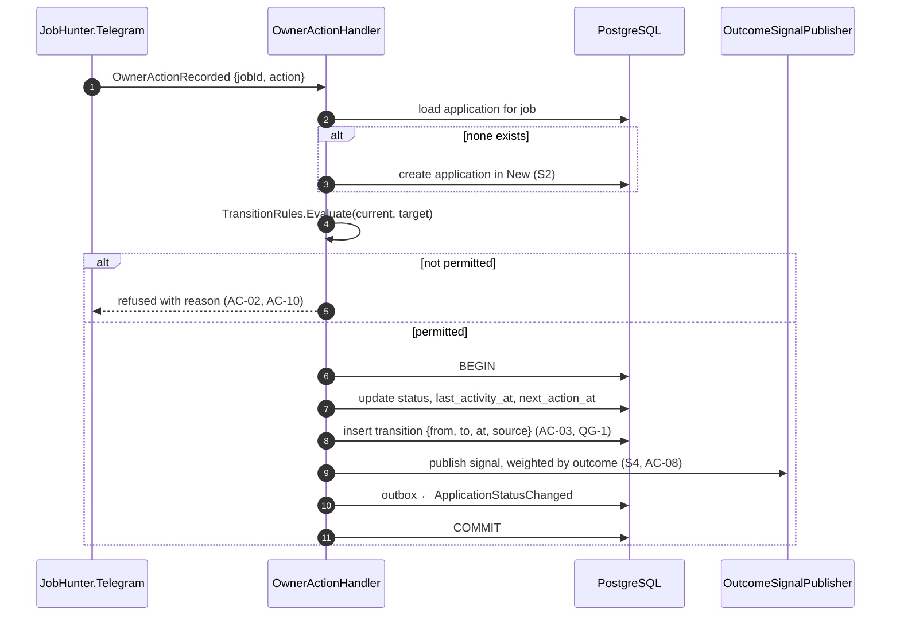
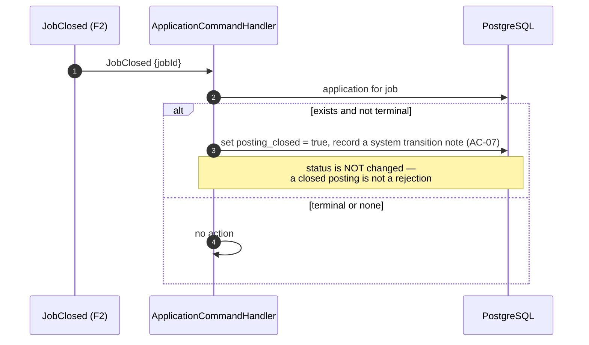

# SAD — F6 Application Tracking

> Refines [[../../00-overview/sad|the system SAD]] for the application lifecycle.

## 1. Intent and quality goals

Make the pipeline self-maintaining from actions the Owner already takes, and turn outcomes into the
system's best preference evidence.

| # | Goal | Verification |
|---|---|---|
| QG-1 | **History is complete and immutable** — every stage change is recorded and never rewritten | Transition-count assertion; no update path on the transitions table |
| QG-2 | **Updating costs nothing** — one tap or one short command, from anywhere | Callback latency ceiling; command coverage |
| QG-3 | **Reminders are useful, not noise** — one per condition, actionable, suppressible | Duplicate-reminder test; action-rate metric |

## 2. Constraints

- The system never applies on the Owner's behalf ([[../../CONTEXT]] invariant 7).
- One application per job — the pipeline is per-opportunity, not per-conversation.
- Transitions are permissive but fully recorded ([[adr/0001-permissive-transitions-with-history|ADR-F6-0001]]).
- Owner-scoped throughout, via the F5 allowlist and the F9 API scope.

## 3. Context and scope

**In:** the application aggregate and its transition rules, creation and advancement from digest
actions, the pipeline view, notes, the reminder sweep, outcome signals.
**Out:** applying (never), email and calendar (backlog), interview preparation (backlog), preference
fitting (F7).

| External | Interaction |
|---|---|
| Telegram (via F5) | status taps and commands |
| API (via F9) | operator reads and writes |

## 4. Solution strategy

| # | Choice | Why |
|---|---|---|
| S1 | Transitions are **permissive with complete history**, not a rigid state machine | Real hiring processes do not respect a diagram; refusing a legitimate move because the model disagrees makes the tool useless ([[adr/0001-permissive-transitions-with-history\|ADR-F6-0001]]) |
| S2 | The application is created lazily on first action, not for every delivered card | 150 cards a day with 8 actions would otherwise create 142 empty rows daily |
| S3 | Reminders are computed by a sweep against thresholds, not scheduled per application | No per-application timer to leak; changing a threshold takes effect immediately |
| S4 | Outcome signals carry a higher weight than card actions | An interview survived a real filter; a tap survived two seconds of attention (AC-08) |
| S5 | A closed posting marks the application, never removes it | AC-07. History has value after the job is gone |
| S6 | `next_action_at` is a column, not a derived value | Makes "what needs attention" one indexed query rather than a scan with per-row logic |

## 5. Building block view

```text
JobHunter.Domain/Applications/   Application · ApplicationStatus · StatusTransition
                                 TransitionRules · ApplicationNote · ReminderPolicy
JobHunter.Application/Applications/  ApplicationCommandHandler · OwnerActionHandler
                                     ReminderSweepJob · PipelineQuery · OutcomeSignalPublisher
JobHunter.Infrastructure/Persistence/ ApplicationRepository · PipelineProjectionQuery
JobHunter.Telegram/Handlers/     PipelineHandler · StatusCallbackHandler · NoteHandler
```

`TransitionRules` is a table, not a chain of conditionals:

```csharp
private static readonly FrozenSet<(ApplicationStatus From, ApplicationStatus To)> Allowed = …;
public static TransitionResult Evaluate(ApplicationStatus from, ApplicationStatus to);
```

A table can be enumerated by a test, which is how the transition matrix suite covers all 36 pairs
rather than the handful someone thought of.

## 6. Runtime view

### 6.1 Action to application



### 6.2 Reminder sweep

```mermaid
sequenceDiagram
  autonumber
  participant H as Hangfire (daily 08:00 Europe/Kyiv)
  participant R as ReminderSweepJob
  participant DB as PostgreSQL
  participant T as Telegram

  R->>DB: applications where next_action_at <= now and not archived
  loop per application
    alt already reminded for this condition
      R->>R: skip (QG-3, AC-05)
    else
      R->>T: one message with the application and a suggested action
      R->>DB: record reminder; push next_action_at forward by the stage threshold
    end
  end
  Note over R,T: sent at 08:00, an hour after the digest —<br/>the morning message stays about opportunities, not admin
```

### 6.3 Job closure



The distinction in 6.3 matters: a posting closing tells us nothing about the Owner's application. Auto-rejecting would fabricate an outcome and poison the preference evidence.

## 7. Deployment view

Runs in `jobhunter-worker` (sweep, handlers) and `jobhunter-telegram` (commands, callbacks). Two
read-only endpoints on `jobhunter-api`. No new deployable.

**Monitoring:** `jobhunter.applications{status}`, `jobhunter.applications.transitions{from,to}`,
`jobhunter.reminders.sent`, `jobhunter.reminders.actioned`.

## 8. Crosscutting concepts

| Concept | Convention |
|---|---|
| Transition source | `Telegram`, `Api`, `System` — recorded on every transition so an automatic change is distinguishable from a deliberate one |
| Thresholds | Per status, in configuration; `Applied` 10 d, `Interview` 7 d, `Saved` 5 d |
| Reminder suppression | One per `(application, condition)` until the condition clears or recurs |
| Signal weight | Card action 1.0; `Applied` 2.0; `Interview` 4.0; `Offer` 6.0; `Rejected` 3.0 |
| Idempotency | Status change on `(application_id, to_status, occurred_at)` |
| Archival | Terminal applications archive after 180 days — hidden from the pipeline view, retained in full |

## 9. Architecture decisions

| # | Title | Status |
|---|---|---|
| [[adr/0001-permissive-transitions-with-history\|F6-0001]] | Permissive transitions, complete history | Accepted |

## 10. Quality requirements

**QG-1. History is complete and immutable**
- **When:** an application has moved through several stages, including corrections.
- **Then:** every change is present with its time and source, in order, and none has been rewritten.
- **How verify:** a test walking an application through ten changes and asserting ten transition rows;
  an architecture test asserting the transitions repository has no update or delete path.

**QG-2. Updating costs nothing**
- **When:** the Owner changes a status from a digest card or a command.
- **Then:** it completes in under a second with visible confirmation.
- **How verify:** callback latency ceiling; command coverage across every status.

**QG-3. Reminders are useful, not noise**
- **When:** an application sits past its threshold for several days.
- **Then:** exactly one reminder is sent, and no more until the condition clears or recurs.
- **How verify:** a sweep run seven consecutive simulated days over one stale application, asserting
  exactly one message.

## 11. Risks and technical debt

| # | Item | Impact | Plan |
|---|---|---|---|
| D1 | Manual status updates decay — the classic spreadsheet failure | The pipeline becomes fiction | Reminders prompt for the update at the moment it is cheapest; freshness is a tracked metric so decay is visible |
| D2 | Interview conversion is a small sample for a long time | Over-reading noise | Presented as a count, not a rate, until the denominator is meaningful |
| D3 | Permissive transitions allow nonsensical sequences | Confusing history | Only genuinely impossible transitions are refused; everything else is recorded and visible, which is more useful than being blocked |
| D4 | Notes are free text with no structure | Not searchable in a useful way | Accepted for MVP; F9 indexes them if it proves worth doing |

**Accepted debt:** no email or calendar integration; no contact tracking; no interview scheduling; no
attachments.

## 12. Glossary

`Application`, `ApplicationStatus` are defined in [[../../CONTEXT]] §1.
