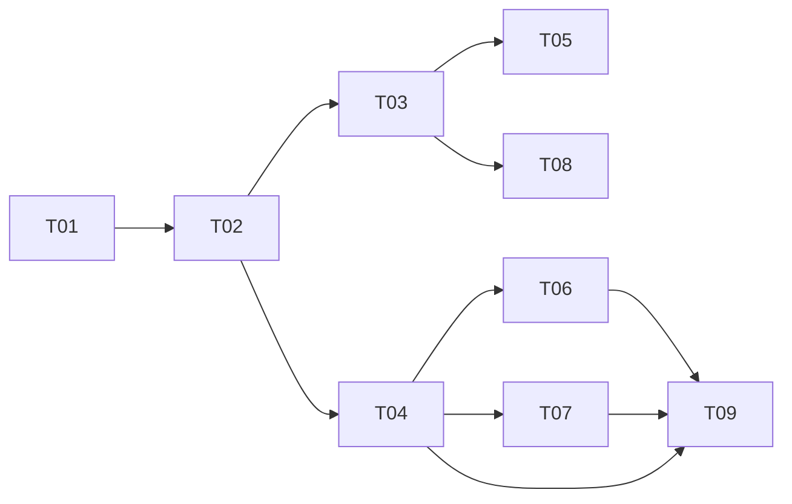

# Task tracker — F6 Application Tracking

Epic: [[_epic|_epic]]. Outcomes recorded here are F7's strongest preference evidence — far stronger than a tap on a card.

Each task is one reviewable PR (≤500 LOC), ≤1 day. Owner: Viacheslav (solo).
Estimate legend: **S** ≈ 2 h · **M** ≈ half a day · **L** ≈ a full day.
Status: `pending` → `in_progress` → `in_review` → `done`.

| ID | Task | Layer | Deps | Est | Status |
|---|---|---|---|---|---|
| T01 | [[T01-domain-application\|Domain: Application, TransitionRules, ReminderPolicy]] | domain | — | M | done |
| T02 | [[T02-application-persistence\|Migration and repositories]] | infra/db | T01 | S | done |
| T03 | [[T03-owner-action-handler\|Owner action handler]] | app | T02 | M | done |
| T04 | [[T04-pipeline-query\|Pipeline query and history view]] | app | T02 | M | done |
| T05 | [[T05-job-closure\|Job closure handling]] | app | T03 | S | done |
| T06 | [[T06-reminder-sweep\|Reminder sweep]] | app | T04 | M | done |
| T07 | [[T07-notes\|Notes]] | app | T04 | S | done |
| T08 | [[T08-outcome-signals\|Outcome signals]] | app | T03 | M | done |
| T09 | [[T09-commands-and-api\|Telegram commands and API endpoints]] | telegram/api | T04, T06, T07, ⟂F9 T04 | M | done |

**9 tasks · 3×S + 6×M + 0×L ≈ 3.75 person-days.**

⟂ **Cross-feature build-order dependency:** T09's API endpoints are hosted on `jobhunter-api`, whose
authenticated host and owner-scope policy are established by [[../../f9-search-and-api/tasks/tracker|F9]]
T04 (api-host-auth). F6 T09 must land after F9 T04. Only F6's side of the edge is recorded here.

## Dependency graph

## DoR / DoD

- **DoR:** the feature's PRD, SAD, data-model and test-plan are accepted
  ([[../../../IMPLEMENTATION-READINESS|readiness]]); the task's own ACs and ADR links resolve.
- **DoD (every task):** code compiles with zero warnings; the transition matrix suite covers every status pair; the transitions table has no update path; the coverage gate stays green; the tracker row is updated in the same PR.

See [[../../../IMPLEMENTATION-READINESS]] §4 for the full per-task checklist.

## Delivered notes

- **T01** — the `Applications` domain in `JobHunter.Domain/Applications`: the `Application` aggregate
  (lazily created in `New` with its creating transition, advancing only along permitted moves and
  recording each as append-only history), `ApplicationStatus` and `TransitionSource` (persisted as
  `text`), `StatusTransition` (append-only history row, `From` null for the creating step),
  `TransitionRules` (the permitted `(from, to)` set as a `FrozenSet` **table**, per SAD §5) returning a
  value-typed `TransitionResult` that carries a per-pair **remedy** on refusal (never an exception —
  coding-standards §4), and `ReminderPolicy` (status→threshold from configuration, SAD §8 defaults
  Applied 10 d / Interview 7 d / Saved 5 d, no hard-coded durations). The **transition matrix suite**
  enumerates the full 7×7 Cartesian product (49 pairs) against
  [[../contracts/application-api|the contract]] table, and asserts every refusal carries a remedy and
  the diagonal is always a permitted no-op. `applied_at` is stamped once on first entry to `Applied`
  and never changed; `MarkPostingClosed` sets `posting_closed` without touching the status (AC-07),
  recording the closure as a `System` self-transition carrying `Application.PostingClosedDetail`
  (`posting closed`) — history without a fabricated move (refined in T05) — and is idempotent;
  `next_action_at` is rescheduled from the policy on each change and cleared for a status with nothing
  to chase.
- **T02** — the F6 persistence. The migration `F6AddApplications` creates `applications`,
  `application_transitions` and `application_notes` with all six declared indexes, including the two
  partial indexes on `applications` (`idx_applications_pipeline WHERE NOT archived`,
  `idx_applications_due WHERE next_action_at IS NOT NULL AND NOT archived`) and the partial
  `idx_transitions_outcome WHERE to_status IN ('Interview','Offer','Rejected')`. `ApplicationNote` joins
  the domain (body capped at 4 000 chars, blank rejected, `AddNote` counts as activity without changing
  status). The EF configs live in `Infrastructure/Persistence/Applications/`, auto-discovered by the
  assembly scan; transitions and notes are owned children written through the same insert. The
  `IApplicationRepository` port exposes only `Add`, `FindByJobAsync` and `SaveChangesAsync` — **no update
  and no delete path** (QG-1), asserted by a reflection test over both the port and its implementation.
  The integration suite proves against a real database: all six index names exist, an application with its
  transitions and notes round-trips, `uq_applications_job` rejects a second application for the same job,
  and the reminder-sweep and pipeline queries are `idx_applications_due`/`idx_applications_pipeline`-covered
  (query-plan assertions with no `Seq Scan`). The `last_reminder_condition`/`last_reminder_at` columns are
  deferred to T06, where reminder suppression (QG-3) gives them behaviour and tests.
- **T03** — the owner-action handler. Two integration events join `JobHunter.Contracts.Pipeline`:
  `OwnerActionRecorded` (the F5 digest tap — `JobId`, `Action` as string constants `Open`/`Ignore`/`Save`/
  `Applied`, `ChatId`, `OccurredAt`) and `ApplicationStatusChanged` (`ApplicationId`, `JobId`, `FromStatus`,
  `ToStatus`, `OccurredAt`), both registered in `PipelineEventContext`. `OwnerActionHandler`
  (`Application/Applications/`, Wolverine-discovered) loads the application for the job, creates it lazily in
  `New` on the first action (S2 — a delivered card with no action creates nothing), maps the action to a
  status (`Save→Saved`, `Ignore→Ignored`, `Applied→Applied`; `Open` is a URL button with no pipeline effect),
  calls `ChangeStatus`, persists, and publishes `ApplicationStatusChanged` — the status change, the history
  row and the outbox message committing together in the one Wolverine EF transaction (AC-03). A refused
  transition changes nothing and publishes nothing (AC-02, a value not an exception). Idempotence is the
  SAD §8 key `(application_id, to_status, occurred_at)`: the durable inbox collapses a redelivered envelope,
  and as a second net the handler skips an action whose exact `(to, occurred_at)` transition already exists,
  so a double-tap appends no second transition and re-emits nothing. Invariant 7 holds structurally — the
  handler has no notifier or HTTP dependency, so setting `Applied` can only write a transition and the event.
  The weighted outcome signal (S4) is T08's, which depends on this. `ReminderPolicy.Default` is registered so
  the handler can reschedule `next_action_at`; T06 will bind the thresholds from options.
- **T04** — the two read sides of F6, both Dapper and read-only (architecture rule 4). `IApplicationPipelineQuery`
  returns `ApplicationPipeline` (groups → entries): non-archived applications joined to their job, company and
  latest score, ordered `status, last_activity_at DESC` — the exact shape of the partial
  `idx_applications_pipeline`, so a preserving group-by yields each status column already most-recently-active
  first (AC-01), and the read is index-covered (query-plan assertion). `daysInStage` is computed at read time
  from the caller's `now` and the most recent **stage-entering** transition (`from_status IS DISTINCT FROM
  to_status`), floored at zero — never stored (contract §Pipeline response, SAD §4 S6 keeps only
  `next_action_at` as a column). Excluding self-transitions means a further interview round or a T05 posting
  closure never resets the stage clock. `IApplicationHistoryQuery` returns the single
  application with its complete ordered transitions (`idx_transitions_application`, oldest first including the
  creating `New` row, QG-1) and its notes (`idx_notes_application`, newest first) via one `QueryMultiple`;
  retrievable by id even when archived (SAD §8 Archival), null for an unknown id. The read models live in
  `Domain/Applications/` (`ApplicationPipeline`/`PipelineGroup`/`PipelineEntry`,
  `ApplicationHistory`/`HistoryTransition`/`HistoryNote`); both ports in `Domain/Abstractions/`; both
  implementations in `Infrastructure/Persistence/Queries/`, registered scoped. `now` is passed in, never
  `DateTime.Now` (coding-standards §IClock). Neither read selects anything about the Owner (F4 invariant).
- **T05** — job-closure handling. `JobClosureHandler` (`Application/Applications/`, Wolverine-discovered)
  consumes `JobClosed` (F1/F2): it loads the application for the job and, if one exists and is not terminal,
  calls `Application.MarkPostingClosed(closedAt)` and commits. The status is deliberately not changed (AC-07)
  — a closed posting tells us nothing about the Owner's application, and auto-rejecting would fabricate an
  outcome that poisons F7's evidence (SAD §6.3). The closure is recorded as history without a fabricated
  move: `MarkPostingClosed` now appends a `System` self-transition (`from == to`) carrying
  `Application.PostingClosedDetail` (`posting closed`, the data-model §application_transitions `detail`
  example), so the event is visible and distinguishable from a deliberate change (SAD §8) — this refines the
  T01 flag-only behaviour, and the pipeline `daysInStage` (T04) ignores self-transitions so the closure never
  resets the stage clock. `Application.IsTerminal` (Rejected/Offer/Ignored) gates the no-op for a terminal
  application; a closure for an untracked job is a no-op, not an error. It publishes nothing (the status did
  not change) and holds no notifier or HTTP dependency, so it cannot act for the Owner (invariant 7).
  Idempotence rests on the durable inbox collapsing a redelivered `JobClosed` (`(JobId, ClosedAt)`) and, as a
  second net, `MarkPostingClosed` being a no-op on an already-closed posting — a redelivered closure records
  no second transition and advances nothing; the application and its full history are always retained
  (invariant 8, QG-1). AC-07 is proven end-to-end against a real database
  (`JobClosureHandlerIntegrationTests`, the test-plan Messaging suite) as well as by the fake-repo unit suite.
  The point-4 reminder for a `Saved` application whose posting closed belongs to the T06 sweep (SAD §6.2,
  which reads `posting_closed`); T05 sets the data the sweep reads.
- **T06** — the reminder sweep (SAD §6.2). A thin `ReminderSweepTrigger` (`Infrastructure/Scheduling/`,
  DI-registered scoped) fires on the 08:00 Europe/Kyiv cron — an hour after the 07:00 digest, deliberately
  separate so the morning message stays about opportunities (done-when 6) — and does nothing but publish one
  `ReminderSweepDue(SweptAt)` onto the durable bus, stamping the instant from `IClock`. The Wolverine-discovered
  `ReminderSweepHandler` (`Application/Applications/`) reads the due applications through the read-only
  `IDueReminderQuery` (`idx_applications_due`-covered, done-when 5 — the `DueReminder` now also carries the job's
  `apply_url` for the "open posting" link) and, for each one not already reminded for its current condition
  (`DueReminder.IsAlreadyReminded`, decided from the read model without loading the aggregate), sends the Owner
  one nudge and records the reminder. Suppression is one reminder per `(application, condition)` until it clears
  or recurs (QG-3, done-when 1): the send is ordered send-then-record, so a crash in the window re-nudges once on
  resume rather than dropping it; the mutation goes only through the aggregate's `RecordReminder` →
  `SaveChangesAsync` write path (QG-1 — no new repository method). The `IReminderRenderer` (port in `Domain`,
  `Telegram/Formatting/ReminderRenderer` the impl, registered alongside the digest renderer) reads only the
  public job facts on the `DueReminder` and shares the one MarkdownV2 escaper — a closed posting suggests
  "drop it or apply elsewhere" and shows no open button, an open one suggests a stage-appropriate chase with an
  "Open posting" URL button — so a hostile title cannot break the send and the CV never crosses this boundary
  (invariant 7, F4 invariant). The SAD §8 thresholds are now configuration: `ReminderOptions`
  (`Application/Applications/`, section `Reminders`, defaults Applied 10 d / Interview 7 d / Saved 5 d) binds and
  startup-validates the day counts and builds the one `ReminderPolicy` both the T03 owner-action handler and this
  sweep resolve through — and because both read the policy at use time, a threshold change takes effect on the
  next sweep with no per-application rescheduling (done-when 4). The suppression rule is proven end-to-end against
  a real database (`ReminderSweepSuppressionTests`, the test-plan sweep suite): a stale application is reminded
  exactly once across seven consecutive daily sweeps, an Owner action that clears the condition the same day takes
  the reminder away, and a shortened threshold governs only the next reschedule, never the already-parked row.
- **T07** — free-text notes (AC-06). `AddNoteHandler` (`Application/Applications/`) is the single write path both
  the Telegram `/note` command and the API `POST …/notes` drive; unlike the Wolverine-discovered pipeline handlers
  it is invoked directly and returns a value-typed `AddNoteOutcome` the caller renders (`Recorded`/`Empty`/`TooLong`/
  `ApplicationNotFound`), so a refusal is an outcome, not an exception (coding-standards §4). The command is keyed by
  `JobId` — the same job-scoped write path every F6 handler uses, so it fits the pinned repository surface (QG-1: it
  loads through `FindByJobAsync`, adds no repository method); the API, which addresses an application by id, resolves
  the id to its job before dispatching (T09). The handler validates at the boundary as values — a blank/whitespace
  body → `Empty`, a body over `ApplicationNote.MaxLength` (4 000) → `TooLong` (the length checked here rather than
  caught from the aggregate) — and a note for an untracked job → `ApplicationNotFound`, never lazily creating an
  application (a note annotates one, it does not create it, unlike an owner action). On success it appends through
  `Application.AddNote`, which counts as activity — it advances `last_activity_at` so the note defers the reminder
  sweep (done-when 4) — without changing the status, and commits through `SaveChangesAsync`. The note body is
  **never logged** — only its length — because it may contain anything the Owner typed (invariant 12, done-when 3):
  a `CapturingLogger` unit test drives a secret-shaped body through the handler and asserts no log line carries a
  fragment of it. Nothing is written on a refusal (`SaveCount` stays 0). AC-06 is proven end-to-end against a real
  database (`ApplicationPersistenceTests`, the persistence suite): a note added through the real handler over a real
  repository round-trips with its time, advances `last_activity_at`, and leaves the status unchanged. Registered
  scoped in Application DI alongside `RecordCardActionHandler`.
- **T08** — weighted outcome signals (S4, SAD §6.1). When an owner action reaches a terminal outcome
  (`Applied`/`Interview`/`Offer`/`Rejected`), `OutcomeSignalPublisher` (`Application/Applications/`) stages a
  weighted `signals` row **into the same EF unit of work as the transition**, so `OwnerActionHandler`'s single
  `SaveChanges` commits the evidence and the status change together (or neither) — a signal is never written for a
  transition that rolled back (done-when 3). The load-bearing distinction: F5's card-action `ISignalRepository`
  opens its own connection and commits at once, which cannot be atomic with the transition, so T08 introduces a
  separate write port — `IOutcomeSignalWriter` (`Domain/Abstractions/`) — whose EF impl `OutcomeSignalWriter`
  (`Infrastructure/Persistence/Repositories/`, `internal`) shares the handler's scoped `JobHunterDbContext` and
  only **stages** (`context.Add`), never commits; this keeps the pinned `IApplicationRepository` surface untouched
  (QG-1). A non-outcome action (`Save`/`Ignore`, F5's card-action signals) stages nothing so F6 never double-counts,
  and `OutcomeSignalPublisher` short-circuits before even reading the snapshot for those. The signal captures the
  job's `JobFacts` at the moment of the tap through the read-only `IJobFactsSnapshotQuery` (T10), so a later job
  edit cannot rewrite history; a closed/superseded job snapshots `null` and the publisher stages nothing rather than
  fabricating a factless signal. The per-kind weights are configuration, not literals (done-when 4):
  `SignalWeightOptions` (section `SignalWeights`, defaults the SAD §8 table — card action 1.0, applied 2.0,
  rejected 3.0, interview 4.0, offer 6.0) binds and startup-validates each weight positive and builds the one
  injected `SignalWeights` the publisher resolves each outcome's weight through. `IsStaged` scans the change tracker
  for a signal already pending with the same `(job_id, kind, occurred_at)`, the in-memory belt to the database's
  unique `uq_signals_action`, so a redelivered outcome in one unit of work stages no duplicate. AC-08 is proven
  end-to-end against a real database (`ApplicationPersistenceTests`): an `Applied` owner action driven through the
  real handler, repository and writer commits a `signals` row carrying the outcome weight, the originating
  `application_id` and the job's facts — read back from a connection the handler never touched. No migration: the
  `signals` table and `Signal` EF mapping already exist from F7 T01/T02.
