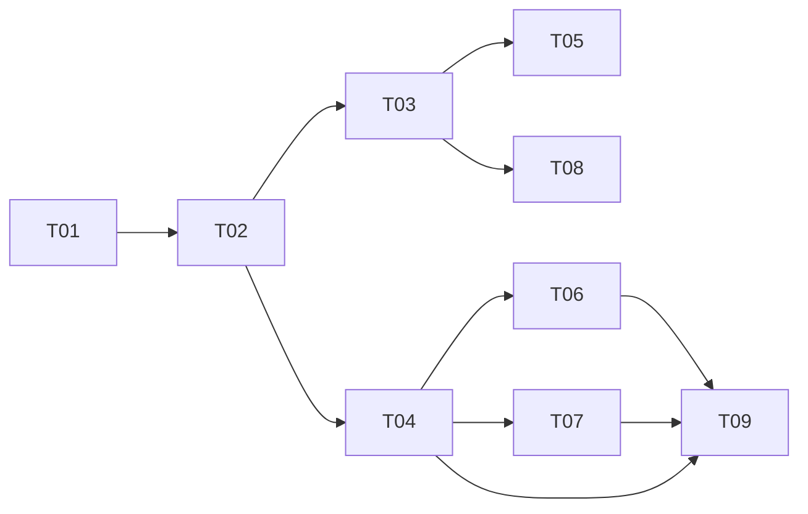

# Task tracker — F6 Application Tracking

Epic: [[_epic|_epic]]. Outcomes recorded here are F7's strongest preference evidence — far stronger than a tap on a card.

Each task is one reviewable PR (≤500 LOC), ≤1 day. Owner: Viacheslav (solo).
Estimate legend: **S** ≈ 2 h · **M** ≈ half a day · **L** ≈ a full day.
Status: `pending` → `in_progress` → `in_review` → `done`.

| ID | Task | Layer | Deps | Est | Status |
|---|---|---|---|---|---|
| T01 | [[T01-domain-application\|Domain: Application, TransitionRules, ReminderPolicy]] | domain | — | M | done |
| T02 | [[T02-application-persistence\|Migration and repositories]] | infra/db | T01 | S | done |
| T03 | [[T03-owner-action-handler\|Owner action handler]] | app | T02 | M | done |
| T04 | [[T04-pipeline-query\|Pipeline query and history view]] | app | T02 | M | done |
| T05 | [[T05-job-closure\|Job closure handling]] | app | T03 | S | pending |
| T06 | [[T06-reminder-sweep\|Reminder sweep]] | app | T04 | M | pending |
| T07 | [[T07-notes\|Notes]] | app | T04 | S | pending |
| T08 | [[T08-outcome-signals\|Outcome signals]] | app | T03 | M | pending |
| T09 | [[T09-commands-and-api\|Telegram commands and API endpoints]] | telegram/api | T04, T06, T07, ⟂F9 T04 | M | pending |

**9 tasks · 3×S + 6×M + 0×L ≈ 3.75 person-days.**

⟂ **Cross-feature build-order dependency:** T09's API endpoints are hosted on `jobhunter-api`, whose
authenticated host and owner-scope policy are established by [[../../f9-search-and-api/tasks/tracker|F9]]
T04 (api-host-auth). F6 T09 must land after F9 T04. Only F6's side of the edge is recorded here.

## Dependency graph

## DoR / DoD

- **DoR:** the feature's PRD, SAD, data-model and test-plan are accepted
  ([[../../../IMPLEMENTATION-READINESS|readiness]]); the task's own ACs and ADR links resolve.
- **DoD (every task):** code compiles with zero warnings; the transition matrix suite covers every status pair; the transitions table has no update path; the coverage gate stays green; the tracker row is updated in the same PR.

See [[../../../IMPLEMENTATION-READINESS]] §4 for the full per-task checklist.

## Delivered notes

- **T01** — the `Applications` domain in `JobHunter.Domain/Applications`: the `Application` aggregate
  (lazily created in `New` with its creating transition, advancing only along permitted moves and
  recording each as append-only history), `ApplicationStatus` and `TransitionSource` (persisted as
  `text`), `StatusTransition` (append-only history row, `From` null for the creating step),
  `TransitionRules` (the permitted `(from, to)` set as a `FrozenSet` **table**, per SAD §5) returning a
  value-typed `TransitionResult` that carries a per-pair **remedy** on refusal (never an exception —
  coding-standards §4), and `ReminderPolicy` (status→threshold from configuration, SAD §8 defaults
  Applied 10 d / Interview 7 d / Saved 5 d, no hard-coded durations). The **transition matrix suite**
  enumerates the full 7×7 Cartesian product (49 pairs) against
  [[../contracts/application-api|the contract]] table, and asserts every refusal carries a remedy and
  the diagonal is always a permitted no-op. `applied_at` is stamped once on first entry to `Applied`
  and never changed; `MarkPostingClosed` sets `posting_closed` without touching the status (AC-07) and
  is idempotent; `next_action_at` is rescheduled from the policy on each change and cleared for a
  status with nothing to chase.
- **T02** — the F6 persistence. The migration `F6AddApplications` creates `applications`,
  `application_transitions` and `application_notes` with all six declared indexes, including the two
  partial indexes on `applications` (`idx_applications_pipeline WHERE NOT archived`,
  `idx_applications_due WHERE next_action_at IS NOT NULL AND NOT archived`) and the partial
  `idx_transitions_outcome WHERE to_status IN ('Interview','Offer','Rejected')`. `ApplicationNote` joins
  the domain (body capped at 4 000 chars, blank rejected, `AddNote` counts as activity without changing
  status). The EF configs live in `Infrastructure/Persistence/Applications/`, auto-discovered by the
  assembly scan; transitions and notes are owned children written through the same insert. The
  `IApplicationRepository` port exposes only `Add`, `FindByJobAsync` and `SaveChangesAsync` — **no update
  and no delete path** (QG-1), asserted by a reflection test over both the port and its implementation.
  The integration suite proves against a real database: all six index names exist, an application with its
  transitions and notes round-trips, `uq_applications_job` rejects a second application for the same job,
  and the reminder-sweep and pipeline queries are `idx_applications_due`/`idx_applications_pipeline`-covered
  (query-plan assertions with no `Seq Scan`). The `last_reminder_condition`/`last_reminder_at` columns are
  deferred to T06, where reminder suppression (QG-3) gives them behaviour and tests.
- **T03** — the owner-action handler. Two integration events join `JobHunter.Contracts.Pipeline`:
  `OwnerActionRecorded` (the F5 digest tap — `JobId`, `Action` as string constants `Open`/`Ignore`/`Save`/
  `Applied`, `ChatId`, `OccurredAt`) and `ApplicationStatusChanged` (`ApplicationId`, `JobId`, `FromStatus`,
  `ToStatus`, `OccurredAt`), both registered in `PipelineEventContext`. `OwnerActionHandler`
  (`Application/Applications/`, Wolverine-discovered) loads the application for the job, creates it lazily in
  `New` on the first action (S2 — a delivered card with no action creates nothing), maps the action to a
  status (`Save→Saved`, `Ignore→Ignored`, `Applied→Applied`; `Open` is a URL button with no pipeline effect),
  calls `ChangeStatus`, persists, and publishes `ApplicationStatusChanged` — the status change, the history
  row and the outbox message committing together in the one Wolverine EF transaction (AC-03). A refused
  transition changes nothing and publishes nothing (AC-02, a value not an exception). Idempotence is the
  SAD §8 key `(application_id, to_status, occurred_at)`: the durable inbox collapses a redelivered envelope,
  and as a second net the handler skips an action whose exact `(to, occurred_at)` transition already exists,
  so a double-tap appends no second transition and re-emits nothing. Invariant 7 holds structurally — the
  handler has no notifier or HTTP dependency, so setting `Applied` can only write a transition and the event.
  The weighted outcome signal (S4) is T08's, which depends on this. `ReminderPolicy.Default` is registered so
  the handler can reschedule `next_action_at`; T06 will bind the thresholds from options.
- **T04** — the two read sides of F6, both Dapper and read-only (architecture rule 4). `IApplicationPipelineQuery`
  returns `ApplicationPipeline` (groups → entries): non-archived applications joined to their job, company and
  latest score, ordered `status, last_activity_at DESC` — the exact shape of the partial
  `idx_applications_pipeline`, so a preserving group-by yields each status column already most-recently-active
  first (AC-01), and the read is index-covered (query-plan assertion). `daysInStage` is computed at read time
  from the caller's `now` and the most recent transition, floored at zero — never stored (contract §Pipeline
  response, SAD §4 S6 keeps only `next_action_at` as a column). `IApplicationHistoryQuery` returns the single
  application with its complete ordered transitions (`idx_transitions_application`, oldest first including the
  creating `New` row, QG-1) and its notes (`idx_notes_application`, newest first) via one `QueryMultiple`;
  retrievable by id even when archived (SAD §8 Archival), null for an unknown id. The read models live in
  `Domain/Applications/` (`ApplicationPipeline`/`PipelineGroup`/`PipelineEntry`,
  `ApplicationHistory`/`HistoryTransition`/`HistoryNote`); both ports in `Domain/Abstractions/`; both
  implementations in `Infrastructure/Persistence/Queries/`, registered scoped. `now` is passed in, never
  `DateTime.Now` (coding-standards §IClock). Neither read selects anything about the Owner (F4 invariant).
