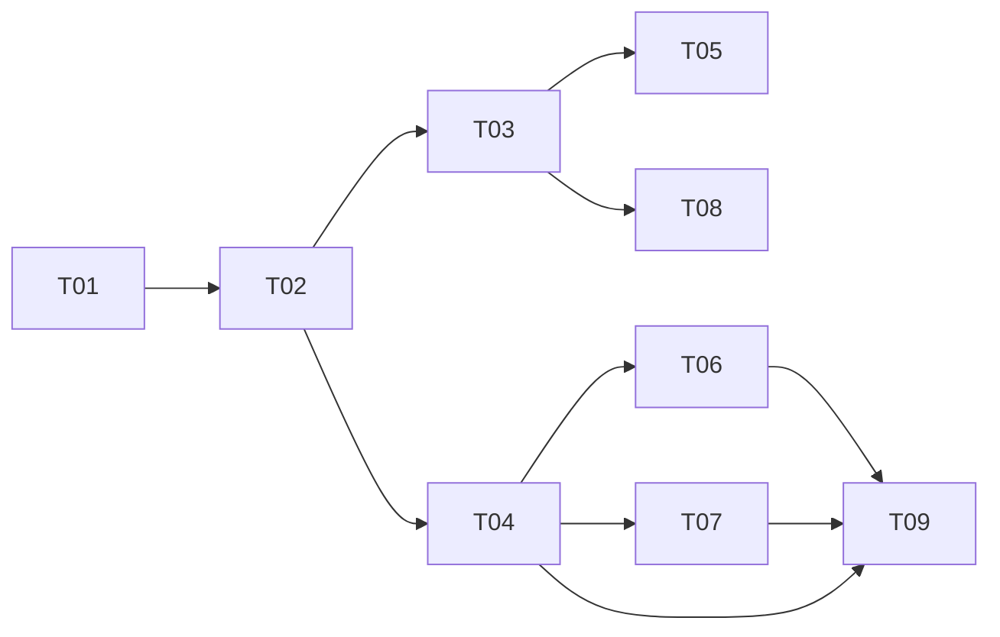

# Task tracker — F6 Application Tracking

Epic: [[_epic|_epic]]. Outcomes recorded here are F7's strongest preference evidence — far stronger than a tap on a card.

Each task is one reviewable PR (≤500 LOC), ≤1 day. Owner: Viacheslav (solo).
Estimate legend: **S** ≈ 2 h · **M** ≈ half a day · **L** ≈ a full day.
Status: `pending` → `in_progress` → `in_review` → `done`.

| ID | Task | Layer | Deps | Est | Status |
|---|---|---|---|---|---|
| T01 | [[T01-domain-application\|Domain: Application, TransitionRules, ReminderPolicy]] | domain | — | M | pending |
| T02 | [[T02-application-persistence\|Migration and repositories]] | infra/db | T01 | S | pending |
| T03 | [[T03-owner-action-handler\|Owner action handler]] | app | T02 | M | pending |
| T04 | [[T04-pipeline-query\|Pipeline query and history view]] | app | T02 | M | pending |
| T05 | [[T05-job-closure\|Job closure handling]] | app | T03 | S | pending |
| T06 | [[T06-reminder-sweep\|Reminder sweep]] | app | T04 | M | pending |
| T07 | [[T07-notes\|Notes]] | app | T04 | S | pending |
| T08 | [[T08-outcome-signals\|Outcome signals]] | app | T03 | M | pending |
| T09 | [[T09-commands-and-api\|Telegram commands and API endpoints]] | telegram/api | T04, T06, T07, ⟂F9 T04 | M | pending |

**9 tasks · 3×S + 6×M + 0×L ≈ 3.75 person-days.**

⟂ **Cross-feature build-order dependency:** T09's API endpoints are hosted on `jobhunter-api`, whose
authenticated host and owner-scope policy are established by [[../../f9-search-and-api/tasks/tracker|F9]]
T04 (api-host-auth). F6 T09 must land after F9 T04. Only F6's side of the edge is recorded here.

## Dependency graph

## DoR / DoD

- **DoR:** the feature's PRD, SAD, data-model and test-plan are accepted
  ([[../../../IMPLEMENTATION-READINESS|readiness]]); the task's own ACs and ADR links resolve.
- **DoD (every task):** code compiles with zero warnings; the transition matrix suite covers every status pair; the transitions table has no update path; the coverage gate stays green; the tracker row is updated in the same PR.

See [[../../../IMPLEMENTATION-READINESS]] §4 for the full per-task checklist.
