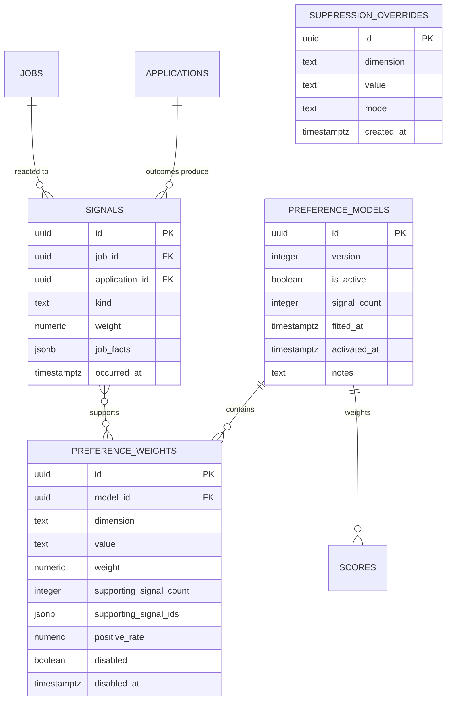

# Data model — f7-preference-learning

> **Owns:** `signals`, `preference_models`, `preference_weights`, `suppression_overrides`
> **References (do not redefine):** `jobs` (F2), `scores` (F4), `applications` (F6).
> **Note:** F5 and F6 **write** `signals` rows; F7 owns the schema and is the only reader.

## ER diagram

## Entities

### `signals`

The evidence. Written by F5 (card actions) and F6 (outcomes); read only by F7.

| Column | Type | Constraints | Notes |
|---|---|---|---|
| `id` | uuid | PK | |
| `job_id` | uuid | NOT NULL, FK | |
| `application_id` | uuid | NULL, FK | present for outcome signals (FK added by F6 when `applications` exists — T02 as-built) |
| `kind` | text | NOT NULL | `Opened`, `Ignored`, `Saved`, `Applied`, `Interview`, `Offer`, `Rejected`, `Rated` |
| `weight` | numeric(3,1) | NOT NULL | 1.0 for card actions up to 6.0 for an offer |
| `job_facts` | jsonb | NOT NULL | **the job's characteristics at the moment of the action** |
| `occurred_at` | timestamptz | NOT NULL | |

`job_facts` is the load-bearing column and the reason signals are not simply a join. It snapshots
salary band, country, company size, technologies, timezone band, remote policy and employment type as
they were **when the Owner reacted**. Joining to `jobs` at fitting time would let a later edit rewrite
what the Owner is recorded as having reacted to — quietly corrupting the evidence.

**Constraints:** unique `(job_id, kind, occurred_at)` — a redelivered action produces no second signal.

### `preference_models`

| Column | Type | Constraints | Notes |
|---|---|---|---|
| `id` | uuid | PK | |
| `version` | integer | NOT NULL, UNIQUE | monotonic |
| `is_active` | boolean | NOT NULL | partial unique index: exactly one |
| `signal_count` | integer | NOT NULL | how much evidence produced it |
| `fitted_at` / `activated_at` | timestamptz | | |
| `notes` | text | NULL | e.g. `insufficient evidence: 143 signals` |

**Immutable.** A refit inserts a new version and flips activation atomically, so a bad refit is a
rollback rather than an incident (SAD §4 S6).

### `preference_weights`

| Column | Type | Notes |
|---|---|---|
| `id` | uuid | PK |
| `model_id` | uuid | FK |
| `dimension` | text | `SalaryBand`, `Country`, `CompanySize`, `Technology`, `TimezoneBand`, `RemotePolicy`, `EmploymentType` (planned: `AiUsage`, `RoleFamily` — TUNE-08 / F7 T10) |
| `value` | text | e.g. `DE`, `150-180k`, `SeriesB`, `Kafka` |
| `weight` | numeric(5,4) | −1.00 to +1.00 |
| `supporting_signal_count` | *(derived)* | **≥ 3 required** (AC-03); not a stored column — derived from `supporting_signal_ids` (T02 as-built) |
| `supporting_signal_ids` | jsonb | **the whole of QG-1** — the evidence, by id |
| `positive_rate` | numeric(5,4) | the rate that produced the weight, retained so the explanation can quote it |
| `disabled` | boolean | Owner override (AC-06) |
| `disabled_at` | timestamptz | NULL |

`supporting_signal_ids` is what turns "the system decided you dislike Berlin" into "34 of your last
38 ignores were Berlin roles". Without it the weight is an assertion; with it, it is evidence
([[adr/0002-evidence-threshold-and-explainability|ADR-F7-0002]]).

`positive_rate` is stored rather than recomputed so the explanation is stable even after the window
moves on.

### `suppression_overrides`

Owner instructions that outrank learning entirely.

| Column | Type | Notes |
|---|---|---|
| `id` | uuid | PK |
| `dimension` / `value` | text | what the rule applies to |
| `mode` | text | `NeverSuppress` or `AlwaysSuppress` |
| `created_at` | timestamptz | |

`NeverSuppress` is the escape hatch for AC-06: the Owner can guarantee a category keeps appearing
regardless of what the model infers.

## Indexes

| Index | Columns | Serves |
|---|---|---|
| `uq_signals_action` | `signals(job_id, kind, occurred_at)` | idempotent capture |
| `idx_signals_window` | `signals(occurred_at DESC)` | the 180-day fitting window |
| `idx_signals_kind` | `signals(kind, occurred_at DESC)` | per-kind aggregation |
| `uq_preference_models_active` | `preference_models(is_active) WHERE is_active` | exactly one active |
| `uq_preference_models_version` | `preference_models(version)` | monotonic versioning |
| `idx_preference_weights_lookup` | `preference_weights(model_id, dimension, value) WHERE NOT disabled` | the per-job lookup during ranking |
| `uq_suppression_overrides` | `suppression_overrides(dimension, value)` | one rule per value |

## Handoffs / interfaces

- **Consumes** `signals` written by F5 and F6.
- **Produces** `PreferenceModelUpdated` → F4 ranking.
- **Read by** F4's `ScoreCalculator` for the preference component, and by F5 for the digest footer.

## Related

[[../../architecture/data-model]] · [[sad]] §8 · [[adr/0002-evidence-threshold-and-explainability|ADR-F7-0002]]
