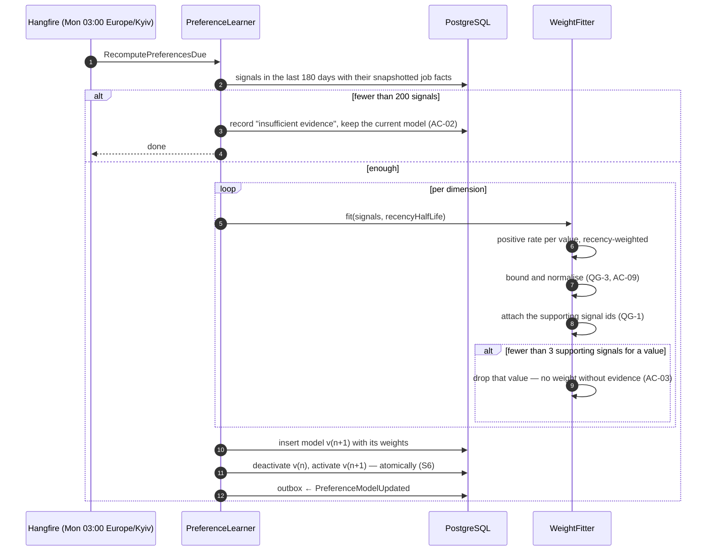
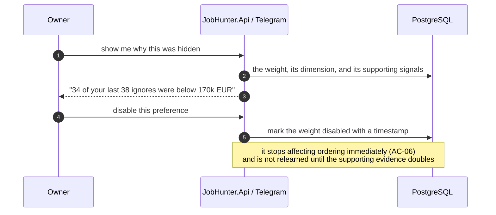

# SAD — F7 Preference Learning

> Supplies the preference component of the ranking formula owned by
> [[../f4-cv-matching-ranking/adr/0001-explainable-linear-scoring|ADR-F4-0001]]. F7 changes one number
> per job; it does not touch the formula.

## 1. Intent and quality goals

Turn recorded behaviour into bounded, explainable weights that measurably improve tomorrow's ordering.

| # | Goal | Verification |
|---|---|---|
| QG-1 | **Every weight is explainable** — the signals that produced it are identifiable | Assertion on every weight row; a weight citing fewer than 3 signals is invalid |
| QG-2 | **Nothing is hidden silently** — every suppression is counted and reasoned | Digest integration test; invariant 11 |
| QG-3 | **Bounded influence** — no dimension can dominate, and learning can never empty the digest | Property test over adversarial signal distributions |

## 2. Constraints

- Weights are consumed as one component of F4's formula. F7 never reorders directly.
- Explicit Profile preferences outrank inferred ones, always (AC-05).
- 200 signals minimum before first activation ([[../../DECISION-LOG|D6]]).
- Suppression records a reason ([[../../CONTEXT]] invariant 11).
- Exactly one active model at a time.

## 3. Context and scope

**In:** signal storage and weighting, the fitting method, model versioning and activation, suppression
rules, the explainability view, Owner overrides.
**Out:** signal capture (F5 and F6), the ranking formula (F4), the digest text (F5).

No external systems. F7 is entirely internal, which is unusual in this codebase and worth noting: its
whole risk surface is statistical rather than operational.

## 4. Solution strategy

| # | Choice | Why |
|---|---|---|
| S1 | **Transparent frequency weighting**, not a learned ranker | Explainability is a hard requirement, and a few hundred signals cannot support anything else without over-fitting ([[adr/0001-transparent-frequency-weighting\|ADR-F7-0001]]) |
| S2 | Weights cite their supporting signals | QG-1, and it makes a wrong weight diagnosable in one query ([[adr/0002-evidence-threshold-and-explainability\|ADR-F7-0002]]) |
| S3 | Weekly refit, not continuous | Stable, cheap, and one bad day cannot move the model |
| S4 | Signals carry the job's facts **at the moment of the action** | A later job edit must not rewrite what the Owner reacted to |
| S5 | Weights are bounded and normalised per dimension | QG-3. An overwhelming pattern in one dimension must not become the only thing that matters |
| S6 | Models are versioned and activated atomically; the previous one stays queryable | A bad refit is a rollback, not an incident |

## 5. Building block view

```text
JobHunter.Domain/Preferences/    Signal · SignalKind · SignalWeight
                                 PreferenceModel · PreferenceWeight · Dimension
                                 SuppressionRule
JobHunter.Application/Preferences/  PreferenceLearner · WeightFitter · DimensionExtractor
                                    SuppressionEvaluator · PreferenceExplainer
JobHunter.Infrastructure/Persistence/ SignalRepository · PreferenceModelRepository
                                      SignalAggregationQuery
```

`WeightFitter` is pure, which is what makes the synthetic-behaviour corpus possible:

```csharp
public static FittedModel Fit(IReadOnlyList<SignalFact> signals, FittingOptions options);
```

No repository, no clock — the recency reference time is an option. Feeding it a synthetic behaviour
profile and asserting the resulting weights is then a fast unit test rather than an integration test.

## 6. Runtime view

### 6.1 Weekly refit



### 6.2 Applying preferences

```mermaid
sequenceDiagram
  autonumber
  participant R as RankingHandler (F4)
  participant P as PreferenceModel
  participant S as SuppressionEvaluator
  participant DB as PostgreSQL

  R->>DB: load the active model
  alt none active
    R->>R: preference component = 0; remaining weights renormalise
  else active
    loop per job
      R->>P: preference score across dimensions
      P->>P: explicit Profile preference overrides any inferred one (AC-05)
      P-->>R: component in [0,1] + per-dimension contributions
      R->>S: evaluate suppression
      alt suppressed
        S-->>R: reason, e.g. "learned: salary below 170k in 34 of 38 ignores"
        R->>DB: score row with suppressed = true and the reason (AC-04, QG-2)
      end
    end
  end
  Note over R,DB: the digest footer reports the counts and reasons —<br/>never a silent filter (invariant 11)
```

### 6.3 Owner override



## 7. Deployment view

Runs in `jobhunter-worker` (the weekly refit) and is consumed inline by F4's ranking. Two read
endpoints and two write endpoints on `jobhunter-api`. No new deployable.

**Monitoring:** `jobhunter.preferences.model_version`, `jobhunter.preferences.signals_used`,
`jobhunter.ranking.suppressed{reason}`, `jobhunter.preferences.weights_disabled`,
and `jobhunter.precision_at_10` as the outcome measure.

## 8. Crosscutting concepts

| Concept | Convention |
|---|---|
| Dimensions | `SalaryBand`, `Country`, `CompanySize`, `Technology`, `TimezoneBand`, `RemotePolicy`, `EmploymentType` |
| Signal weight | Card action 1.0; `Applied` 2.0; `Interview` 4.0; `Offer` 6.0; `Rejected` 3.0 (F6 §8) |
| Recency | Exponential decay, 60-day half-life within a 180-day window |
| Evidence floor | A value needs ≥ 3 supporting signals to earn a weight (AC-03) |
| Bounding | No dimension contributes more than 0.40 of the preference component (AC-09) |
| Suppression floor | If suppression would leave fewer than 3 cards, the least-suppressed are restored and the digest says so (QG-3) |
| Precedence | Explicit Profile > learned weight > default. Conflicts recorded (AC-05) |
| Versioning | Immutable models; activation is atomic; the previous model stays queryable for rollback |

## 9. Architecture decisions

| # | Title | Status |
|---|---|---|
| [[adr/0001-transparent-frequency-weighting\|F7-0001]] | Transparent frequency weighting, not a learned ranker | Accepted |
| [[adr/0002-evidence-threshold-and-explainability\|F7-0002]] | No weight without cited evidence; 200-signal activation floor | Accepted |

## 10. Quality requirements

**QG-1. Every weight is explainable**
- **When:** the Owner asks why something was hidden or down-ranked.
- **Then:** the answer names the dimension, the value, the rate and the number of supporting actions,
  in one sentence.
- **How verify:** every persisted weight cites ≥ 3 signal ids; a weight citing fewer is rejected at
  the domain boundary, not filtered out later.

**QG-2. Nothing is hidden silently**
- **When:** any job is suppressed by a learned preference.
- **Then:** it is counted in the digest footer with its reason, and remains retrievable.
- **How verify:** integration test asserting the digest's suppression breakdown equals the count of
  suppressed score rows, per reason.

**QG-3. Bounded influence**
- **When:** the signal history is adversarial — one dimension overwhelmingly one-sided, or almost
  everything ignored.
- **Then:** no dimension exceeds its bound, and the digest still contains at least three cards.
- **How verify:** property test over generated adversarial distributions, asserting both bounds hold.

## 11. Risks and technical debt

| # | Item | Impact | Plan |
|---|---|---|---|
| D1 | Over-fitting to a transient mood — a bad week narrows the digest for months | Missed opportunities | 200-signal floor, 180-day window with recency decay, bounded weights, one-tap Owner override |
| D2 | Correlated dimensions double-count — salary and company size move together | One preference applied twice | Weights normalised across dimensions; the synthetic corpus includes a correlated profile that asserts the total effect stays bounded |
| D3 | Suppression regret is invisible unless measured | A wrong weight persists | Suppressed jobs are retrievable and a `/hidden` view exists; retrieval-then-action is tracked as regret |
| D4 | `precision@10` is a small weekly sample | Improvement is hard to prove | Reported as a trend with a baseline, never a single-week claim; AC-08 asks for comparability, not significance |
| D5 | Frequency weighting cannot express interactions | Nuance lost | Accepted, and stated: the model's `match_score` already captures interaction within fit. Revisit only with thousands of signals ([[../../BACKLOG]] §4) |

**Accepted debt:** no learned ranker; no cross-dimension interactions; no real-time adaptation; no
per-dimension confidence intervals.

## 12. Glossary

`Signal`, `PreferenceModel` are defined in [[../../CONTEXT]] §1.
