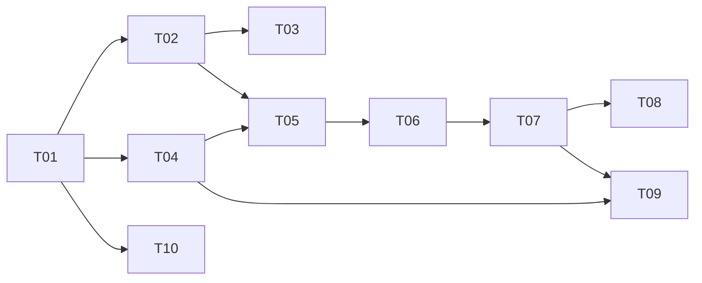

# Task tracker — F7 Preference Learning

Epic: [[_epic|_epic]]. Explainability is a hard requirement here: a filter the Owner cannot see is indistinguishable from a bug.

> Task T10 added from the [[../../../reviews/career-alignment-tuning-backlog|career-alignment tuning backlog]] (career-goal alignment).

Each task is one reviewable PR (≤500 LOC), ≤1 day. Owner: Viacheslav (solo).
Estimate legend: **S** ≈ 2 h · **M** ≈ half a day · **L** ≈ a full day.
Status: `pending` → `in_progress` → `in_review` → `done`.

| ID | Task | Layer | Deps | Est | Status |
|---|---|---|---|---|---|
| T01 | [[T01-domain-preferences\|Domain: Signal, PreferenceModel, PreferenceWeight]] | domain | — | M | done |
| T02 | [[T02-preference-persistence\|Migration and repositories]] | infra/db | T01 | S | done |
| T03 | [[T03-signal-capture\|Signal capture verification]] | app | T02 | S | done |
| T04 | [[T04-weight-fitter\|WeightFitter]] | app | T01 | L | done |
| T05 | [[T05-preference-learner\|PreferenceLearner and weekly refit]] | app | T04, T02 | M | done |
| T06 | [[T06-preference-component\|Preference component and precedence]] | app | T05 | M | done |
| T07 | [[T07-suppression-floor\|Suppression evaluation and the card floor]] | app | T06 | M | done |
| T08 | [[T08-explainability-overrides\|Explainability view and Owner overrides]] | app/api | T07, ⟂F9 T04 | M | done |
| T09 | [[T09-corpus-and-metrics\|Synthetic corpus, property suite and precision tracking]] | tests | T04, T07 | L | pending |
| T10 | [[T10-aiusage-rolefamily-dimensions\|Add AiUsage and RoleFamily as preference dimensions]] | domain | T01 | M | done |

**9 tasks · 2×S + 5×M + 2×L ≈ 5 person-days.**

**Career-alignment tuning task (T10): 1×M ≈ 0.5 person-day.** Added from the
[[../../../reviews/career-alignment-tuning-backlog|career-alignment tuning backlog]] (TUNE-08); it
extends the closed `Dimension` enum with `AiUsage` and `RoleFamily` so the loop can reinforce the
Owner's target trajectory under the existing evidence and weight guards.

**O5 decided (2026-08-07).** The salary floor is a ranking down-weight, not a hard pre-filter — the hard
filter is an explicit Owner opt-in, off by default ([[../../../ARCHITECTURE-OPEN-DECISIONS|O5]]). T07 was
blocked on that decision; it is now settled and T07 is `done`. All other F7 tasks are `[ ]` ready.

⟂ **Cross-feature build-order dependency:** T08's explainability and override endpoints are hosted on
`jobhunter-api`, whose authenticated host and owner-scope policy are established by
[[../../f9-search-and-api/tasks/tracker|F9]] T04 (api-host-auth). F7 T08 must land after F9 T04. Only
F7's side of the edge is recorded here.

## Dependency graph

## DoR / DoD

- **DoR:** the feature's PRD, SAD, data-model and test-plan are accepted
  ([[../../../IMPLEMENTATION-READINESS|readiness]]); the task's own ACs and ADR links resolve.
- **DoD (every task):** code compiles with zero warnings; all nine synthetic profiles pass including the indifferent one; every weight cites at least three signals; every suppression records a reason; the coverage gate stays green; the tracker row is updated in the same PR.

See [[../../../IMPLEMENTATION-READINESS]] §4 for the full per-task checklist.
