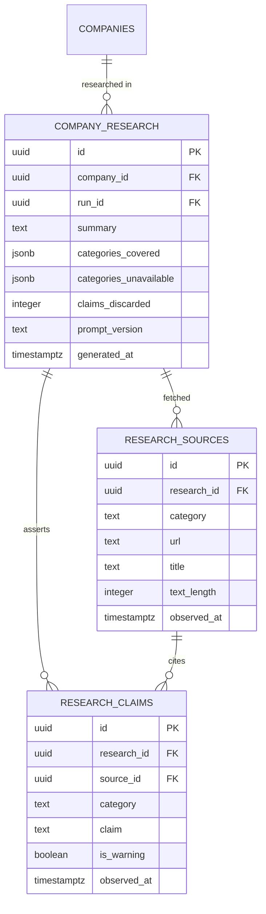

# Data model — f8-company-research-agent

> **Owns:** `company_research`, `research_claims`, `research_sources`
> **References (do not redefine):** `companies` (F1 — F8 updates `stage` and `employee_band` under the
> whitelisted cross-owner write in [[../../AUDIT-RESOLUTION-DECISIONS]] §1), `runs` (F3).

## ER diagram

## Entities

### `company_research`

One dossier per `(company, run)`.

| Column | Type | Constraints | Notes |
|---|---|---|---|
| `id` | uuid | PK | |
| `company_id` / `run_id` | uuid | NOT NULL, FK | |
| `summary` | text | NOT NULL | two or three sentences, itself constrained to the cited claims |
| `categories_covered` | jsonb | NOT NULL | which of the eight produced claims |
| `categories_unavailable` | jsonb | NOT NULL | which produced nothing — **absence of information is information** (AC-07) |
| `claims_discarded` | integer | NOT NULL DEFAULT 0 | uncited claims dropped. A rising value across dossiers is the early warning that the prompt is drifting toward assertion |
| `prompt_version` | text | NOT NULL | |
| `generated_at` | timestamptz | NOT NULL | |

**Constraints:** unique `(company_id, run_id)`.

Recording `categories_unavailable` explicitly, rather than simply omitting them, is what lets the
dossier say "no engineering blog found" instead of leaving the Owner to wonder whether it was checked.

### `research_sources`

Every document fetched, stored **before** synthesis (SAD §4 S2). This table is the citation authority.

| Column | Type | Notes |
|---|---|---|
| `id` | uuid | PK |
| `research_id` | uuid | FK |
| `category` | text | which fetcher retrieved it |
| `url` | text | **the exact URL fetched** — what a claim must match |
| `title` | text | |
| `text_length` | integer | the extracted text is not retained after synthesis, only its length, for diagnostics |
| `observed_at` | timestamptz | fetch time, which becomes the claim's date (AC-03) |

Storing the sources before the model runs is what turns "did the model invent this" from a judgement
into a set-membership check. That inversion is the whole design.

The extracted text itself is discarded after synthesis — it is reproducible by re-fetching, and
retaining megabytes of third-party page content indefinitely buys nothing.

### `research_claims`

| Column | Type | Constraints | Notes |
|---|---|---|---|
| `id` | uuid | PK | |
| `research_id` | uuid | NOT NULL, FK | |
| `source_id` | uuid | **NOT NULL**, FK to `research_sources` | **This is [[../../CONTEXT]] invariant 5.** A claim cannot exist without a source — enforced by the schema, not by a validation step |
| `category` | text | NOT NULL | one of the eight |
| `claim` | text | NOT NULL | one sentence |
| `is_warning` | boolean | NOT NULL DEFAULT false | layoffs, funding difficulty — surfaced first (AC-04) |
| `observed_at` | timestamptz | NOT NULL | copied from the source (AC-03) |

`source_id NOT NULL` with a foreign key is the strongest available expression of the invariant: an
uncited claim is not merely rejected by application logic, it is unrepresentable.

## Indexes

| Index | Columns | Serves |
|---|---|---|
| `uq_research_company_run` | `company_research(company_id, run_id)` | one dossier per company per Run |
| `idx_research_company_latest` | `company_research(company_id, generated_at DESC)` | the latest dossier, and freshness checks |
| `idx_sources_research` | `research_sources(research_id, category)` | citation verification |
| `uq_sources_url` | `research_sources(research_id, url)` | one row per fetched URL |
| `idx_claims_research` | `research_claims(research_id, category)` | rendering, grouped by category |
| `idx_claims_warnings` | `research_claims(research_id) WHERE is_warning` | warnings first (AC-04) |

## Handoffs / interfaces

- **Consumes** `RankingCompleted` (F4) to select targets; `companies` (F1) for identity.
- **Produces** `ResearchCompleted` — consumed by F5 for digest enrichment.
- **Updates** `companies.stage` and `companies.employee_band` from the firmographic categories
  (AC-10) — the whitelisted cross-owner write in F8 ([[../../AUDIT-RESOLUTION-DECISIONS]] §1, owner F1
  acknowledges), and it is deliberate: better data should improve ranking, not only the dossier.
- **Read by** F5 (digest and the company command) and F9 (search facets).

## Related

[[../../architecture/data-model]] · [[sad]] §8 · [[contracts/research-schema]] · [[../../CONTEXT]] invariant 5
