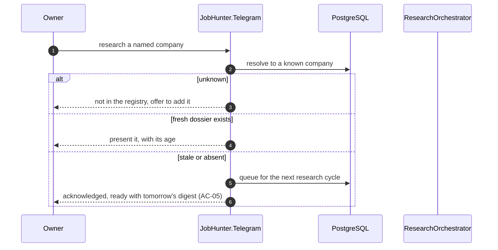

# SAD — F8 Company Research Agent

> Reuses the Run and Batch machinery from [[../f3-claude-batch-enrichment/sad|F3]] for synthesis.

## 1. Intent and quality goals

Produce a trustworthy company dossier automatically, where *trustworthy* means every claim is traceable.

| # | Goal | Verification |
|---|---|---|
| QG-1 | **Zero uncited claims** — a claim without a source is discarded, never shown | Assertion on every claim row; the uncited-claim suite |
| QG-2 | **Fetch, then synthesise** — the model summarises retrieved text, it does not recall facts | Architecture: the synthesiser receives only fetched content and can cite only what it was given |
| QG-3 | **Safe fetching** — no request can be aimed at internal infrastructure | SSRF suite over adversarial URLs |

## 2. Constraints

- Public sources only; no paid providers, no authentication to third parties.
- All fetching goes through F1's `PolitenessHandler` — robots, rate budget, timeouts, SSRF guard.
- Synthesis is one deep-tier batch item per company, through F3's machinery.
- Every claim carries a source URL ([[../../CONTEXT]] invariant 5).
- ≤ 5 automatic dossiers per day; on-demand requests are separate and bounded.

## 3. Context and scope

| External | Interaction | Failure |
|---|---|---|
| Company website and `/blog`, `/engineering` | HTML, JSON-LD, RSS | Category recorded as unavailable |
| GitHub organisation API | public REST | Category recorded as unavailable |
| Funding sources with public APIs or feeds | JSON / RSS | Category recorded as unavailable |
| News search with a public feed | RSS | Category recorded as unavailable |
| Anthropic (via F3) | one deep-tier item per company | Dossier deferred to the next cycle |

**In:** target selection, the fetcher set, content extraction, synthesis, citation verification,
freshness, on-demand requests, presentation.
**Out:** contact data, salary benchmarking, interview preparation, any recommendation.

## 4. Solution strategy

| # | Choice | Why |
|---|---|---|
| S1 | **Fetch first, synthesise second** — the model only ever sees text we retrieved | QG-1 and QG-2. A model asked to recall facts about a company will produce fluent, partly-false prose ([[adr/0001-fetch-then-synthesise\|ADR-F8-0001]]) |
| S2 | Every fetched document is stored with its URL and fetch time **before** synthesis | Makes citation verification a set-membership check rather than a judgement |
| S3 | Claims are verified against the fetched set; unmatched claims are **discarded**, not flagged | QG-1. A flagged uncertain claim still gets read as a claim |
| S4 | One fetcher per category behind a port | A dead source degrades one category, never the dossier |
| S5 | Fetch targets pass an allowlist and a public-address check | QG-3. This is the only feature where a URL derives partly from model output |
| S6 | Funding stage feeds back to `companies.stage` | AC-10 — better data improves ranking, not just the dossier |

## 5. Building block view

```text
JobHunter.Domain/Research/     CompanyResearch · ResearchClaim · ResearchCategory
                               ResearchSource · Freshness
JobHunter.Domain/Abstractions/ IResearchFetcher
JobHunter.Application/Research/  ResearchTargetSelector · ResearchOrchestrator
                                 ClaimVerifier · FreshnessPolicy
JobHunter.Scrapers/Research/   CompanyWebsiteFetcher · EngineeringBlogFetcher
                               GitHubOrgFetcher · FundingFetcher · NewsFeedFetcher
                               ReviewsFetcher · InterviewProcessFetcher
JobHunter.Claude/Prompts/ResearchSynthesisPrompt.cs
JobHunter.Infrastructure/Persistence/ ResearchRepository
```

```csharp
public interface IResearchFetcher
{
    ResearchCategory Category { get; }
    Task<IReadOnlyList<FetchedDocument>> FetchAsync(Company company, CancellationToken ct);
}

public sealed record FetchedDocument(string Url, string Title, string Text, DateTimeOffset ObservedAt);
```

`FetchedDocument.Url` is what every claim must later match. Storing the URL with the text, before the
model ever sees it, is what turns "did the model make this up" into a set-membership question.

## 6. Runtime view

### 6.1 Research a company

```mermaid
sequenceDiagram
  autonumber
  participant R as RankingCompleted (F4)
  participant S as ResearchTargetSelector
  participant O as ResearchOrchestrator
  participant F as IResearchFetcher (×7)
  participant P as PolitenessHandler (F1)
  participant DB as PostgreSQL
  participant C as Claude (deep, via F3)
  participant V as ClaimVerifier

  R->>S: top job ids
  S->>DB: their companies, dossier freshness
  S->>S: pick <= 5 with no dossier or a stale one (AC-06)
  loop per company
    O->>F: fetch each category
    F->>P: HTTP through the shared politeness pipeline
    P->>P: allowlist + public-address check (QG-3)
    F-->>O: documents, or none
    O->>DB: store every fetched document with its URL and observed time (S2)
    alt no document for a category
      O->>DB: record the category as unavailable (AC-07)
    end
  end
  O->>C: synthesis batch — one item per company, containing ONLY the fetched text
  C-->>O: claims, each asserting a source URL
  loop per claim
    V->>V: does the asserted URL appear in this company's fetched set?
    alt matched
      V->>DB: store the claim with its source and observed date (AC-02, AC-03)
    else unmatched
      V->>DB: record the discard; the claim is NOT stored (AC-08, QG-1)
    end
  end
  O->>DB: update companies.stage from the funding category (AC-10)
  O->>DB: outbox ← ResearchCompleted
```

The verification step in the loop is the feature. The model is asked to cite; the verifier checks;
anything unmatched is dropped without ceremony.

### 6.2 On-demand request



## 7. Deployment view

Runs in `jobhunter-worker`. Requires outbound HTTPS to arbitrary public hosts — which is why the SSRF
guard is load-bearing here rather than precautionary. No new deployable.

**Monitoring:** `jobhunter.research.dossiers`, `jobhunter.research.claims_discarded`,
`jobhunter.research.category_coverage`, `jobhunter.research.fetch_failures{category}`.
A rising discard rate is the early warning that the prompt is drifting toward assertion.

## 8. Crosscutting concepts

| Concept | Convention |
|---|---|
| Categories | `Funding`, `EngineeringBlog`, `OpenSource`, `Reviews`, `News`, `Layoffs`, `Stack`, `InterviewProcess` |
| Citation | Every claim stores the exact fetched URL; verification is set membership, not string similarity |
| Freshness | 30 days; `News` and `Layoffs` refresh at 7 days |
| Fetch budget | ≤ 12 requests and ≤ 60 s per company, enforced by the orchestrator |
| Allowlist | Target hosts must match a category-specific pattern; anything else is refused and logged |
| Extraction | HTML to plain text at the boundary; scripts and styles discarded; capped at 20 000 chars per document |
| Idempotency | Research on `(company_id, run_id)` |
| Unavailable | A category with no documents is recorded explicitly — absence of information is information |

## 9. Architecture decisions

| # | Title | Status |
|---|---|---|
| [[adr/0001-fetch-then-synthesise\|F8-0001]] | Curated fetchers plus synthesis, never open web search | Accepted |

## 10. Quality requirements

**QG-1. Zero uncited claims**
- **When:** synthesis returns claims, including some citing URLs that were never fetched.
- **Then:** only claims whose source is in the fetched set are stored; the rest are discarded and counted.
- **How verify:** the uncited-claim suite — fixtures containing fabricated citations, asserting they
  are discarded; plus an assertion that every stored claim row has a non-null source that appears in
  `research_sources`.

**QG-2. Fetch, then synthesise**
- **When:** a dossier is produced for a company the model has extensive training knowledge of.
- **Then:** the dossier contains only claims traceable to the fetched documents, even where the model
  "knows" more.
- **How verify:** a fixture with a deliberately sparse fetch set for a famous company; assert the
  dossier is correspondingly sparse rather than richly populated from memory.

**QG-3. Safe fetching**
- **When:** a fetch target derives from model output or a company-controlled page.
- **Then:** private, link-local and loopback addresses are refused, and non-allowlisted hosts are refused.
- **How verify:** the SSRF suite over adversarial URLs — raw IPs, decimal-encoded IPs, DNS rebinding,
  redirects into private space, and `file://`-style schemes.

## 11. Risks and technical debt

| # | Item | Impact | Plan |
|---|---|---|---|
| D1 | **SSRF** — the only feature fetching URLs influenced by model output | Internal network exposure | Allowlist plus public-address resolution, checked after redirects too; the SSRF suite; a required security review |
| D2 | Public sources change shape or disappear | Category coverage falls | One fetcher per category behind a port; a dead source degrades one category |
| D3 | Review sources have restrictive terms | Category unavailable | Only sources with a usable public API or feed; skip rather than scrape ([[../../ARCHITECTURE-OPEN-DECISIONS\|O4]]) |
| D4 | A model asserting a plausible URL that happens to have been fetched | A fabricated claim slips through with a real citation | Claims must be substantiated by the *text* of the cited document, asserted by a sampling check in the corpus; imperfect, and stated as such |
| D5 | Dossiers age silently | Stale information presented as current | Every claim shows its observed date (AC-03); staleness triggers refresh |

**Accepted debt:** no paid data sources; no cross-company comparison; no sentiment scoring of reviews;
D4's residual risk is acknowledged rather than solved.

## 12. Glossary

`CompanyResearch`, `ResearchClaim` are defined in [[../../CONTEXT]] §1.
