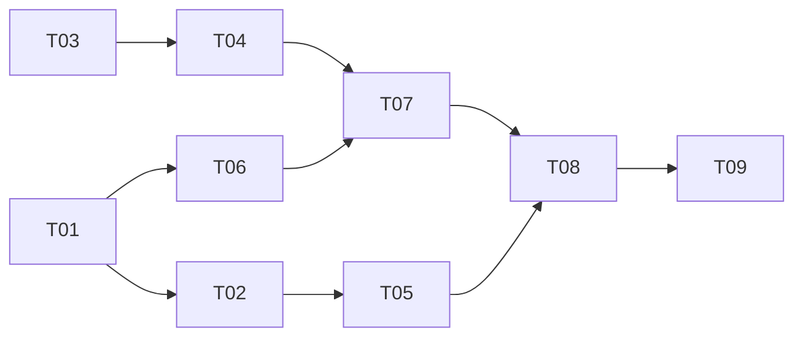

# Task tracker — F8 Company Research Agent

Epic: [[_epic|_epic]]. Every claim carries a URL, or it is discarded. A security review is required before this ships — it is the only feature fetching URLs influenced by model output.

Each task is one reviewable PR (≤500 LOC), ≤1 day. Owner: Viacheslav (solo).
Estimate legend: **S** ≈ 2 h · **M** ≈ half a day · **L** ≈ a full day.
Status: `pending` → `in_progress` → `in_review` → `done`.

| ID | Task | Layer | Deps | Est | Status |
|---|---|---|---|---|---|
| T01 | [[T01-domain-research\|Domain: CompanyResearch, ResearchClaim, categories]] | domain | — | S | done |
| T02 | [[T02-research-persistence\|Migration and repository]] | infra/db | T01 | S | done |
| T03 | [[T03-fetcher-port-ssrf\|IResearchFetcher port and SSRF-safe fetch path]] | scrapers | — | L | done |
| T04 | [[T04-category-fetchers\|Category fetchers]] | scrapers | T03 | L | done |
| T05 | [[T05-target-selection\|Target selection and freshness]] | app | T02 | M | pending |
| T06 | [[T06-synthesis-prompt\|Synthesis prompt and schema]] | claude | T01 | M | pending |
| T07 | [[T07-claim-verification\|Claim verification]] | app | T06, T04 | M | pending |
| T08 | [[T08-orchestration-feedback\|Orchestration, warnings and stage feedback]] | app | T07, T05 | M | pending |
| T09 | [[T09-presentation-command\|Presentation and on-demand command]] | telegram/api | T08 | M | pending |

**9 tasks · 2×S + 5×M + 2×L ≈ 5 person-days.**

## Dependency graph

## DoR / DoD

- **DoR:** the feature's PRD, SAD, data-model and test-plan are accepted
  ([[../../../IMPLEMENTATION-READINESS|readiness]]); the task's own ACs and ADR links resolve.
- **DoD (every task):** code compiles with zero warnings; the uncited-claim and SSRF suites are green; every stored claim has a verifiable source; the coverage gate stays green; the tracker row is updated in the same PR.

See [[../../../IMPLEMENTATION-READINESS]] §4 for the full per-task checklist.
