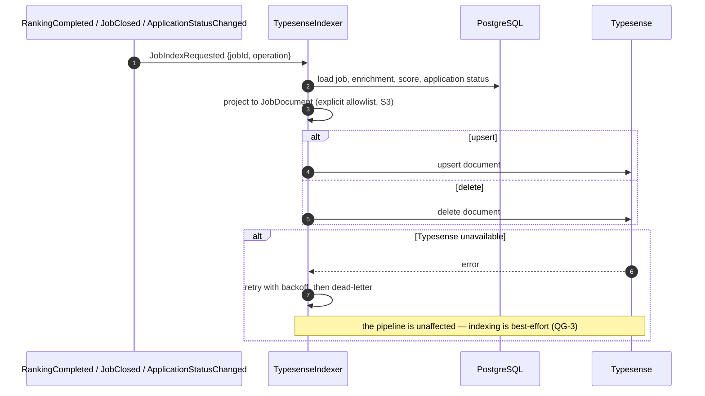
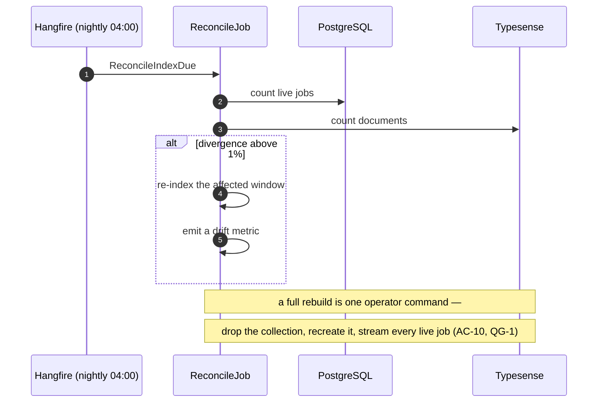

# SAD — F9 Search & Public API

> The system's only inbound HTTP surface. Refines [[../../00-overview/sad|the system SAD]] §3 and §5.

## 1. Intent and quality goals

Make the corpus queryable without ever letting the query path become something the pipeline depends on.

| # | Goal | Verification |
|---|---|---|
| QG-1 | **The index is derived, never authoritative** — losing it is a rebuild, not a loss | Rebuild test asserting byte-equivalent reconstruction from PostgreSQL |
| QG-2 | **Nothing private is exposed** — no CV content in the index, every endpoint scoped | Index scan suite; endpoint-convention test |
| QG-3 | **Search failure is contained** — the pipeline and the digest are unaffected | Fault-injection test with Typesense unavailable |

## 2. Constraints

- Typesense, shared helios instance, collections prefixed `{env}_jobhunter_`
  ([[../../00-overview/adr/0008-typesense-over-postgres-fts|ADR-0008]]).
- Keycloak OIDC; two scopes; fallback-deny
  ([[../../00-overview/adr/0014-keycloak-api-telegram-allowlist|ADR-0014]]).
- No write endpoints for pipeline data; reads plus a small set of operator actions.
- The digest query reads PostgreSQL directly and **never** touches the index.
- No CV content, ever — the F4 boundary extends here.

## 3. Context and scope

| External | Interaction | Failure |
|---|---|---|
| Typesense (helios) | index and query | Search returns a clear failure; nothing else is affected |
| Keycloak (helios) | JWT validation | API returns unavailable; the pipeline is untouched |
| Cloudflare | TLS, WAF, rate limiting at the edge | — |

**In:** the Typesense schema and indexer, the query service, the HTTP API and its OpenAPI document,
authentication and authorisation, operational endpoints, the Telegram search command, reconciliation
and rebuild.
**Out:** any write path for jobs, enrichments or matches; a user interface; semantic search.

## 4. Solution strategy

| # | Choice | Why |
|---|---|---|
| S1 | The index is a **projection**, written by a subscriber, rebuildable by one command | QG-1 ([[adr/0001-index-as-rebuildable-projection\|ADR-F9-0001]]) |
| S2 | A nightly reconcile compares counts and re-indexes drift | Drift becomes a self-healing condition rather than an incident |
| S3 | The indexed document is an **explicit allowlist** of fields, never a serialised aggregate | QG-2. A new field on `Job` cannot silently reach the index |
| S4 | Minimal API endpoints grouped by resource, each declaring its scope | Gate G7; fallback-deny makes omission fail closed |
| S5 | Read models come from Dapper queries, not from the index | The API is correct even when Typesense is down (QG-3) |
| S6 | The OpenAPI document is generated from the endpoints and asserted in a test | AC-05 — a description that drifts from reality is worse than none |

## 5. Building block view

```text
JobHunter.Domain/Abstractions/  ISearchIndex · ISearchQuery
JobHunter.Search/               TypesenseIndexer · TypesenseQueryService
                                JobDocument (the explicit allowlist) · SearchSchema
                                ReconcileJob · RebuildCommand
JobHunter.Api/
  Program.cs                    auth, OpenAPI, Scalar, fallback-deny policy
  Endpoints/JobEndpoints.cs · SearchEndpoints.cs · CompanyEndpoints.cs
            ApplicationEndpoints.cs · RunEndpoints.cs · PreferenceEndpoints.cs
            AdminEndpoints.cs
JobHunter.Infrastructure/Persistence/Queries/  JobDetailQuery · CompanyDetailQuery
                                               RunSummaryQuery · StatsQuery
JobHunter.Telegram/Handlers/SearchHandler.cs
```

`JobDocument` is deliberately a hand-written record rather than a mapping from `Job`:

```csharp
public sealed record JobDocument(
    string Id, string Title, string CompanyName, string CompanyDomain,
    string Description, string[] Technologies, string[] Countries,
    string RemotePolicy, string Seniority, string EmploymentType,
    string CompanyStage, string AiUsage, int? SalaryMin, int? SalaryMax,
    string? SalaryCurrency, double Score, long PostedAt, long FirstSeenAt,
    string Status, string? ApplicationStatus);
```

Every field is listed explicitly. Adding a field to `Job` — including any field that might one day
carry CV-derived text — cannot reach the index without someone editing this record, which is the whole
of QG-2's structural half.

## 6. Runtime view

### 6.1 Indexing



### 6.2 Search

```mermaid
sequenceDiagram
  autonumber
  participant C as Client (API or Telegram)
  participant A as JobHunter.Api
  participant K as Keycloak
  participant Q as TypesenseQueryService
  participant T as Typesense

  C->>A: search with filters
  A->>K: validate bearer token
  alt invalid, or subject is not the Owner
    A-->>C: refused (AC-06)
  else valid
    A->>Q: query + filters + facets
    Q->>Q: escape and build the filter expression — never string concatenation
    Q->>T: search, excluding closed jobs unless asked (AC-08)
    alt unavailable
      T-->>Q: error
      Q-->>A: search unavailable
      A-->>C: clear failure; nothing else affected (AC-09)
    else
      T-->>Q: hits + facet counts
      A-->>C: results + refinements (AC-01, AC-02)
    end
  end
```

### 6.3 Reconcile and rebuild



## 7. Deployment view

`jobhunter-api`, two replicas in production, the **only** deployment with an ingress. Traffic path:
Internet → Cloudflare → cloudflared → NGINX ingress → `jobhunter-api`. Indexing and reconciliation run
in `jobhunter-worker`.

**Monitoring:** `jobhunter.search.latency`, `jobhunter.search.queries`, `jobhunter.index.drift`,
`jobhunter.api.requests{endpoint,status}`, `jobhunter.api.auth_failures`.
Runbook [[../../operations/runbooks|R8]] covers drift and rebuild.

## 8. Crosscutting concepts

| Concept | Convention |
|---|---|
| Collection | `{env}_jobhunter_jobs`, per the helios naming rule |
| Document id | The job id — so an upsert is idempotent with no lookup |
| Indexed fields | Explicit allowlist in `JobDocument`; a new `Job` field cannot leak in |
| Filters | Built from typed parameters and escaped; never string-concatenated from user input |
| Default scope | Live jobs only; closed ones require an explicit flag (AC-08) |
| Scopes | `jobhunter:read` for reads, `jobhunter:admin` for state-changing operations |
| Fallback policy | `RequireAuthenticatedUser` — a new endpoint is protected by default |
| Pagination | Cursor-based on `(score, id)`; no offset paging |
| Errors | RFC 7807 problem details, with no internal detail in the body |
| OpenAPI | Generated and asserted against the registered endpoints in a test (S6) |

## 9. Architecture decisions

| # | Title | Status |
|---|---|---|
| [[../../00-overview/adr/0008-typesense-over-postgres-fts\|ADR-0008]] | Typesense over Postgres FTS | Accepted |
| [[../../00-overview/adr/0014-keycloak-api-telegram-allowlist\|ADR-0014]] | Keycloak OIDC, two scopes | Accepted |
| [[adr/0001-index-as-rebuildable-projection\|F9-0001]] | The index is a rebuildable projection | Accepted |

## 10. Quality requirements

**QG-1. The index is derived, never authoritative**
- **When:** the collection is deleted entirely.
- **Then:** one command reconstructs it from PostgreSQL with no information loss, in under ten minutes.
- **How verify:** a rebuild test that drops the collection, rebuilds, and asserts document-by-document
  equivalence with a freshly projected set.

**QG-2. Nothing private is exposed**
- **When:** the entire index is dumped and every endpoint is exercised.
- **Then:** no CV content and no Owner personal detail appears anywhere; every endpoint required a credential.
- **How verify:** the index-scan suite using F4's sentinel CV; plus an endpoint-convention test
  asserting every registered endpoint declares a scope (gate G7).

**QG-3. Search failure is contained**
- **When:** Typesense is unavailable for an entire day.
- **Then:** discovery, enrichment, matching, ranking and the 07:00 digest all complete normally; only
  search endpoints fail, and they fail clearly.
- **How verify:** fault-injection test running a full pipeline with the index unreachable, asserting a
  delivered digest.

## 11. Risks and technical debt

| # | Item | Impact | Plan |
|---|---|---|---|
| D1 | **Internet-facing surface** — the only one in the system | Exposure | Cloudflare WAF and rate limiting, Keycloak, fallback-deny, subject check, required security review |
| D2 | Index drift from PostgreSQL | Stale results | Nightly reconcile with a drift metric; one-command rebuild; the digest never reads the index |
| D3 | A new `Job` field leaking into the index | Privacy | The explicit allowlist means it cannot happen without an edit to `JobDocument`, and the scan suite would catch it anyway |
| D4 | OpenAPI drifting from the implementation | A misleading description | Generated from the endpoints and asserted in a test (S6) |
| D5 | Typesense schema changes require a re-index | Downtime for search | The rebuild command makes it a one-command operation; search is not a critical path |

**Accepted debt:** no semantic search; no UI; no public demo credential; no multi-collection search
across companies and jobs together.

## 12. Glossary

No new terms.
