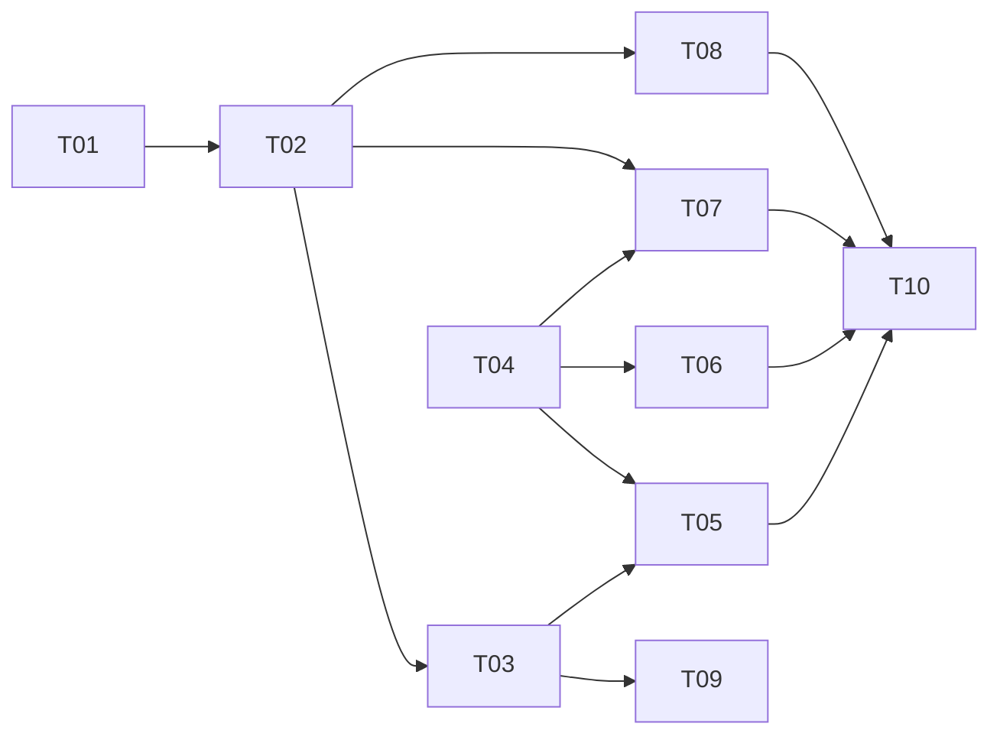

# Task tracker — F9 Search & Public API

Epic: [[_epic|_epic]]. The system's only inbound HTTP surface. A security review is required before it ships.

Each task is one reviewable PR (≤500 LOC), ≤1 day. Owner: Viacheslav (solo).
Estimate legend: **S** ≈ 2 h · **M** ≈ half a day · **L** ≈ a full day.
Status: `pending` → `in_progress` → `in_review` → `done`.

| ID | Task | Layer | Deps | Est | Status |
|---|---|---|---|---|---|
| T01 | [[T01-search-port-document\|ISearchIndex port and JobDocument allowlist]] | domain/search | — | S | done |
| T02 | [[T02-typesense-indexer\|Typesense schema and indexer]] | search | T01 | M | done |
| T03 | [[T03-query-service\|Query service, filters and facets]] | search | T02 | M | done |
| T04 | [[T04-api-host-auth\|API host: auth, fallback-deny, OpenAPI]] | api | — | M | done |
| T05 | [[T05-search-job-endpoints\|Search, job and CV endpoints]] | api | T03, T04 | M | done |
| T06 | [[T06-company-run-preference-endpoints\|Company, run lifecycle and preference endpoints]] | api | T04 | M | pending |
| T07 | [[T07-admin-endpoints\|Operational endpoints]] | api | T04, T02 | M | pending |
| T08 | [[T08-reconcile-rebuild\|Reconcile and rebuild]] | search | T02 | M | pending |
| T09 | [[T09-telegram-search\|Telegram search command]] | telegram | T03 | S | pending |
| T10 | [[T10-verification-suites\|Index scan, rebuild and convention suites]] | tests | T05, T06, T07, T08 | L | pending |

**10 tasks · 2×S + 7×M + 1×L ≈ 5 person-days.**

## Dependency graph

## DoR / DoD

- **DoR:** the feature's PRD, SAD, data-model and test-plan are accepted
  ([[../../../IMPLEMENTATION-READINESS|readiness]]); the task's own ACs and ADR links resolve.
- **DoD (every task):** code compiles with zero warnings; the index scan, rebuild and convention suites are green; no endpoint ships without a declared scope; the coverage gate stays green; the tracker row is updated in the same PR.

See [[../../../IMPLEMENTATION-READINESS]] §4 for the full per-task checklist.
